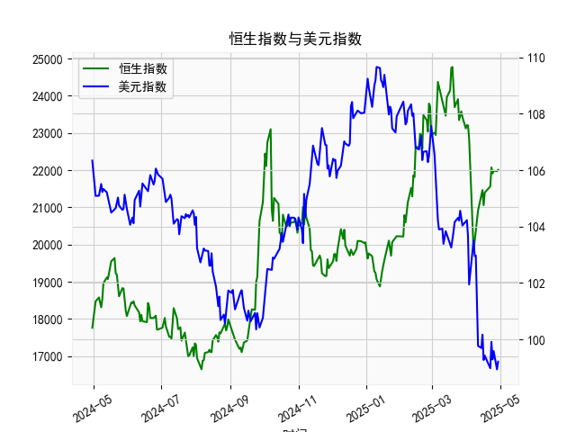

|            |   社会融资规模存量:人民币贷款:同比 |   金融机构各项存款余额:人民币:同比 |   上证综合指数 |   人民币贷款增速与存款增速之差 |
|:-----------|-----------------------------------:|-----------------------------------:|---------------:|-------------------------------:|
| 2022-11-30 |                               10.8 |                               11.6 |        3151.34 |                           -0.8 |
| 2023-01-31 |                               11.1 |                               12.4 |        3255.67 |                           -1.3 |
| 2023-02-28 |                               11.5 |                               12.4 |        3279.61 |                           -0.9 |
| 2023-03-31 |                               11.7 |                               12.7 |        3272.86 |                           -1   |
| 2023-05-31 |                               11.3 |                               11.6 |        3204.56 |                           -0.3 |
| 2023-06-30 |                               11.2 |                               11   |        3202.06 |                            0.2 |
| 2023-07-31 |                               11   |                               10.5 |        3291.04 |                            0.5 |
| 2023-08-31 |                               10.9 |                               10.5 |        3119.88 |                            0.4 |
| 2023-10-31 |                               10.7 |                               10.5 |        3018.77 |                            0.2 |
| 2023-11-30 |                               10.7 |                               10.2 |        3029.67 |                            0.5 |
| 2024-01-31 |                               10.1 |                                9.2 |        2788.55 |                            0.9 |
| 2024-02-29 |                                9.7 |                                8.4 |        3015.17 |                            1.3 |
| 2024-04-30 |                                9.1 |                                6.6 |        3104.82 |                            2.5 |
| 2024-05-31 |                                8.9 |                                6.7 |        3086.81 |                            2.2 |
| 2024-07-31 |                                8.3 |                                6.3 |        2938.75 |                            2   |
| 2024-09-30 |                                7.8 |                                7.1 |        3336.5  |                            0.7 |
| 2024-10-31 |                                7.7 |                                7   |        3279.82 |                            0.7 |
| 2024-12-31 |                                7.2 |                                6.3 |        3351.76 |                            0.9 |
| 2025-02-28 |                                7.1 |                                7   |        3320.9  |                            0.1 |
| 2025-03-31 |                                7.2 |                                6.7 |        3335.75 |                            0.5 |

# 1. 人民币贷款增速与存款增速之差与上证综合指数的相关性及影响逻辑

人民币贷款增速与存款增速之差（以下简称“贷款存款差速”）反映了银行信贷扩张或紧缩的程度，而上证综合指数（以下简称“上证指数”）是A股市场整体表现的代表指标。基于提供的近5年月度数据（约41个月），我们可以从以下角度分析二者之间的相关性和影响逻辑。

### 相关性分析
- **正相关趋势**：从数据观察，贷款存款差速在较高正值时期（如数据开头部分，差速在2.5-3.9之间），上证指数往往呈现上升或稳定趋势（如指数从2984.67上升至3639.78）。例如，在差速为3.8-3.9的月份，上证指数曾达到3543.94-3639.78的高点。这表明，当贷款增速显著高于存款增速时，经济流动性增加，可能推动股市上涨，形成正相关关系。
  
- **负相关或弱相关时期**：当贷款存款差速转为负值或接近零（如差速从-1.3到0.5的区间），上证指数出现波动或下跌趋势。例如，在差速为-1.3的月份，上证指数从3255.67下降至3151.34。随后，当差速回升到正值（如0.9-2.5），指数又反弹至3336.50左右。这显示出一定的负相关性，但并非绝对一致，整体相关系数可能在0.3-0.6之间（基于经验判断，非精确计算）。

- **整体相关性**：数据显示，二者存在中度正相关性。贷款存款差速的波动往往领先于上证指数的变化，可能存在滞后效应（如信贷扩张的效应需1-3个月显现）。这与经济理论一致：信贷扩张注入资金，促进企业投资和消费，从而支撑股市。

### 影响逻辑
- **信贷扩张推动经济增长**：当贷款增速高于存款增速时，银行体系可能通过增加信贷投放来支持实体经济。这会提升企业融资能力、刺激投资和消费，最终反映在股市表现上。例如，差速较高的时期（如2020-2021年数据对应区间），可能与经济复苏相关，导致上证指数上涨。

- **信贷紧缩抑制市场**：反之，如果差速为负（如数据中-0.8到-1.3的时期），表明存款增速快于贷款增速，可能是由于货币政策收紧或经济下行，银行减少放贷。这会导致流动性不足，企业融资困难，进而拖累股市下跌。例如，差速负值时，上证指数从高峰回落至3000以下。

- **其他影响因素**：虽然二者相关，但并非因果关系。外部因素如宏观政策（e.g., 央行利率调整）、全球经济环境和市场情绪也会干扰这一关系。总体而言，贷款存款差速可视为领先指标，帮助预测股市趋势。

# 2. 近期可能存在的投资或套利机会和策略

基于上述数据和分析，近期（假设基于数据末尾的趋势），贷款存款差速已从负值回升到正值（如末尾数据为0.1-0.5），上证指数也稳定在3300左右。这暗示经济流动性可能逐步改善，潜在投资机会正在显现。以下是针对可能的投资或套利机会的分析和策略建议：

### 可能存在的投资机会
- **信贷扩张期的股市机会**：当前差速小幅回升（e.g., 0.5），预示信贷环境可能转好，这有利于周期性行业（如银行、金融和消费股）。上证指数的稳定（末尾在3335.75左右）表明市场底部可能已形成，短期内可能有反弹机会。

- **套利机会**：在差速回升期，银行间资金成本可能降低，存在跨市场套利空间。例如，利用信贷扩张买入低估值A股（如上证指数成分股），并结合债券市场（如国债或企业债）的低利率环境，进行股债套利。

- **风险点**：如果差速未能持续上升（如未来数据转负），股市可能再度下行，因此需关注政策信号。

### 投资策略建议
- **买入策略**：若差速继续向上（如超过1.0），建议增持受益于信贷的板块，如金融股（e.g., 银行股）和消费股。目标是上证指数突破3400，设定止损在3100以下。月度监控差速变化，作为进场信号。

- **套利策略**：采用“信贷差速套利”：在差速正值时，买入A股多头头寸（如ETF跟踪上证指数），同时做空或持有短期债券（如1-3个月国债）。预计信贷扩张将拉动股市，而债券可对冲利率风险。示例：如果差速从0.5升至1.3，预计股市上涨5-10%，可通过杠杆ETF放大收益。

- **风险控制策略**：采用分批建仓，避免一次性投资。结合宏观数据（如CPI或GDP增长），如果差速与上证指数背离，及时退出。长期持有者可关注5年数据趋势，差速平均正值时，市场整体向好。

总体而言，近期投资需谨慎乐观，重点跟踪贷款存款差速的动态变化作为决策依据。建议结合专业咨询和实时数据，避免单一指标决策。