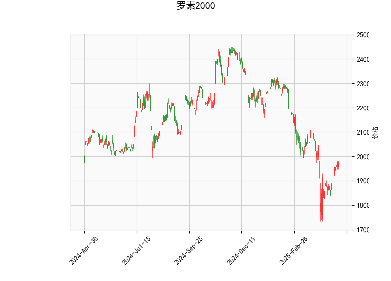

# 罗素2000指数技术分析

## 指标分析概述
罗素2000指数当前价格为1976.52，基于提供的技术指标，我们可以评估其近期市场趋势和潜在信号。以下是对关键指标的逐一分析，这些指标共同反映了指数的动量、趋势强度和波动性。

- **RSI (相对强弱指数)**: 当前RSI值为53.13，这是一个中性水平（通常RSI在30-70之间表示市场平衡）。RSI高于50表明短期内有一定的买入压力，但尚未达到超买区域（70以上）。这暗示市场可能处于温和的牛市阶段，没有明显的超卖或超买风险，适合观察进一步的确认信号。

- **MACD (移动平均收敛散度)**: MACD线为-15.22，信号线为-36.24，MACD直方图为21.01（正值）。尽管MACD线和信号线均为负（表示短期趋势可能仍偏弱势），但直方图的正值显示MACD线正在向上接近信号线，这是一个潜在的看涨信号。如果MACD线成功穿越信号线，可能预示着短期反弹。整体来看，MACD暗示市场可能从之前的弱势中恢复，但仍需警惕可能的假突破。

- **Bollinger Bands (布林带)**: 上轨为2309.70，中轨为2040.11，下轨为1770.51。当前价格1976.52位于中轨（2040.11）下方，但高于下轨（1770.51），表明指数处于布林带的中间偏下区域。这通常表示市场波动性适中，价格可能接近支撑位。如果价格向上突破中轨，可能触发反弹；反之，如果跌破下轨，则可能加剧下行压力。

- **K线形态**: 提供的K线形态列表为空，这意味着近期没有明显的经典K线模式（如锤头线、吞没形态等）。这可能表示市场缺乏强烈的短期反转信号，趋势更多依赖于其他指标的确认。

总体而言，技术指标显示罗素2000指数当前处于一个相对平衡但略带看涨潜力的状态。RSI的中性水平和MACD的正直方图暗示短期内可能有反弹机会，而布林带的位置强调了价格的波动性。

## 近期投资或套利机会和策略判断
基于上述分析，我们可以判断罗素2000指数的近期机会。罗素2000作为小型股指数，通常对经济复苏和市场情绪敏感。以下是对潜在投资或套利机会的评估，以及相应的策略建议。请注意，投资涉及风险，建议结合宏观经济因素和个人风险承受能力进行决策。

### 潜在投资机会
- **看涨机会**: MACD直方图的正值和RSI的中性水平表明可能存在短期多头机会，尤其如果市场情绪转好（如经济数据改善）。价格接近布林带中轨下方，可能提供低位买入点。预计如果指数反弹至2000以上，将测试中轨阻力位，进一步上行可能挑战上轨2309.70。
  
- **套利机会**: 由于布林带显示中等波动性，存在波动率套利潜力。例如，如果市场预期经济数据波动（如就业报告或通胀数据），可以通过期权或差价合约策略捕捉波动性差异。但当前指标未显示极端波动，因此套利机会较为温和，主要适合经验丰富的交易者。

- **风险因素**: 如果全球经济不确定性增加（如地缘政治事件），指数可能跌向下轨1770.51，导致卖出机会。RSI如果跌破30，将强化空头信号。

### 投资策略建议
- **多头策略**: 在MACD线向上穿越信号线时考虑买入，目标价位设在中轨2040以上。止损可放置在下轨1770附近，以控制风险。适合中期投资者，通过跟踪RSI避免超买风险。
  
- **空头策略**: 如果价格无法突破中轨并回落，考虑卖出或做空，目标下探至下轨1770。结合RSI，如果其降至40以下，可作为确认信号。
  
- **套利策略**: 利用布林带的收缩期进行波动率套利，例如通过买入看涨期权和卖出看跌期权构建中性策略。监控市场事件，如果预期波动率扩大（如美联储政策会议），可增加仓位。但需注意，当前RSI和MACD未显示强烈信号，因此套利宜小额测试。
  
- **风险管理建议**: 无论策略如何，始终设置止盈止损（如基于布林带轨道），并结合成交量和更广泛的市场指标（如S&P 500）进行验证。建议定期复盘，避免过度依赖单一指标。

总之，近期罗素2000指数可能呈现小幅反弹机会，但需警惕市场波动。投资者应保持谨慎，结合基本面分析制定策略。