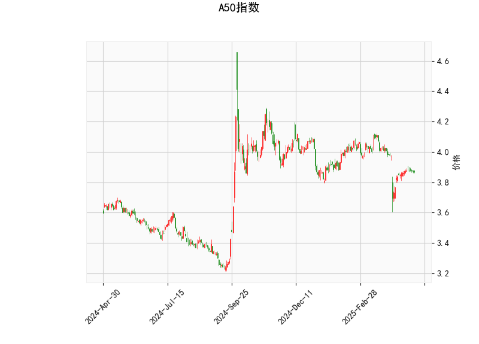

### A50指数技术分析结果解析

#### 1. 对技术分析结果的详细分析
以下是对A50指数当前技术指标的逐项分析，基于提供的指标数据（当前价为3.869）。这些指标共同反映了市场的短期动态和潜在趋势。

- **当前价格（Current Price）**:
  - 当前价格为3.869，这位于布林带的中轨（3.968）和下轨（3.773）之间，表明价格处于中性区域，没有明显偏离均值。价格接近中轨可能暗示市场正在盘整或等待突破，如果向上突破中轨，可能预示短期上行；反之，向下测试下轨可能加剧下行压力。

- **RSI（Relative Strength Index，相对强弱指数）**:
  - RSI值为43.26，这处于中性水平（一般RSI低于30为超卖，高于70为超买）。当前RSI显示市场没有过度买入或卖出，暗示A50指数可能处于均衡状态，短期内缺乏强烈的趋势信号。但如果RSI开始上升（接近50以上），可能表示买盘增强；反之，继续下降可能预示进一步回调。

- **MACD（Moving Average Convergence Divergence，移动平均收敛散度）**:
  - MACD线为-0.0228（负值），信号线为-0.0305（也为负值），而MACD柱状图（Hist）为0.0077（正值）。这表明MACD线虽仍处于负区（暗示整体下行趋势），但柱状图转为正值，显示短期内多头力量在增强，可能是一个潜在的看涨信号。如果MACD线向上穿越信号线，将进一步确认短期反弹；否则，负MACD线可能导致价格进一步下探。

- **布林带（Bollinger Bands）**:
  - 上轨为4.163，中轨为3.968，下轨为3.773。目前价格（3.869）靠近中轨，表明市场波动率较低，处于收缩状态（窄幅震荡）。布林带收窄往往预示即将有突破：向上突破上轨可能引发上行趋势，向下突破下轨则可能加剧下行。整体来看，这反映了A50指数的短期不确定性，投资者需关注价格是否脱离中轨。

- **K线形态（Candlestick Patterns）**:
  - 形态包括CDLMATCHINGLOW（匹配低点）、CDLSHORTLINE（短线）和CDLSPINNINGTOP（纺锤顶）。这些形态 collectively 暗示市场犹豫和潜在反转：
    - CDLMATCHINGLOW：表示价格可能在低点附近形成支撑，暗示短期反转机会，可能是一个买入信号。
    - CDLSHORTLINE：显示小幅波动或窄幅整理，表明市场缺乏方向性，适合观望。
    - CDLSPINNINGTOP：这是一个犹豫形态，通常出现在趋势转折点，显示多空力量均衡。如果后续K线确认向上，可能转为看涨。

总体而言，A50指数的技术面显示短期市场处于盘整阶段（RSI中性、布林带收窄），但K线形态和MACD柱状图的正值提供了潜在的反转信号。当前价格未出现极端超买或超卖，整体趋势偏中性，但需警惕下行风险。

#### 2. 近期可能存在的投资或套利机会和策略判断
基于上述分析，以A50指数的当前技术面为依据，我对近期投资机会进行了判断。A50指数（通常指富时中国A50指数）涉及中国市场，机会可能包括股票指数期货、期权或其他衍生品。以下是关键机会和策略建议，强调风险管理。

- **可能的投资机会**:
  - **短期反弹机会**：K线形态（如CDLMATCHINGLOW和CDLSPINNINGTOP）暗示潜在反转，结合MACD柱状图的正值，A50指数可能迎来短期上行。如果价格突破布林带中轨（3.968）并站稳，可能推动价格向4.163（上轨）靠近，提供10-20点的上涨空间（约2-5%的潜在收益）。这适合短期交易者。
  - **盘整套利机会**：当前布林带收窄和RSI中性表明市场波动小，可能存在波动率套利（如卖出期权波动率）。如果A50指数与相关资产（如A股或期货）存在价差，也可通过跨市套利（如A50期货与现货的基差交易）捕捉无风险收益。
  - **风险警示**：如果价格跌破下轨（3.773），可能触发进一步回调，RSI若跌至30以下则加剧卖出压力。整体机会偏短期，中期趋势需更多数据确认。

- **推荐投资策略**:
  - **买入策略**：在价格企稳于3.800以上时考虑轻仓买入A50指数相关产品（如ETF或期货），目标价位设在4.000附近（布林上轨）。止损位可设在3.700以下，以控制风险。结合MACD信号，待MACD线向上穿越信号线再入场，提高胜率。
  - **卖出或套利策略**：如果预期盘整延续，可采用中性策略，如卖出看涨期权（卖方期权套利），利用低波动率获利。或通过A50指数与沪深300指数的价差套利（如果A50相对低估），在价差收敛时获利。
  - **风险管理建议**：采用仓位控制（总仓位不超过30%用于此类交易），并结合基本面（如中国经济数据）验证技术信号。短期内，市场不确定性较高，建议优先观察1-2天K线形态变化，避免盲目操作。
  - **整体评估**：投资机会中等，适合经验丰富的交易者。潜在收益为5-10%（短期反弹），但下行风险约5-8%（若突破失败）。长期投资者可等待更明确信号，如RSI回升至50以上。