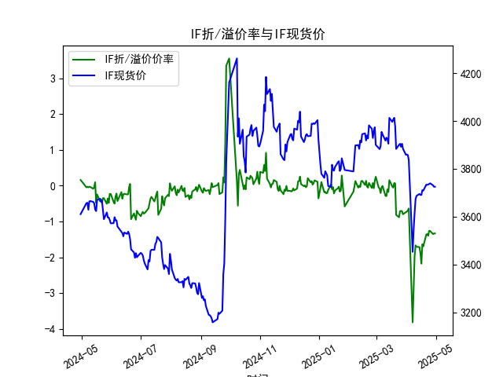
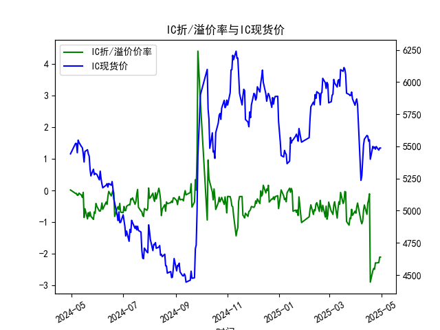
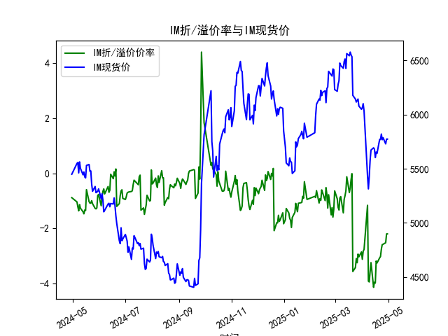

|            |   IF折/溢价率 |   IF现货价 |   IH折/溢价率 |   IH现货价 |   IC折/溢价率 |   IC现货价 |   IH折/溢价率 |   IH现货价 |
|:-----------|--------------:|-----------:|--------------:|-----------:|--------------:|-----------:|--------------:|-----------:|
| 2025-04-02 |     -0.689576 |     3857.6 |     -0.5168   |     5868.6 |     -0.5168   |     5868.6 |      -2.82374 |     6100   |
| 2025-04-03 |     -0.634556 |     3837   |     -0.395252 |     5822.4 |     -0.395252 |     5822.4 |      -2.76398 |     6031.8 |
| 2025-04-07 |     -3.81231  |     3452.6 |     -0.961471 |     5236.2 |     -0.961471 |     5236.2 |      -1.16153 |     5432.6 |
| 2025-04-08 |     -2.92977  |     3543.8 |     -1.04965  |     5271   |     -1.04965  |     5271   |      -3.91353 |     5313.6 |
| 2025-04-09 |     -1.97446  |     3614   |     -0.96643  |     5387.2 |     -0.96643  |     5387.2 |      -3.9405  |     5429.6 |
| 2025-04-10 |     -1.663    |     3673   |     -0.632471 |     5509   |     -0.632471 |     5509   |      -3.56785 |     5578.2 |
| 2025-04-11 |     -1.70421  |     3686.6 |     -0.457211 |     5555.8 |     -0.457211 |     5555.8 |      -3.2409  |     5672.2 |
| 2025-04-14 |     -1.71162  |     3694.8 |     -0.752381 |     5584.8 |     -0.752381 |     5584.8 |      -4.13446 |     5693   |
| 2025-04-15 |     -1.88329  |     3690.4 |     -0.402211 |     5580   |     -0.402211 |     5580   |      -3.95041 |     5680.4 |
| 2025-04-16 |     -2.17398  |     3690.8 |     -0.296286 |     5540.4 |     -0.296286 |     5540.4 |      -3.98173 |     5603   |
| 2025-04-17 |     -1.63358  |     3710.6 |     -0.104562 |     5551.2 |     -0.104562 |     5551.2 |      -3.18113 |     5653.8 |
| 2025-04-18 |     -1.68913  |     3708.8 |     -2.89029  |     5400   |     -2.89029  |     5400   |      -3.25269 |     5642   |
| 2025-04-21 |     -1.36545  |     3733.2 |     -2.52696  |     5499.8 |     -2.52696  |     5499.8 |      -3.06818 |     5770   |
| 2025-04-22 |     -1.34653  |     3733   |     -2.45739  |     5486   |     -2.45739  |     5486   |      -3.02072 |     5769.6 |
| 2025-04-23 |     -1.39646  |     3734   |     -2.48358  |     5495   |     -2.48358  |     5495   |      -2.75012 |     5820   |
| 2025-04-24 |     -1.25668  |     3736.8 |     -2.28117  |     5478   |     -2.28117  |     5478   |      -2.58556 |     5767.4 |
| 2025-04-25 |     -1.26205  |     3739.2 |     -2.28499  |     5498.6 |     -2.28499  |     5498.6 |      -2.57433 |     5786.6 |
| 2025-04-28 |     -1.34913  |     3730.6 |     -2.27382  |     5471   |     -2.27382  |     5471   |      -2.51923 |     5729   |
| 2025-04-29 |     -1.33181  |     3724.8 |     -2.10005  |     5487.2 |     -2.10005  |     5487.2 |      -2.19842 |     5773.6 |
| 2025-04-30 |     -1.33181  |     3724.8 |     -2.10005  |     5487.2 |     -2.10005  |     5487.2 |      -2.19842 |     5773.6 |

### 1. 股指期货折/溢价率与现货价的相关性及影响逻辑

股指期货的折/溢价率（即ANAL_BASISPERCENT）是指期货价格相对于现货价格（CLOSE）的偏离程度。正值表示期货溢价（期货价格高于现货），负值表示期货折价（期货价格低于现货）。这种关系受多种市场因素影响，下面从相关性和影响逻辑两方面进行解释。

**相关性：**  
股指期货折/溢价率与现货价之间存在紧密的正相关或负相关动态。具体而言：  
- **正相关性：** 当现货价格上涨时，期货价格通常会跟随上涨，但如果期货价格上涨更快或滞后，则可能导致溢价（正值）。反之，现货价格下跌可能加剧折价（负值）。从提供的数据看（如ANAL从2024-04-30的0.16%正溢价到2025-04-30的-1.33%折价），折/溢价率往往与现货价的波动方向相关，但幅度不一致。例如，IH和IC在2024-05数据显示现货价上涨（从5442.0到5548.6），但折价率从正值转为负值，表明期货可能未完全跟上现货变动。  
- **负相关性：** 在某些情况下，折价加深可能预示现货价的潜在回调。例如，IM数据中折价率从-0.88%逐步加深到-2.2%，而现货价在后期稳定在5700-5800区间，这可能反映市场对未来现货走势的悲观预期。总体上，相关性不是绝对的，而是受短期市场情绪和长期经济因素影响。

**影响逻辑：**  
折/溢价率的形成源于期货与现货价格的理论均衡关系（基于无套利原理），但实际受多种因素干扰：  
- **成本因素：** 期货价格应等于现货价格加上持有成本（如融资利率、股息调整）。如果实际期货价格低于此值（折价），可能是由于利率上升或市场流动性不足；反之，溢价可能源于市场对未来现货上涨的过度乐观。从数据看，2024年上半年多为正溢价（如ANAL的0.16%），可能反映当时市场信心强；到2025年折价普遍加深（如IH的-2.1%），可能因经济不确定性或利率上升导致持有成本增加。  
- **市场预期和情绪：** 折/溢价率往往是市场预期的领先指标。如果投资者预期现货价格将上涨，他们可能推高期货价格导致溢价；反之，预期悲观时折价加深。例如，数据中IH和IC的折价率从2024-05到2025-04逐步恶化，可能与宏观经济数据（如GDP增长放缓）或地缘事件相关，进而影响现货价的短期波动。  
- **其他外部因素：** 包括政策变化（如央行利率调整）、全球事件（如贸易摩擦）和流动性问题。数据显示的整体折价趋势（从正值到负值）可能反映了2024年底至2025年初的市场调整期，期货作为衍生品更敏感于这些因素，从而间接拉动现货价向均衡靠拢。

总之，折/溢价率不是现货价的直接驱动器，而是二者互动的结果。长期看，市场会通过套利行为（如正套或反套）推动二者收敛。

### 2. 近期可能存在的投资或套利机会和策略

基于提供的数据（覆盖2024-04-30至2025-04-30），股指期货折/溢价率整体从正溢价转为显著折价（如ANAL约-1.33%，IH和IC约-2.1%，IM约-2.2%），这暗示了潜在的套利机会。以下分析近期（近1-3个月数据）可能的机会和策略，重点关注折价加深的现象。

**可能存在的投资或套利机会：**  
- **正套利机会：** 当前数据显示大多数指数（如IH、IC和IM）处于较深折价状态（-2%以下），这意味着期货价格低于现货价格，符合正套利条件（买入现货、卖出期货）。例如，IH从2024-05的轻微折价到2025-04的-2.1%，折价率扩大可能源于市场对经济下行的担忧，提供无风险套利空间。如果折价持续收敛（如历史数据中常见），投资者可获利。  
- **投资机会：** 折价加深可能反映市场过度悲观，尤其是IM的-2.2%折价与现货价稳定在5700以上，这或许是做多期货或现货的时机。如果经济数据好转（如政策刺激），现货价上涨可能带动期货反弹。相反，如果折价是暂时的噪音，IH和IC的-2.1%水平可能低于历史均值（假设基于过去1年数据），提供低风险买入点。  
- **潜在风险：** 虽然机会存在，但折价加深也可能预示市场调整（如2025-04数据所示），如果外部事件（如利率上行）加剧，机会可能转为风险。总体上，ANAL的轻微折价（-1.33%）相对IH和IC更温和，可能更适合保守投资者。

**具体投资或套利策略：**  
- **正套利策略：**  
  - **操作：** 对于IH和IC（折价率约-2.1%），买入现货指数基金或相关ETF，同时卖出相应期货合约。待折价收敛（如期货价格上涨或现货下跌）时平仓。基于数据，2025-04的折价已持续数月，收敛窗口可能在1-3个月内。  
  - **风险控制：** 设置止损点（如折价率扩大到-3%时退出），并关注合约到期日（避免交割风险）。预期收益：如果收敛1%，正套可获利约1-2%的无风险回报。  
- **反向投资策略：**  
  - **操作：** 如果判断折价是过度（如IM的-2.2%可能已触及底部），可做多期货（如买入IM期货），期待现货价上涨带动期货反弹。结合数据，IM现货价从2024-05的5500左右升至2025-04的5700以上，显示潜在上行趋势。  
  - **风险控制：** 结合技术分析（如K线图），在现货价突破关键位（如IH的5500）时入场，并使用期权对冲以降低波动风险。预期收益：如果市场反弹，3-6个月内可能获利5%以上。  
- **组合策略建议：**  
  - **多指数分散：** 同时关注ANAL（折价较轻）和IH（折价较深），构建组合套利（如50%正套ANAL + 50%正套IH），降低单一指数风险。  
  - **时机选择：** 等待关键经济数据发布（如CPI或GDP数据），如果数据好于预期，折价可能快速收敛。总体上，建议在折价率稳定在-1.5%以下时行动，结合实时数据监控。  

需提醒的是，任何策略均需考虑个人风险偏好和市场环境，上述分析基于历史数据推断，非投资建议。

