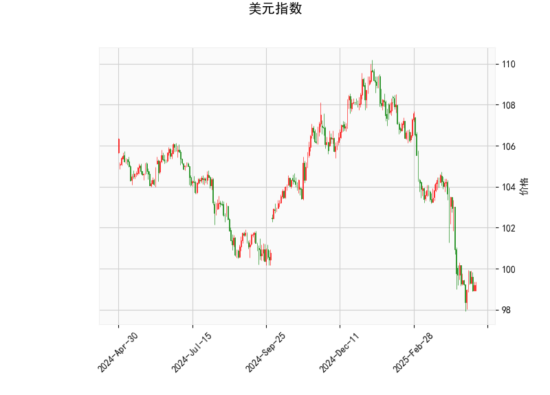

### 1. 美元指数的技术分析结果解读

根据提供的美元指数技术指标数据，以99.21为当前价位，我们可以从多个角度进行分析，以评估其短期趋势和潜在风险。

- **RSI（相对强弱指数）分析**：RSI值为36.94，这处于超卖区域（一般低于30被视为超卖）。这表明美元指数近期可能遭受过度抛售，市场情绪偏向悲观，但也暗示潜在的反弹机会。如果RSI开始回升至50以上，可能标志着短期趋势的逆转。

- **MACD（移动平均收敛散度）分析**：MACD值为-1.23，信号线为-1.31，MACD直方图（Hist）为0.08（正值）。整体MACD线低于信号线，显示短期看跌信号，但直方图由负转正（从之前的负值开始回升），这可能表示看跌动能正在减弱，潜在的买入信号出现。如果MACD线向上穿越信号线，将进一步确认反弹。

- **布林带分析**：当前价99.21位于下轨（97.84）和中轨（103.42）之间，接近下轨。这反映出美元指数处于超卖状态，通常是价格可能反弹的信号。上轨（108.99）作为阻力位，如果价格向上突破中轨，可能测试上轨；反之，如果继续下探下轨以下，将加剧弱势。

- **K线形态分析**：K线形态为空（[]），表示近期未形成明显的看涨或看跌模式。这可能意味着市场处于盘整阶段，缺乏强势方向，需要结合其他指标观察。

总体而言，美元指数当前处于弱势，但RSI超卖和MACD直方图回升的迹象显示潜在反弹风险。短期内，美元可能企稳或小幅反弹，但若无外部驱动（如经济数据或美联储政策），难以快速突破中轨。投资者需警惕全球风险事件对美元的影响，例如通胀数据或地缘政治因素。

### 2. 基于美元指数分析，判断近期A股和港股的投资或套利机会及策略

美元指数的弱势（结合超卖信号）通常对新兴市场有利，因为美元走弱可能吸引资金流入高增长区域，如中国市场。然而，如果美元指数反弹（如RSI和MACD所示的潜在信号），这可能导致资金外流，增加A股和港股的波动性。A股（以人民币计价）和港股（受美元汇率影响较大）往往与美元指数负相关，因此我们需结合当前经济环境（如中国经济复苏和全球流动性）评估机会。

#### 潜在投资机会
- **A股机会**：
  - **短期反弹潜力**：如果美元指数反弹被视为短期修正（RSI超卖暗示可能很快），A股可能迎来低吸机会。目前A股估值相对合理（如科技和消费板块），若中国经济数据向好（如PMI或出口数据），可关注低估值蓝筹股（如银行、金融）。例如，沪深300指数若突破关键阻力位，可能吸引外资流入。
  - **主题性机会**：美元弱势可能利好出口导向股（如机械、电子），因为人民币相对走强有助于海外需求。反之，如果美元反弹，内需驱动股（如消费、医疗）更具防御性。

- **港股机会**：
  - **外资流入窗口**：港股作为国际市场桥梁，更敏感于美元波动。美元超卖可能推动港股反弹，尤其在中概股（如互联网、科技）回归后。若恒生指数站稳关键支撑（如20000点），可捕捉估值修复机会。
  - **跨境联动**：港股与A股存在溢价差异（如A/H股比），美元弱势可能放大这一效应，利于中资股表现。

- **套利机会**：
  - **A/H股套利**：A股和港股间常有价格偏差（如H股较A股折价）。如果美元指数反弹导致港股短期承压，投资者可通过买入H股（如腾讯、阿里在港股的H股）并卖出对应A股进行套利。当前，若A/H股比扩大（A股溢价较高），这是理想时机。
  - **汇率相关套利**：美元弱势可能推升人民币，投资者可关注汇率套利策略，例如通过港股通买入A股相关资产，同时对冲汇率风险。

#### 投资策略建议
- **短期策略**：
  - **防御性配置**：鉴于美元潜在反弹风险，优先选择低波动的板块，如A股的必需消费和医疗股、港股的公用事业股。这些板块抗风险能力强，可在市场波动中稳健持仓。
  - **波段操作**：监控美元指数关键点位（如若突破中轨103.42，则加仓防御股；若RSI回升至40以上，则考虑加仓A股科技股）。

- **中长期策略**：
  - **多元化布局**：结合宏观因素（如美联储政策和中国刺激措施），构建A股和港股组合。例如，50%配置A股蓝筹、30%港股科技股、20%现金对冲。
  - **风险管理**：使用止损机制（如设定美元指数反弹至102时的卖出信号），并关注全球事件（如美债收益率变化）。若美元持续弱势，可加大新兴市场暴露。

总体风险提示：美元指数的潜在反弹可能加剧A股和港股的短期下行压力，投资者应结合基本面（如中国GDP数据）谨慎操作，避免追高。机会窗口可能在美元修正后出现，建议通过专业工具（如MT4）实时跟踪指标。