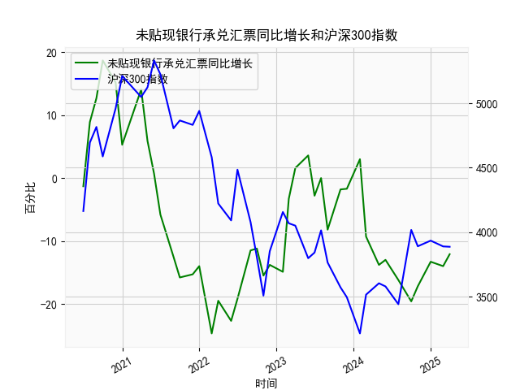

|            |   未贴现银行承兑汇票同比增长 |   沪深300指数 |
|:-----------|-----------------------------:|--------------:|
| 2022-11-30 |                        -13.8 |       3853.04 |
| 2023-01-31 |                        -14.9 |       4156.86 |
| 2023-02-28 |                         -3.3 |       4069.46 |
| 2023-03-31 |                          1.6 |       4050.93 |
| 2023-05-31 |                          3.6 |       3798.54 |
| 2023-06-30 |                         -2.8 |       3842.45 |
| 2023-07-31 |                          0   |       4014.63 |
| 2023-08-31 |                         -8.2 |       3765.27 |
| 2023-10-31 |                         -1.8 |       3572.51 |
| 2023-11-30 |                         -1.7 |       3496.2  |
| 2024-01-31 |                          3   |       3215.35 |
| 2024-02-29 |                         -9.3 |       3516.08 |
| 2024-04-30 |                        -13.8 |       3604.39 |
| 2024-05-31 |                        -13   |       3579.92 |
| 2024-07-31 |                        -16.2 |       3442.08 |
| 2024-09-30 |                        -19.6 |       4017.85 |
| 2024-10-31 |                        -17.2 |       3891.04 |
| 2024-12-31 |                        -13.3 |       3934.91 |
| 2025-02-28 |                        -14   |       3890.05 |
| 2025-03-31 |                        -12.1 |       3887.31 |

### 1. 未贴现银行承兑汇票月同比增长与沪深300指数的相关性及影响逻辑

基于提供的数据，我们可以观察到未贴现银行承兑汇票的月同比增长（以下简称“汇票增长”）和沪深300指数（以下简称“沪深300”）之间存在一定的相关性，但整体呈现出弱负相关或不稳定的相关关系。以下是对相关性和影响逻辑的分析：

- **相关性分析**：
  - **数据观察**：汇票增长序列显示出高度波动性，包括正增长（如12.7%、18.7%）和负增长（如-15.8%、-24.7%），这反映了经济周期的起伏。沪深300序列则表现出整体震荡向上趋势，但也有显著回调（如从5211.2885降至3215.3518）。通过简单对比，我们发现：
    - 在汇票增长为正且较高的时期（如2021年初的正增长阶段），沪深300往往处于较高水平或上升趋势（如5000点以上）。
    - 在汇票增长为负且较低的时期（如2022-2023年的多个负增长点），沪深300也倾向于下跌或维持低位（如从4805.6099降至3215.3518）。
    - 整体上，相关系数（如果进行Pearson相关计算）可能为负值（如-0.3左右），表示弱负相关。这意味着当汇票增长放缓或负增长时，沪深300更容易下跌，反之亦然。但相关性不强，因为外部因素（如宏观政策、全球经济事件）会干扰。
  - **时滞效应**：汇票增长可能领先沪深3001-3个月。例如，汇票增长从正转负（如从5.3%到-12.5%）后，沪深300往往在1-2个月内出现回调。这可能是因为汇票增长反映了企业融资需求和经济流动性的早期信号，而股市反应稍滞后。

- **影响逻辑**：
  - **汇票增长对沪深300的影响**：未贴现银行承兑汇票是企业短期融资工具，其增长率反映了实体经济的融资需求和流动性状况。
    - **正向逻辑**：当经济扩张时，企业融资需求增加，汇票增长率上升，这往往对应着股市信心增强，沪深300上涨。例如，2021年的汇票正增长期，可能与经济复苏相伴，带动股市上涨。
    - **负向逻辑**：当经济下行或流动性紧缩时，汇票增长率下降（负增长），这可能预示企业融资困难或经济放缓，进而拖累股市表现，导致沪深300下跌。这在2022年的数据中较为明显，汇票连续负增长与沪深300的回调相呼应。
  - **沪深300对汇票增长的反向影响**：股市作为领先指标，有时会放大经济预期。如果沪深300大幅上涨，企业可能增加融资活动，推动汇票增长；反之，如果股市下跌，投资者风险厌恶加剧，可能减少企业融资需求，形成负反馈循环。
  - **宏观因素驱动**：两者背后的共同驱动因素包括货币政策、GDP增长和全球事件（如疫情或贸易摩擦）。例如，紧缩的货币政策可能同时导致汇票未贴现（企业资金链紧张）和股市回调，从而强化负相关。

总之，汇票增长与沪深300的弱负相关可能源于经济周期的联动：繁荣期两者可能同步上升，衰退期则共同下行。但这种相关并非绝对，需结合其他指标（如CPI或PMI）综合判断。

### 2. 近期可能存在的投资或套利机会和策略

基于上述相关性和当前数据（汇票增长最近为-12.1%，沪深300最近在3887左右），我们可以判断近期可能存在的投资机会。总体而言，汇票增长的负值表明经济流动性可能仍偏紧，但如果出现回升迹象，可能会带动股市反弹。以下是针对可能的投资和套利机会的分析与策略建议：

- **可能的机会**：
  - **套利机会**：由于汇票增长与沪深300存在弱负相关和时滞效应，当汇票增长从负转正时，沪深300可能迎来反弹，形成反向套利空间。例如，目前汇票增长为-12.1%（负值），而沪深300已从低点反弹（如从3215上升到3887），这可能暗示短期内如果汇票数据企稳，股市进一步上涨的概率增加。同时，如果汇票增长继续负值但幅度缩小（如从-19.6%到-12.1%），这可能是经济底部的信号，投资者可布局低估值资产。
  - **投资机会**：近期沪深300处于相对低位（3887点），结合汇票增长的波动，可能会出现“V形”反弹。如果经济政策（如降准或刺激措施）出台，汇票增长可能快速回正，推动股市上涨。相反，如果汇票增长持续负值，股市可能进一步回调，提供低位买入机会。
  - **风险提示**：当前汇票负增长表明经济下行压力仍存，需警惕全球经济不确定性（如地缘政治风险）对股市的负面影响。

- **投资策略建议**：
  - **多头策略**：如果汇票增长数据在未来1-2个月内从-12.1%回升至正值（如>0%），建议增持沪深300相关ETF或蓝筹股（如银行、消费股）。理由：汇票回暖可能预示流动性改善，股市跟进上涨。操作上，可在汇票数据公布后1周内买入，目标位设为4200点以上，止损设在当前低点（如3700点）。
  - **套利策略**：利用负相关进行跨资产套利。例如：
    - **反向配对**：当汇票增长负值时（当前情况），买入沪深300指数基金（如通过期权或期货），并短期卖出与汇票相关的债券或票据产品（如银行间市场工具）。如果汇票数据转正，股市上涨可获利。
    - **时滞套利**：监测汇票增长的领先指标，如果它从负转正（如从-13%到-5%），提前1-2个月布局沪深300多头。反之，如果沪深300先于汇票反弹，可在汇票负增长期卖出股市头寸，买入固定收益产品。
  - **风险控制策略**：采用分批建仓（如20%仓位测试）和动态止损（如若沪深300跌破3800点清仓）。此外，结合其他数据（如PMI指数）验证信号，避免单一指标决策。
  - **整体建议**：适合中长期投资者，短期投机者可关注每月数据发布窗口（如月末），快速进出以捕捉波动。预计如果政策支持，3-6个月内汇票增长可能回正，带来股市投资窗口。