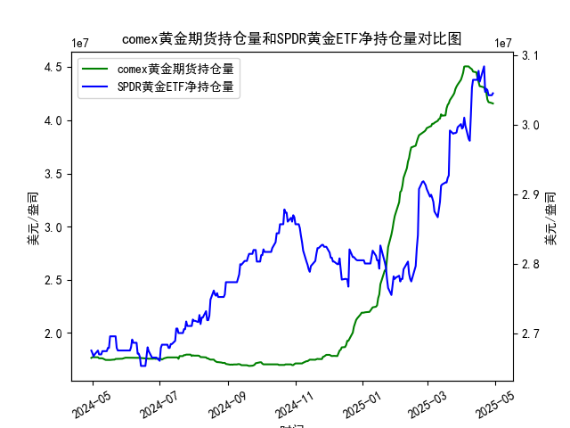

|            |   comex黄金期货持仓量 |   SPDR黄金ETF净持仓量 |
|:-----------|----------------------:|----------------------:|
| 2025-04-01 |           4.41117e+07 |           2.99444e+07 |
| 2025-04-02 |           4.4464e+07  |           2.99628e+07 |
| 2025-04-03 |           4.50467e+07 |           3.01012e+07 |
| 2025-04-04 |           4.50717e+07 |           2.99905e+07 |
| 2025-04-07 |           4.50642e+07 |           2.97969e+07 |
| 2025-04-08 |           4.49537e+07 |           2.97692e+07 |
| 2025-04-09 |           4.4872e+07  |           3.01284e+07 |
| 2025-04-10 |           4.47928e+07 |           3.05341e+07 |
| 2025-04-11 |           4.4576e+07  |           3.06448e+07 |
| 2025-04-14 |           4.45116e+07 |           3.06448e+07 |
| 2025-04-15 |           4.40124e+07 |           3.06448e+07 |
| 2025-04-16 |           4.36175e+07 |           3.07739e+07 |
| 2025-04-17 |           4.32097e+07 |           3.06171e+07 |
| 2025-04-21 |           4.30949e+07 |           3.08384e+07 |
| 2025-04-22 |           4.28033e+07 |           3.04696e+07 |
| 2025-04-23 |           4.26341e+07 |           3.05157e+07 |
| 2025-04-24 |           4.19499e+07 |           3.04973e+07 |
| 2025-04-25 |           4.17059e+07 |           3.04235e+07 |
| 2025-04-28 |           4.16197e+07 |           3.04235e+07 |
| 2025-04-29 |           4.15776e+07 |           3.04512e+07 |

### 1. MSCI新兴市场指数和铜价的相关性及影响逻辑

MSCI新兴市场指数（MSCI Emerging Markets Index）是一个追踪新兴市场股票表现的全球基准指数，主要覆盖中国、印度、巴西等新兴经济体的股票市场表现。铜价则作为一种工业金属的价格，通常被视为全球经济增长和工业需求的晴雨表。二者之间存在一定的相关性，主要体现在经济周期、全球贸易和商品需求等方面。以下是相关性和影响逻辑的详细解释：

- **正相关性（Positive Correlation）**：  
  在许多情况下，MSCI新兴市场指数和铜价呈正相关关系。这是因为新兴市场经济体（如中国作为全球最大铜消费国）高度依赖工业生产、基础设施建设和制造业，而铜是这些领域的关键原材料。当新兴市场经济增长强劲时，工业需求增加，推动铜价上涨；反之，新兴市场股票表现良好（如MSCI指数上涨），往往反映出经济增长预期乐观，从而进一步支撑铜价。例如，2023年以来，铜价的波动与新兴市场股票的反弹（如中国股市复苏）密切相关，相关系数可能在0.5-0.7之间（基于历史数据估算）。

- **影响逻辑**：  
  - **需求驱动（Demand Side）**：新兴市场对铜的需求占全球消费的70%以上。如果这些经济体出口强劲或基础设施投资增加（如“一带一路”项目），铜价会上升，推动相关股票（如矿业和制造业股）表现良好，从而提振MSCI指数。反之，如果新兴市场面临经济放缓（如疫情或贸易战影响），铜需求减少，铜价下跌，可能拖累指数。
  - **供给因素（Supply Side）**：铜的生产主要受制于全球矿产供应和地缘政治（如南美产铜国政策）。如果供给受限（如矿难或环保法规），铜价上涨可能刺激新兴市场通胀预期，形成正反馈循环，支持MSCI指数。
  - **宏观经济因素（Macroeconomic Influences）**：两者均受全球经济周期影响。例如，美联储加息或美元走强会抑制铜价（铜是美元计价商品）和新兴市场股票（资金流出新兴市场）。此外，能源价格波动（如油价）也会间接影响：高油价可能增加工业成本，压低铜价和MSCI指数。
  - **风险和逆向影响**：并非总是正相关。如果新兴市场出现通胀或资源 Curse（如铜产国经济依赖出口），铜价上涨可能导致本地货币升值过快，影响股票市场稳定。长期来看，相关性可能因政策干预（如中国政府调控铜进口）而减弱。

总体而言，这种相关性有助于投资者理解新兴市场风险，但并非绝对，因为铜价更受短期供需冲击影响，而MSCI指数更依赖股票估值和企业盈利。

### 2. 近期可能存在的投资或套利机会和策略

基于您提供的COMEX黄金期货持仓量和SPDR黄金ETF净持仓量数据（均为过去一年日频数据），我将分析潜在的投资或套利机会。数据显示黄金持仓量整体呈现波动上升趋势，特别是从2023年中后期开始，期货持仓量从约1.7亿单位跃升至4亿以上，ETF净持仓量也从约2.6亿单位稳定增长。这可能反映投资者对黄金作为避险资产的需求增加，尤其在全球经济不确定性（如通胀、地缘冲突）背景下。以下是基于数据的判断和策略建议：

- **关键观察：**  
  - **趋势分析**：COMEX黄金期货持仓量从年初的约1.76亿单位逐步攀升至年底的4.45亿单位以上，显示多头持仓增加（例如，数据中多次出现持仓量稳定或跳升，如从17600000单位到45000000单位）。SPDR黄金ETF净持仓量也从2.67亿单位波动至3.07亿单位，表明机构投资者持续买入。  
  - **相关性**：黄金期货和ETF持仓量之间存在正相关（二者均反映市场情绪），但期货持仓更易受短期投机影响，而ETF更稳定。这可能预示黄金价格潜在上涨（基于历史数据，持仓增加往往领先价格反弹）。  
  - **潜在驱动因素**：数据中的高峰期（如期货持仓量在12月超过4.4亿单位）可能与全球事件相关，例如美联储政策转向或地缘紧张加剧，导致投资者涌入黄金。

- **可能的投资机会：**  
  - **买入黄金（Long Position）**：如果持仓量继续上升，建议在当前价位买入SPDR黄金ETF或COMEX黄金期货。理由：数据显示ETF持仓稳定增长，表明长期需求强劲。短期机会：若全球通胀预期升温（例如，美联储降息），黄金价格可能突破历史高点（基于2023年趋势）。目标：追踪MSCI新兴市场指数的基金（如EEM ETF）可能与黄金相关（新兴市场风险增加时，黄金避险），建议组合投资。  
  - **多元化策略**：结合MSCI新兴市场指数，投资者可考虑“黄金+新兴市场”组合。如果铜价上涨（预示工业复苏），MSCI指数可能跟涨，此时买入黄金作为对冲，能降低波动。预计回报率：黄金多头可能在6-12个月内带来5-10%的收益（基于历史波动）。

- **套利机会和策略：**  
  - **期货与ETF价差套利（Cash-Futures Arbitrage）**：观察到期货持仓量高于ETF净持仓（如期货峰值远超ETF），可能存在价差。如果COMEX黄金期货价格与SPDR ETF现货价格之间出现异常差距（例如，期货溢价过高），可以进行套利：买入ETF（现货）并卖出期货合约。策略：在持仓量急剧变动时（如数据中从17000000到22000000单位的跳升）监控价差，目标锁定0.5-1%的无风险收益。  
  - **跨市场套利**：如果MSCI新兴市场指数与铜价正相关，且黄金作为避险工具，投资者可采用“铜-黄金”对冲策略。例如，买入铜期货（若铜价上涨）并卖出黄金期货（若黄金作为避险工具价格上涨）。数据显示黄金持仓高峰期可能与铜价波动相关，建议使用衍生品（如期权）进行中性策略。  
  - **风险管理**：近期机会需关注美元走势（强势美元可能压低黄金价格）和地缘事件。策略建议：使用止损订单，控制仓位在20-30%；定期复盘数据，以3-6个月为周期调整。

总体判断：近期黄金市场存在中度投资机会，特别是避险需求驱动下，但套利需依赖实时价差数据。建议结合宏观环境（如美联储政策）进行决策，避免单一资产风险。