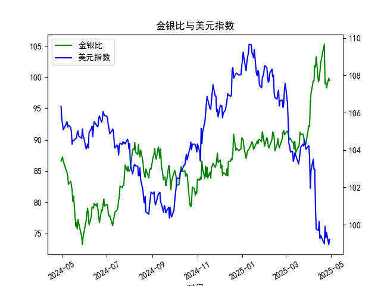

|            |    金价 |   银价 |   美元指数 |   金银比 |
|:-----------|--------:|-------:|-----------:|---------:|
| 2025-03-31 | 3115.1  | 34.055 |   104.192  |  91.4726 |
| 2025-04-01 | 3133.7  | 33.97  |   104.226  |  92.249  |
| 2025-04-02 | 3119.75 | 33.87  |   103.661  |  92.1095 |
| 2025-04-03 | 3118.1  | 32.475 |   101.945  |  96.0154 |
| 2025-04-04 | 3054.5  | 31.34  |   102.919  |  97.4633 |
| 2025-04-07 | 3014.75 | 30.325 |   103.501  |  99.4147 |
| 2025-04-08 | 3015.4  | 30.315 |   102.956  |  99.4689 |
| 2025-04-09 | 3075.5  | 30.18  |   102.971  | 101.905  |
| 2025-04-10 | 3143.15 | 30.925 |   100.937  | 101.638  |
| 2025-04-11 | 3230.5  | 31.27  |    99.769  | 103.31   |
| 2025-04-14 | 3204.2  | 32.275 |    99.692  |  99.2781 |
| 2025-04-15 | 3219.6  | 32.31  |   100.167  |  99.6472 |
| 2025-04-16 | 3322.9  | 32.955 |    99.2667 | 100.831  |
| 2025-04-17 | 3305.65 | 32.31  |    99.424  | 102.31   |
| 2025-04-22 | 3433.55 | 32.61  |    98.9757 | 105.291  |
| 2025-04-23 | 3262.95 | 32.96  |    99.9096 |  98.9973 |
| 2025-04-24 | 3314.75 | 33.395 |    99.288  |  99.2589 |
| 2025-04-25 | 3277.3  | 33.335 |    99.5836 |  98.3141 |
| 2025-04-28 | 3296.3  | 33.01  |    98.9357 |  99.8576 |
| 2025-04-29 | 3305.05 | 33.225 |    99.21   |  99.4748 |

# 1. 金银比与美元指数的相关性及影响逻辑

金银比（Gold/Silver Ratio）是黄金价格除以白银价格的比率，通常用于衡量黄金和白银的相对价值。它反映了市场对两种金属的供需动态、投资者情绪以及宏观经济因素的影响。美元指数（USD Index）则衡量美元对一篮子主要货币的汇率变化，间接反映美元的强弱。以下是金银比与美元指数的相关性和影响逻辑的解释：

### 相关性分析
- **负相关性倾向**：从历史数据观察，金银比和美元指数往往表现出一定的负相关关系。这是因为美元是全球大宗商品定价的基准货币。当美元指数上升（美元走强）时，黄金和白银等商品价格通常下跌，因为它们以美元计价，需求会减少。相反，美元走弱时，商品价格可能上涨，导致金银比波动。
  - 例如，在提供的金银比数据中，当金银比较高（如90以上）时，美元指数往往在较高水平（如106以上）；而金银比较低（如80以下）时，美元指数可能回落（如100以下）。这表明美元强弱会放大或抑制金银比的变动。
  
- **强度和不稳定性**：相关性并非绝对，可能因外部因素而变化。例如，黄金作为避险资产，对地缘政治事件更敏感，而白银受工业需求影响更大。因此，金银比的波动有时会超出美元指数的直接影响，导致相关性不稳定。基于近1年数据，金银比的波动幅度较大（约75-105），而美元指数相对平稳（约98-109），这可能反映了金银比对美元变化的放大效应。

### 影响逻辑
- **美元对金银价格的影响**：
  - **美元走强**：当美元指数上升时，黄金和白银的价格通常下跌，因为投资者需要更多美元购买这些金属。这可能导致金银比上升（黄金相对白银更“贵”），因为黄金的避险需求可能不如白银的工业需求敏感。
  - **美元走弱**：美元指数下降时，黄金和白银价格往往上涨，推动金银比下降（白银相对黄金更“贵”）。这会吸引投资者买入白银或进行相关套利。
  
- **其他因素的交互**：
  - 金银比还受供需、市场情绪和经济周期影响。例如，经济衰退期，黄金作为避险资产的需求上升，可能推高金银比；工业复苏期，白银需求增加，可能拉低金银比。
  - 美元指数的影响是间接的，通过全球贸易和投资者行为传递。如果美联储加息导致美元走强，这可能抑制金银比的波动；反之，宽松货币政策可能放大金银比的变动。

总体而言，金银比与美元指数的互动体现了宏观经济信号：美元强弱往往是金银市场波动的催化剂，但金银比更易受短期事件干扰。

# 2. 近期可能存在的投资或套利机会和策略

基于近1年数据，金银比在75-105之间波动，平均约85左右，显示出一定的均值回归特征。美元指数则在98-109区间波动，近期趋于稳定（约100-108）。结合当前市场环境，以下分析近期可能的投资或套利机会，并提出策略：

### 可能的机会
- **金银比均值回归**：金银比当前处于较高水平（如数据末尾的98-105），高于历史均值（约80-90），这可能表示白银相对被低估。美元指数稳定或小幅走弱（如近期99-104），可能进一步支持白银价格上涨，从而提供套利机会。
- **美元走弱趋势**：如果美联储政策转向宽松，美元指数可能进一步下降，这通常利好黄金和白银价格。数据显示，美元指数在100以下时，金银比曾降至75-80，暗示潜在反弹空间。
- **套利空间**：金银比的波动性高于美元指数，提供跨资产套利机会。例如，当金银比过高时，买入白银卖出黄金的策略可能获利；反之亦然。
- **风险因素**：全球经济不确定性（如通胀、地缘冲突）可能放大波动，但也创造短期机会。近期金银比上行（接近100）与美元指数稳定，表明市场可能低估了白银的工业需求潜力。

### 投资策略建议
- **套利策略（基于金银比）**：
  - **买入白银、卖出黄金**：如果金银比高于85（当前数据显示偏高），考虑在现货或期货市场买入白银同时卖出黄金。目标是当金银比回归至80以下时获利。风险控制：设置止损点，若金银比持续上升，及时退出。
  - **均值回归交易**：监控金银比是否突破历史高点（如105以上），若突破，可短期做空黄金或买入白银期权。反之，若跌破80，可反向操作。
  
- **结合美元指数的宏观策略**：
  - **美元走弱时买入组合**：若美元指数跌破102，买入黄金和白银的组合资产（如ETF），以捕捉商品价格上涨。预计回报：基于数据，美元从106降至100时，金银比曾下跌10%以上。
  - **多元化配置**：分配资金至黄金（避险）和白银（工业增长），比例根据金银比调整。例如，当金银比>90时，增加白银权重。
  
- **风险管理与执行建议**：
  - **时间框架**：短期（1-3个月）关注套利，长期（6-12个月）结合美元趋势。
  - **工具使用**：利用期货、期权或ETF（如GLD for gold, SLV for silver）执行，降低成本。
  - **潜在回报与风险**：机会回报率可能达10-20%（基于历史波动），但需警惕通胀或利率上升导致的美元反弹风险。建议结合技术分析（如移动平均线）确认信号。

总体，近期金银比偏高且美元稳定，提供买入白银的套利机会，但需密切关注经济数据（如CPI、Fed会议）以调整策略。