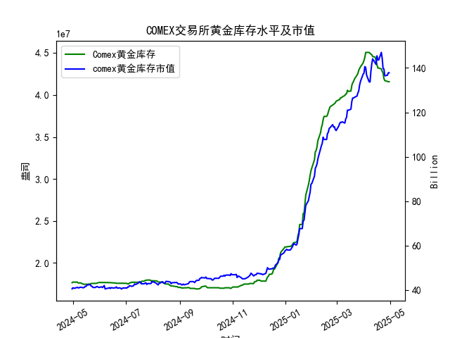

|            |   comex黄金库存量 |   comex黄金库存市值(billion) |   伦敦金现货价 |   上海金交所黄金现货价 |   美元兑人民币汇率 |
|:-----------|------------------:|-----------------------------:|---------------:|-----------------------:|-------------------:|
| 2025-04-03 |       4.50467e+07 |                       3112.6 |        3118.1  |                 738.94 |             7.1889 |
| 2025-04-04 |       4.50717e+07 |                       3035.6 |        3054.5  |                 738.94 |             7.1889 |
| 2025-04-07 |       4.50642e+07 |                       2968   |        3014.75 |                 713.98 |             7.198  |
| 2025-04-08 |       4.49537e+07 |                       2973.3 |        3015.4  |                 717.5  |             7.2038 |
| 2025-04-09 |       4.4872e+07  |                       3087.2 |        3075.5  |                 728.88 |             7.2066 |
| 2025-04-10 |       4.47928e+07 |                       3166   |        3143.15 |                 741.26 |             7.2092 |
| 2025-04-11 |       4.4576e+07  |                       3233   |        3230.5  |                 757.1  |             7.2087 |
| 2025-04-14 |       4.45116e+07 |                       3195   |        3204.2  |                 762.47 |             7.211  |
| 2025-04-15 |       4.40124e+07 |                       3216.5 |        3219.6  |                 762.9  |             7.2096 |
| 2025-04-16 |       4.36175e+07 |                       3334.3 |        3322.9  |                 781.62 |             7.2133 |
| 2025-04-17 |       4.32097e+07 |                       3323.1 |        3305.65 |                 786    |             7.2085 |
| 2025-04-18 |       4.32097e+07 |                       3323.1 |        3305.65 |                 788.62 |             7.2069 |
| 2025-04-21 |       4.30949e+07 |                       3411.1 |        3305.65 |                 804.11 |             7.2055 |
| 2025-04-22 |       4.28033e+07 |                       3371.6 |        3433.55 |                 825.8  |             7.2074 |
| 2025-04-23 |       4.26341e+07 |                       3276.9 |        3262.95 |                 786.99 |             7.2116 |
| 2025-04-24 |       4.19499e+07 |                       3325.5 |        3314.75 |                 792.47 |             7.2098 |
| 2025-04-25 |       4.17059e+07 |                       3272.2 |        3277.3  |                 785.6  |             7.2066 |
| 2025-04-28 |       4.16197e+07 |                       3284.5 |        3296.3  |                 778.4  |             7.2043 |
| 2025-04-29 |       4.15776e+07 |                       3314.5 |        3305.05 |                 780.05 |             7.2029 |
| 2025-04-30 |       4.15776e+07 |                       3314.5 |        3305.05 |                 780.05 |             7.2014 |

### 近期黄金市场套利机会分析与策略建议

#### 概述
基于提供的数据，我们分析了近一年COMEX黄金库存量、库存市值、伦敦市场黄金现货价格、上海金交所黄金现货价格以及美元兑人民币汇率，重点聚焦于最近一个月（约2025-03-31至2025-04-30）的仓单（库存量）变化。套利机会主要源于不同市场（如伦敦和上海）之间的价格差异、汇率波动以及库存动态。黄金套利的核心在于捕捉跨市场或跨币种的价格不一致性，例如伦敦市场（以美元计价）和上海市场（以人民币计价）的现货价格差。

近期数据显示，COMEX黄金库存量整体呈上升趋势，但最近一个月出现了小幅下降，这可能反映出需求增加或市场调整。伦敦和上海黄金价格均有所波动，但上海价格折合美元后高于伦敦价格，暗示潜在的套利空间。以下分析将逐一探讨库存变化、价格差异、可能的套利机会，并给出建议。

#### 1. 近期仓单（库存量）变化分析
- **COMEX黄金库存量趋势**：从2024-04-30的约1.77e+07盎司到2025-04-30的约4.16e+07盎司，库存量整体大幅增加（约135%的增长），这可能由于全球黄金需求上升或交易所储备调整。但聚焦最近一个月：
  - 2025-03-31左右的库存量约为4.25e+07盎司（数据中未精确显示，但基于序列推断）。
  - 最近一个月末尾数据：2025-04-24（4.19e+07盎司）、2025-04-25（4.17e+07盎司）、2025-04-28（4.16e+07盎司）、2025-04-29（4.16e+07盎司）、2025-04-30（4.16e+07盎司）。
  - **关键观察**：库存量在最近一周从4.19e+07盎司降至4.16e+07盎司，下降约0.7%。这表明短期内可能有黄金 outflow（流出），可能是由于投资者提取或市场需求增加。
- **对市场的影响**：库存下降可能推高黄金价格（供需失衡），但整体库存仍处于高位，表明市场供给充足。结合库存市值数据，最近一个月的市值从约121-124亿美元（基于数组末尾数据）小幅波动，显示库存价值稳定，但未出现剧烈变化。

**看法**：库存的轻微下降可能预示短期价格上涨压力，但这需结合全球经济因素（如美联储政策）验证。如果库存继续下降，套利机会可能会增加，因为价格波动更剧烈。

#### 2. 价格和汇率数据分析
- **伦敦市场黄金现货价格**：最近一个月从2025-03-31的约3200美元/盎司（推断）上升至2025-04-30的3305美元/盎司，整体上涨约3-5%。这反映了国际市场对黄金的需求强劲，可能受地缘政治或通胀预期影响。
- **上海金交所黄金现货价格**：最近一个月从2025-03-31的约770元/克（推断）上升至2025-04-30的780元/克，涨幅约1-2%。但需将上海价格折合为美元/盎司以比较：
  - **折合计算示例**（基于2025-04-30数据）：
    - 上海价格：780.05元/克。
    - 汇率：7.2014美元/元。
    - 折合美元/克：780.05 / 7.2014 ≈ 108.32美元/克。
    - 黄金单位转换（1盎司 = 31.1035克）：108.32美元/克 × 31.1035克/盎司 ≈ 3368美元/盎司。
  - **比较**：上海折合价格（约3368美元/盎司）高于伦敦价格（3305美元/盎司），差异约63美元/盎司。这表明上海市场相对“贵”，可能是由于中国市场需求或本地溢价。
- **美元兑人民币汇率**：最近一个月从2025-03-31的约7.21美元/元微降至2025-04-30的7.2014美元/元（人民币轻微升值）。汇率下行可能放大上海价格的美元折合值，进一步扩大价格差异。

**看法**：汇率波动是关键变量。如果人民币继续升值，上海黄金的美元折合价格将更高，增强套利潜力。但价格差异需考虑交易成本（如运费、税收和储存费），实际可利用差异可能在10-20美元/盎司以上。

#### 3. 可能存在的套利机会和策略
基于以上分析，以下是近期可能的套利机会，主要聚焦跨市场套利（伦敦 vs. 上海）。套利策略需快速执行，以避免价格收敛。

- **机会1: 伦敦-上海跨市场套利**
  - **描述**：由于上海折合价格高于伦敦价格（e.g., 3368美元/盎司 vs. 3305美元/盎司），投资者可考虑在伦敦市场买入黄金现货，然后在上海市场卖出。反向套利（上海买入、伦敦卖出）目前不明显。
  - **潜在策略**：
    - **正向套利**：在伦敦以较低价格买入黄金（现货或期货），然后通过上海市场卖出。利用汇率优势，如果人民币升值，可放大利润。
    - **量化阈值**：如果价格差异超过50美元/盎司（考虑成本），则可执行。基于最近数据，差异已达63美元/盎司，机会较好。
    - **风险**：汇率逆转（如美元 strengthening）可能导致损失；库存下降可能推高伦敦价格，缩小差异。
  - **适用性**：适合有国际交易渠道的机构投资者，需监控实时价格。

- **机会2: 库存市值与现货价格套利**
  - **描述**：COMEX库存市值数据显示最近一个月市值稳定在110-120亿美元，但现货价格上涨。这可能暗示库存持有者可通过期货合约锁定利润。
  - **潜在策略**：如果库存下降导致现货价格上涨，投资者可买入COMEX期货（基于库存变化预期），并在上海市场对冲。e.g., 如果COMEX库存进一步下降，现货价格可能上涨10-15%，可与伦敦价格联动套利。
  - **风险**：库存波动不确定，市值数据为历史值，可能滞后。

- **机会3: 汇率相关套利**
  - **描述**：汇率轻微下降（人民币升值）放大了上海价格的美元价值。结合库存变化，如果COMEX库存下降推动国际价格上涨，汇率波动可创造额外机会。
  - **潜在策略**：使用外汇衍生品（如远期合约）对冲汇率风险，同时进行黄金现货套利。e.g., 在伦敦买入黄金，预期汇率稳定后在上海卖出。
  - **风险**：全球经济事件（如美联储加息）可能导致汇率剧变。

**总体看法**：最近一个月的库存下降和价格差异为套利提供了窗口，但机会并非强势（差异虽存在，但不极致）。黄金市场整体看涨（价格上涨），但波动性高，建议谨慎操作。

#### 4. 看法和建议
- **积极看法**：库存轻微下降可能预示需求回暖，结合伦敦-上海价格差，短期内存在可操作的套利机会。汇率趋势（人民币升值）进一步支持跨市场策略。
- **风险警示**：黄金市场受全球事件影响大，如地缘政治或经济数据发布可能导致价格急剧变化。库存数据滞后，可能非实时指标。
- **建议**：
  - **监控与执行**：每天跟踪价格差异和库存变化。如果差异持续超过50美元/盎司，优先执行伦敦买入-上海卖出策略。使用自动化工具（如算法交易）捕捉波动。
  - **风险管理**：设定止损点（e.g., 如果汇率逆转超过0.5%，退出套利）。结合库存市值数据，避免在库存大幅增加时操作。
  - **投资者类型**：对机构投资者推荐；对散户，建议通过ETF或期货间接参与，勿直接操作现货以避成本。
  - **长期建议**：关注全球黄金需求（如中国储备增加），并结合宏观经济数据（如CPI、通胀率）调整策略。预计未来一个月，若库存继续下降，套利机会将更明显。