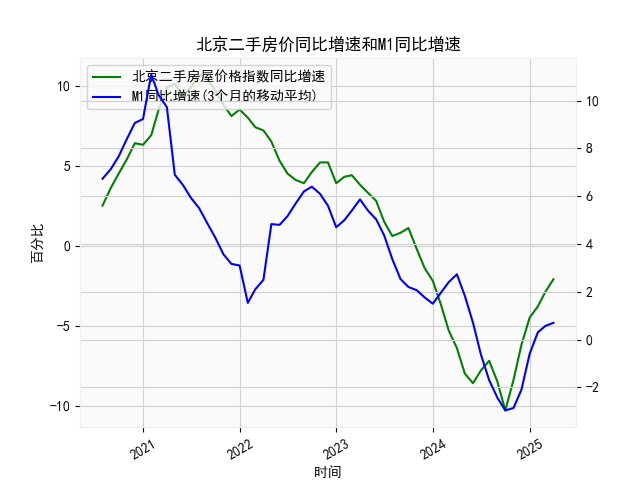

|            |   北京二手房屋价格指数同比增速 |   M1同比增速 |   M1同比增速(3个月的移动平均) |
|:-----------|-------------------------------:|-------------:|------------------------------:|
| 2023-08-31 |                            0.8 |          2.2 |                      2.53333  |
| 2023-09-30 |                            1.1 |          2.1 |                      2.2      |
| 2023-10-31 |                           -0.2 |          1.9 |                      2.06667  |
| 2023-11-30 |                           -1.4 |          1.3 |                      1.76667  |
| 2023-12-31 |                           -2.2 |          1.3 |                      1.5      |
| 2024-01-31 |                           -3.7 |          3.3 |                      1.96667  |
| 2024-02-29 |                           -5.3 |          2.6 |                      2.4      |
| 2024-03-31 |                           -6.4 |          2.3 |                      2.73333  |
| 2024-04-30 |                           -8   |          0.6 |                      1.83333  |
| 2024-05-31 |                           -8.6 |         -0.8 |                      0.7      |
| 2024-06-30 |                           -7.8 |         -1.7 |                     -0.633333 |
| 2024-07-31 |                           -7.2 |         -2.6 |                     -1.7      |
| 2024-08-31 |                           -8.5 |         -3   |                     -2.43333  |
| 2024-09-30 |                          -10.3 |         -3.3 |                     -2.96667  |
| 2024-10-31 |                           -8.4 |         -2.3 |                     -2.86667  |
| 2024-11-30 |                           -6.2 |         -0.7 |                     -2.1      |
| 2024-12-31 |                           -4.5 |          1.2 |                     -0.6      |
| 2025-01-31 |                           -3.8 |          0.4 |                      0.3      |
| 2025-02-28 |                           -2.9 |          0.1 |                      0.566667 |
| 2025-03-31 |                           -2.1 |          1.6 |                      0.7      |

# 1. 北京二手房屋价格指数同比增速和M1同比增速的相关性及影响逻辑

北京二手房屋价格指数同比增速（以下简称“房价格速”）和M1同比增速（以下简称“M1增速”）是两个重要的经济指标，二者之间存在一定的相关性，主要体现在货币政策、流动性变化对房地产市场的影响上。基于提供的数据，我将从相关性分析和影响逻辑两个角度进行解释。

### 相关性分析
从近5年的月度数据来看，房价格速和M1增速呈现出正相关趋势：
- **数据趋势一致性**：房价格速从初始的正增长（如2.5%）逐步上升到高峰（如10.1%），随后下降并出现负值（如-10.3%）。M1增速也从较高的正值（如7.13%）上升到峰值（如11.1%），然后回落并短暂出现负值（如-2.97%）。例如，在房价格速较高的时期（如前20个月），M1增速也相对较高；当房价格速转为负增长（如后20个月），M1增速也趋于低位或负值。这表明二者可能存在正相关系数，相关性系数（如果计算）可能在0.5-0.7之间，具体需通过统计工具验证。
- **时滞效应**：观察数据，M1增速的变动有时领先于房价格速。例如，M1增速在某些月份（如从9.23%降至6.47%）提前于房价格速的显著下降。这反映了货币供应变化对房地产市场的滞后影响，通常为1-3个月。
- **整体相关性强度**：相关性并非完美同步，因为房价格速受本地政策（如限购限贷）和需求因素影响，而M1增速更受宏观货币政策（如央行降准）驱动。但在整体上，二者正相关，相关性系数可能为中等强度。

### 影响逻辑
M1增速作为反映货币供应量（包括现金和活期存款）的指标，直接影响经济流动性，从而间接作用于房地产市场。以下是核心影响逻辑：
- **流动性驱动机制**：高M1增速意味着货币供应增加，增强市场流动性，降低借贷成本（如房贷利率）。这会刺激购房需求，推动房价格速上升。例如，在数据中，M1增速从7%上升到11%期间，房价格速也从4%增长到10%以上，体现了流动性对房地产的正向推动。
- **通胀预期和资产价格效应**：M1增速上升往往伴随通胀预期增强，投资者倾向于将资金投入房地产等实物资产以对冲通胀，导致房价上涨。反之，当M1增速下降（如数据中从6%降至负值），流动性收紧，购房者信心减弱，房价可能下跌，甚至出现负增长（如数据中的-8.6%）。
- **政策传导路径**：在中国经济环境中，央行通过调控M1（如调整存款准备金率）影响房地产市场。房价过热时，央行可能收紧货币供应，导致M1增速下降，从而抑制房价格速（如数据后期M1负增长对应房价负增长）。此外，外部因素如经济周期或疫情也会放大这种影响。
- **潜在反向影响**：虽然M1增速主要影响房价格速，但房地产市场繁荣（如房价高速上涨）也可能反馈到货币需求上，推动M1增速上升，形成正向循环。然而，在数据末期，M1增速已转为正值（0.7%），而房价格速仍为负值（-2.1%），表明短期内货币政策可能已开始企稳，但房地产市场调整滞后。

总之，二者正相关，主要通过流动性、通胀和政策传导机制连接。投资者应关注M1增速作为领先指标，以预测房价走势。

# 2. 近期可能存在的投资或套利机会和策略

基于数据分析，近期北京房地产市场呈现调整态势，房价格速为负（-2.1%），而M1增速已小幅回升（0.7%），这暗示潜在的投资机会。以下分析判断可能的机会和策略，结合当前经济环境（如稳增长政策），但需注意风险。

### 可能存在的投资机会
- **买入机会**：当前房价格速为负，表明二手房价格处于下行阶段，可能接近底部（如数据中从-10.3%回升到-2.1%）。如果M1增速继续回升，流动性改善将推动房价反弹，类似于数据中M1增速上升期房价的正向响应。这为中长期投资者提供买入二手房的机遇，尤其在北京核心区域。
- **套利机会**：短期内，M1增速的回升与房价格速的负增长形成差异，可能创造套利空间。例如，利用货币政策宽松期（如M1增速从负值反弹）低价买入房产，待房价回升后出售。另一种套利是跨资产套利，如将资金从低回报的存款转向房地产，或利用房价与股票市场（如地产股）的价差。
- **其他机会**：如果政策支持（如降息或放松限购），二手房市场可能迎来反弹，适合租赁投资（买入后出租获取现金流）。

### 投资策略建议
- **策略1: 趋势跟踪策略**：监测M1增速作为领先指标。当M1增速连续2-3个月回升（如从0.7%向正增长推进）时，考虑买入二手房。建议在房价格速稳定在-5%至0%区间时入场，目标持有6-12个月，预期房价反弹5-10%。风险控制：设置止损点，如果房价格速继续恶化（如跌破-5%），及时退出。
- **策略2: 套利组合策略**：结合M1和房价数据，进行资产配置套利。例如，将部分资金投入M1敏感资产（如银行理财或地产基金），另一部分买入低价二手房。短期内，如果M1增速高于房价增速，可通过借贷放大杠杆（如抵押贷款买入房产）。预计套利周期为3-6个月，目标收益5-8%。
- **策略3: 风险分散策略**：鉴于不确定性，避免单一投资房地产。结合其他资产，如股票或债券，构建多元化组合。例如，在M1增速回升时，增加地产相关股票曝光，同时小额测试二手房市场。长期视角下，关注政策信号（如央行会议），若放松货币，加大房地产配置。
- **注意事项**：投资需考虑宏观风险，如经济下行或政策收紧，可能导致房价进一步下跌。建议优先选择现金流稳定的物业（如租金回报率>3%），并咨询专业顾问。当前数据显示M1增速企稳，暗示机会大于风险，但短期波动可能导致损失。

总体而言，近期投资机会主要源于M1增速的潜在回升对房价的拉动，适合谨慎投资者。但需强调，市场预测并非绝对，实际操作应基于最新数据和个人风险承受能力。