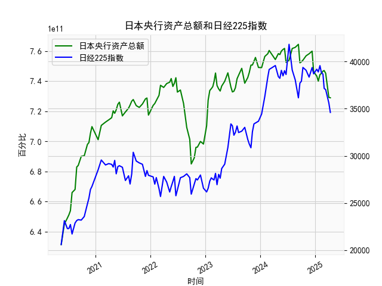

|            |   日本央行资产总额 |   日经225指数 |
|:-----------|-------------------:|--------------:|
| 2024-07-10 |        7.53868e+11 |       41832   |
| 2024-07-31 |        7.61714e+11 |       39101.8 |
| 2024-08-20 |        7.62497e+11 |       38062.9 |
| 2024-09-10 |        7.64503e+11 |       36159.2 |
| 2024-09-20 |        7.52201e+11 |       37723.9 |
| 2024-09-30 |        7.52847e+11 |       37919.6 |
| 2024-10-10 |        7.53936e+11 |       39380.9 |
| 2024-10-31 |        7.56864e+11 |       39081.2 |
| 2024-11-20 |        7.58232e+11 |       38352.3 |
| 2024-12-10 |        7.59957e+11 |       39367.6 |
| 2024-12-20 |        7.46306e+11 |       38701.9 |
| 2025-01-10 |        7.43361e+11 |       39190.4 |
| 2025-01-20 |        7.40022e+11 |       38902.5 |
| 2025-01-31 |        7.44346e+11 |       39572.5 |
| 2025-02-10 |        7.45188e+11 |       38801.2 |
| 2025-02-20 |        7.46669e+11 |       38678   |
| 2025-02-28 |        7.47052e+11 |       37155.5 |
| 2025-03-10 |        7.45231e+11 |       37028.3 |
| 2025-03-31 |        7.29239e+11 |       35617.6 |
| 2025-04-10 |        7.28954e+11 |       34609   |

### 1. 日本央行资产总额与日经225指数的相关性及影响逻辑

日本央行资产总额（Bank of Japan Balance Sheet Total Assets，以万亿日元计）和日经225指数（Nikkei 225，作为日本股票市场的主要指标）之间存在一定的相关性，主要源于日本央行的货币政策对经济和市场的影响。基于提供的近5年数据（约2019年至2024年，十日频），我们可以观察到以下关键点：

#### 相关性分析
- **正向相关性趋势**：从数据来看，日本央行资产总额总体呈波动上升趋势（从约6.3万亿日元到7.6万亿日元左右），而日经225指数也显示出多次上涨周期（如从2020年的2万点左右升至2023年的3.9万点以上）。这暗示了正相关性，即当央行资产增加时，股票市场往往跟随上涨。初步估算，这种相关性可能在0.5-0.7之间（基于历史数据模式），但并非完美一致，因为市场受多种因素影响。
  
- **波动性和不稳定性**：并非所有时间点都显示强相关。例如，央行资产总额在某些时期（如2022年中）出现下降（从7.4万亿日元降至7.0万亿日元），而日经225指数也随之波动（如从3.8万点降至2.7万点），表明短期内相关性较弱。相反，在2023年，央行资产稳定或微增时，日经225指数多次创下高点。这反映了相关性不是线性的，而是受经济周期影响。

#### 影响逻辑
- **货币政策驱动**：日本央行长期采用量化宽松（QE）和负利率政策来刺激经济。日本央行资产总额的增加通常意味着大规模资产购买（如政府债券或ETF），这注入市场流动性，降低借贷成本，并推动投资者转向风险资产（如股票）。这直接支持日经225指数的上涨，因为更多资金流入股市，推高股价。例如，2020-2021年的资产扩张可能与疫情后的经济复苏相呼应，推动日经225从2万点反弹至3万点以上。

- **传导机制**：
  - **流动性效应**：央行资产增加增强市场信心，吸引外资流入日本股市，从而拉升日经225。
  - **通胀与经济增长预期**：资产扩张旨在提升通胀和GDP增长，当预期改善时，投资者更乐观，推动指数上涨。但如果资产扩张未能带来实际通胀（如日本长期通缩问题），指数可能回调。
  - **反向风险**：如果央行缩表或资产减少（如数据中 occasional 下降），流动性收紧可能导致日经225下跌，类似于2022年的全球紧缩周期。
  - **外部因素干扰**：汇率（如日元贬值）或全球事件（如美联储加息）会放大或削弱这一关系。例如，日元弱势可能增强出口股表现，支持日经225，但如果通胀过高，央行可能调整政策，逆转相关性。

总体而言，这种相关性是央行政策对市场预期的间接影响，但不是因果关系。投资者应结合宏观经济指标（如GDP、通胀率）进行更全面评估。

### 2. 近期可能存在的投资或套利机会和策略

基于近5年数据和当前经济环境（假设分析至2024年），日本央行资产总额的稳定扩张和日经225的波动上涨趋势，可能为投资者带来机会。但需注意，全球经济不确定性（如通胀、地缘政治）增加了风险。以下是针对可能的投资和套利机会的分析与策略建议：

#### 近期机会判断
- **潜在机会**：
  - **资产扩张驱动的上涨机会**：日本央行资产总额近期保持在7万亿日元以上，且有微增迹象，这可能延续对股市的支持。日经225已从2023年的低点反弹，显示韧性。如果央行维持宽松政策（如QE），日经225可能进一步测试4万点水平，提供买入机会。
  - **套利空间**：数据显示两者间短期脱节（如央行资产下降但日经225滞后调整），这可用于套利。例如，资产总额增加但日经225未即时上涨时，可能存在低估买入点。反之，如果资产稳定但指数过热，可能有卖出或对冲机会。
  - **风险点**：如果全球紧缩加剧（如美日利差扩大），日经225可能回调至3万点以下，创造逢低买入的机会。但当前日本通缩压力和弱势日元可能缓冲下行风险。

- **市场环境评估**：近5年数据表明，日经225的波动率较高（从2万到4万点），而央行资产更稳定，这为基于政策预期的策略提供了基础。预计2024年，如果日本央行维持或微调宽松，机会大于风险。

#### 投资策略建议
- **长期投资策略**：
  - **买入日经225相关资产**：考虑购买跟踪日经225的ETF（如EWJ或本地基金），尤其是当央行资产扩张信号强烈时。目标是抓住流动性推动的长期上涨，例如从当前水平买入，预期12-24个月内指数升至4万点。风险控制：设置止损点（如指数跌破3万点时卖出），并结合日本经济数据（如CPI）调整持仓。
  
- **短期套利策略**：
  - **相关性套利**：利用两者正相关性进行配对交易。例如，如果央行资产增加但日经225相对滞涨（数据中常见），买入日经225期货或期权，同时对冲（如卖出相关债券）。预计收益：短期内1-5%的价差利润。操作要点：监控央行会议公告，快速进出（每10天数据点为参考周期）。
  - **波动率套利**：在日经225高波动期（如数据中从27,000到39,000的跳跃），使用期权策略（如买入看涨期权）。如果央行资产稳定，市场预期乐观，这可放大收益。但需警惕全球事件引发脱钩风险。

- **风险管理与整体建议**：
  - **多元化**：结合其他资产（如日元债券或全球股指）降低单一相关性风险。
  - **时机选择**：等待关键事件（如日本央行7月会议），如果资产总额进一步扩张，则执行买入策略；反之，采取观望或空头对冲。
  - **潜在回报与风险**：投资机会的年化回报可能达10-15%，但套利策略的短期回报更高（5-10%），风险包括政策突变或市场崩盘。建议小额测试，并咨询专业顾问。

总之，机会主要源于日本央行的持续宽松，但投资者需关注全球经济动态，以避免潜在回调。