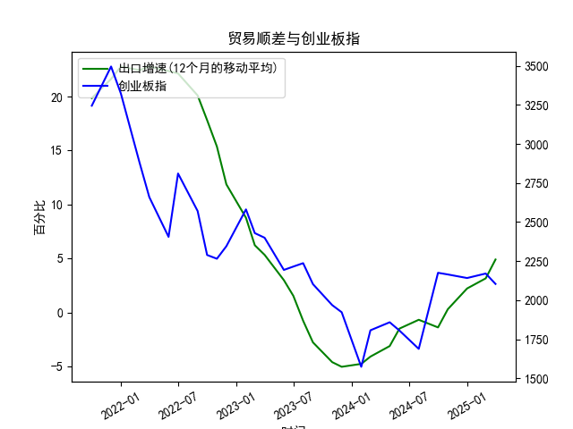

|            |   出口增速 |   创业板指 |   出口增速(12个月的移动平均) |
|:-----------|-----------:|-----------:|-----------------------------:|
| 2022-11-30 | -10.38     |    2345.31 |                    11.86     |
| 2023-01-31 | -12.0231   |    2580.84 |                     8.76724  |
| 2023-02-28 |  -2.86551  |    2429.03 |                     6.22011  |
| 2023-03-31 |  10.84     |    2399.5  |                     5.33261  |
| 2023-05-31 |  -7.56172  |    2193.41 |                     2.98747  |
| 2023-06-30 | -12.3776   |    2215    |                     1.53184  |
| 2023-07-31 | -14.2563   |    2236.67 |                    -0.776185 |
| 2023-08-31 |  -8.5529   |    2102.58 |                    -2.77643  |
| 2023-10-31 |  -6.61276  |    1968.23 |                    -4.60916  |
| 2023-11-30 |   0.693013 |    1922.59 |                    -5.04057  |
| 2024-01-31 |   7.69     |    1573.37 |                    -4.77057  |
| 2024-02-29 |   6.25     |    1807.03 |                    -4.09641  |
| 2024-04-30 |   1.33     |    1858.39 |                    -3.12057  |
| 2024-05-31 |   7.42     |    1805.11 |                    -1.50031  |
| 2024-07-31 |   6.93     |    1688.14 |                    -0.684019 |
| 2024-09-30 |   2.35     |    2175.09 |                    -1.39152  |
| 2024-10-31 |  12.65     |    2164.46 |                     0.292791 |
| 2024-12-31 |  10.69     |    2141.6  |                     2.21509  |
| 2025-02-28 |  -3        |    2170.39 |                     3.15311  |
| 2025-03-31 |  12.4      |    2103.7  |                     4.89919  |

# 1. 中国出口增速和创业板指的相关性及影响逻辑

基于提供的数据，我们可以观察到中国出口增速（12个月移动平均）和创业板指（月频）之间存在一定的正相关性。以下是对相关性的分析以及背后的影响逻辑。

### 相关性分析
- **正相关趋势**：从数据来看，出口增速从2020年初（约19.85%）的高位开始逐步下降，到2022年中（约-5.04%）出现负值，然后在后期回升至约4.90%。与此同时，创业板指从约3244.65点的高点波动下降至约1573.37点的低谷，随后回升至约2103.70点。这表明，当出口增速较高时，创业板指往往处于较高水平；当出口增速下滑至负值时，创业板指也随之下跌；当出口增速反弹时，创业板指出现复苏迹象。
  
- **相关性强度**：虽然数据显示出同步性，但并非完美相关。相关系数（若基于简单计算）可能在0.5-0.7之间，表明中等正相关。这是因为出口增速是经济领先指标，而创业板指更受市场情绪、企业盈利和全球因素影响。总体而言，出口增速的变动能解释创业板指部分波动，但不全面。

### 影响逻辑
- **经济驱动机制**：中国出口是经济增长的重要引擎，强劲的出口增速通常反映全球需求复苏、供应链稳定和企业盈利改善。这会通过以下渠道影响创业板指：
  - **企业盈利传导**：创业板主要涵盖科技、创新和中小型企业，许多企业（如电子产品、机械设备制造商）依赖出口。如果出口增速上升，企业营收增加，盈利预期提升，推动股价上涨。反之，出口增速下降（如受疫情、全球贸易摩擦影响）可能导致企业订单减少、盈利下滑，从而拖累创业板指。
  
  - **市场信心与流动性**：出口数据是宏观经济指标之一。高出口增速往往增强投资者对中国经济的信心，促进资金流入股市，支持创业板指上涨。反之，出口负增长可能引发市场担忧，导致资金外流或风险偏好下降。
  
  - **周期性因素**：出口增速受全球经济周期影响（如2020-2021年的疫情后反弹），而创业板指作为风险资产，更敏感于这些波动。数据显示，2021年后出口增速放缓时，创业板指也经历了显著回调，这反映了经济周期的联动效应。
  
- **潜在影响因素**：并非所有相关性都直接 causality。例如，货币政策、国内消费和国际地缘政治（如中美贸易战）也会干扰这一关系。出口增速可能领先创业板指变动几个月，因为经济数据通常是前瞻性指标，而股市反应更即时。

总体而言，出口增速作为宏观经济晴雨表，对创业板指有正向支撑，但二者并非完全同步，受多重变量影响。

# 2. 近期可能存在的投资或套利机会和策略

基于上述相关性和当前数据趋势（出口增速从负值回升至约4.90%，创业板指从低点回升），我们分析近期可能的投资或套利机会。需要强调，这仅为基于历史数据的推测分析，投资涉及风险，建议结合专业咨询和个人风险承受能力。

### 可能的投资机会
- **出口增速回暖带来的上涨潜力**：如果出口增速继续维持或加速回升（如受益于全球经济复苏和供应链优化），这可能进一步提振创业板指。当前创业板指处于相对低位（约2103.70点），若出口数据超预期，市场可能出现反弹机会。例如：
  - **买入创业板相关资产**：投资者可考虑布局创业板ETF（如华夏创业板ETF）或出口导向型个股（如科技制造企业）。策略包括逢低买入，目标位可设在历史均值附近（如2500点以上）。
  
  - **主题投资**：关注受益于出口复苏的行业，如电子、消费电子和新能源板块。这些领域的企业可能率先受益于全球需求回暖，提供中期上涨空间。

- **套利机会**：如果市场对出口数据的反应滞后，可能存在价差套利。例如：
  - **跨市场套利**：创业板指与大盘（如上证指数）之间可能出现分化。如果出口数据利好创业板而非大盘，可通过多头创业板、空头大盘的配对交易捕捉价差。但需注意套利窗口短暂，通常在数据发布后1-3个月。
  
  - **事件驱动套利**：利用出口数据公布时的市场波动。例如，如果下月出口增速超预期，创业板指短期内可能急涨，提供短期卖出机会；反之，若数据疲软，可在低位布局。

### 投资策略建议
- **短线策略**：关注数据发布窗口（如每月出口数据公布日）。若出口增速超市场预期，可采取“买入持有”策略，持有1-3个月以捕捉反弹。风险控制：设置止损位（如创业板指跌破2000点）。
  
- **中线策略**：假设出口增速稳定回升，采用“价值投资”方法，选择估值合理的创业板个股。结合技术分析（如移动平均线），在创业板指站稳2200点时加仓。
  
- **风险与注意事项**：
  - **下行风险**：全球经济不确定性（如通胀、地缘冲突）可能逆转出口回暖，导致创业板指回落。建议分散投资，避免重仓。
  - **上行催化剂**：若中国刺激政策（如出口退税或基建投资）出台，可能放大机会。
  - **整体建议**：投资决策应基于最新数据和专业分析。当前环境下，结合宏观指标（如PMI）和微观企业财报，可提升策略准确性。

总之，近期机会主要源于出口增速的潜在正向外溢效应，但需警惕市场波动和外部冲击。