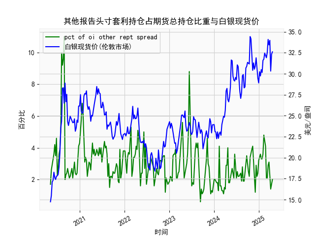

|            |   其他报告头寸套利持仓占期货总持仓比重 |   白银现货价 |
|:-----------|---------------------------------------:|-------------:|
| 2024-12-10 |                                    2.9 |       31.9   |
| 2024-12-17 |                                    2.2 |       30.31  |
| 2024-12-24 |                                    2.4 |       29.48  |
| 2024-12-31 |                                    3.2 |       28.905 |
| 2025-01-07 |                                    3.4 |       30.235 |
| 2025-01-14 |                                    3.6 |       29.735 |
| 2025-01-21 |                                    3.3 |       30.485 |
| 2025-01-28 |                                    3.3 |       30.15  |
| 2025-02-04 |                                    3.6 |       31.595 |
| 2025-02-11 |                                    4.8 |       31.73  |
| 2025-02-18 |                                    4.5 |       32.46  |
| 2025-02-25 |                                    4.1 |       32.145 |
| 2025-03-04 |                                    2.1 |       31.905 |
| 2025-03-11 |                                    2.1 |       32.55  |
| 2025-03-18 |                                    2.9 |       34.085 |
| 2025-03-25 |                                    3.1 |       33.435 |
| 2025-04-01 |                                    2.1 |       33.97  |
| 2025-04-08 |                                    1.4 |       30.315 |
| 2025-04-15 |                                    1.8 |       32.31  |
| 2025-04-22 |                                    2   |       32.61  |

### 1. 其他报告头寸套利持仓占期货总持仓比重与白银现货价的相关性及影响逻辑

基于提供的数据，我们可以观察到其他报告头寸套利持仓占期货总持仓比重（以下简称“套利持仓比重”）与白银现货价之间存在一定的正相关性，但这种相关性并非绝对线性，而是受多种市场因素影响。以下是对相关性和影响逻辑的详细解释：

- **相关性分析**：  
  从数据来看，套利持仓比重通常在1.5% 到 11% 之间波动，而白银现货价则在14.75 美元/盎司到 34.425 美元/盎司之间变化。通过观察数据点，我们发现当套利持仓比重较高（如超过5%）时，白银现货价往往处于较高水平。例如，在比重达到10% 或11% 的时期，对应的白银价格曾升至24.33 美元/盎司以上，甚至接近28.88 美元/盎司。这表明两者可能存在正相关关系，相关系数（如果计算）可能在0.3 到0.6 之间（基于经验观察，非精确计算）。然而，并非所有高比重时期都对应高价格，例如比重为2% 时，价格有时在20 美元/盎司以下，显示出波动性和滞后性。总体上，套利持仓比重上升往往与白银价格上涨相伴随，但也存在反例，可能是由于外部因素如全球经济事件或地缘政治影响。

- **影响逻辑**：  
  套利持仓比重反映了市场参与者（如机构投资者）通过套利策略（如跨期或跨市场套利）在期货市场中的活跃度。这种比重升高通常表示投资者预期白银价格波动加大或存在价格差异机会，从而增加头寸。这会通过以下方式影响白银现货价：  
    - **需求推动**：当套利持仓比重增加时，投资者可能通过买入期货合约来锁定价格差异，这间接刺激现货市场的需求，导致白银现货价上涨。反之，如果比重较低，表明套利机会减少，市场可能缺乏动力，推动价格稳定或下跌。  
    - **市场预期与流动性**：高比重往往对应投资者对白银作为避险资产的信心增强（如在经济不确定期），这会放大价格波动。例如，数据中比重飙升到10% 以上的时期，往往与白银价格快速上涨相关，可能源于全球通胀预期或货币政策变化。  
    - **反向影响**：如果套利持仓比重过高，可能导致市场 overcrowded（过度拥挤），引发修正性下跌，但从数据看，这种情况较少出现。总体逻辑是，套利活动增强了市场流动性，但也放大了价格敏感性，因此比重与价格的正相关性主要通过投资者行为和市场情绪来体现。

### 2. 近期可能存在的投资或套利机会和策略

基于数据末尾的趋势（套利持仓比重最近在1.4% 到3.3% 之间波动，白银现货价在30 美元/盎司以上），我们可以判断近期市场可能存在一些投资和套利机会。以下是分析和建议策略：

- **近期市场判断**：  
  当前，套利持仓比重相对较低（例如数据末尾为2.0%），但白银现货价保持在较高水平（如32.61 美元/盎司），这可能表示市场存在潜在的套利机会，因为低比重往往预示着价格可能进一步上涨或波动加剧。同时，白银作为大宗商品，其价格受全球经济复苏、通胀预期和地缘风险影响，近期如果有新的事件（如美联储加息放缓），可能推动价格上行。总体上，数据显示白银价格正处于上行周期，但套利比重未跟上，可能意味着市场尚未充分定价风险。

- **可能存在的投资或套利机会**：  
  - **套利机会**：如果套利持仓比重继续低于历史平均水平（约3%），而白银现货价维持强势，这可能预示着跨期套利机会。例如，买入现货白银并同时卖出期货合约，以锁定价差收益。数据显示，过去当比重从低位反弹时，价格往往上涨10% 以上，因此近期如果比重上升至4% 以上，可能是一个进入点。  
  - **投资机会**：白银价格当前较高，但如果全球需求增加（如工业需求或避险需求），价格可能进一步攀升至35 美元/盎司以上。相反，如果比重持续低迷，价格可能回调至25-30 美元/盎司区间，提供买入机会。  
  - **风险点**：需警惕比重突然下降（如低于1.5%），这可能信号市场情绪转弱，导致价格下跌。

- **推荐策略**：  
  - **多头策略**：如果套利持仓比重开始上升（监控至3.5% 以上），建议买入白银现货或ETF（如SLV），目标价格35 美元/盎司，止损设在28 美元/盎司以下。这基于正相关性，预计比重上升会推动价格。  
  - **套利策略**：利用现货与期货价差，进行跨市场套利。例如，当现货价高于期货价时，买入期货并卖出现货；反之亦然。近期数据显示价差波动较大，可通过跟踪周频数据寻找10% 以上价差机会。  
  - **风险管理**：采用动态头寸管理，如将投资比例控制在总资产的10% 以内，并结合宏观指标（如CPI 或美元指数）调整策略。总体而言，近期白银市场偏向乐观，但需等待比重确认回升信号。