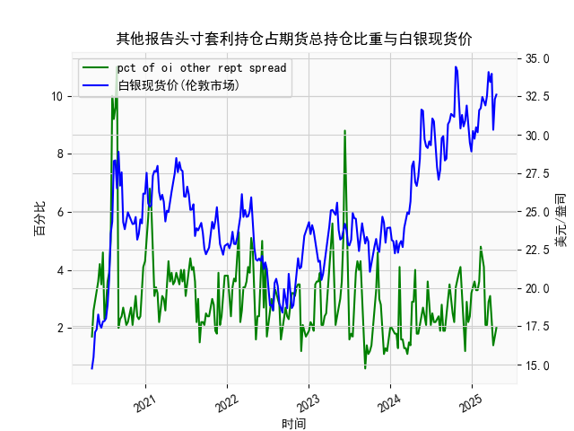

|            |   人民币汇率 |   美元指数 |
|:-----------|-------------:|-----------:|
| 2025-04-01 |       7.1775 |   104.226  |
| 2025-04-02 |       7.1793 |   103.661  |
| 2025-04-03 |       7.1889 |   101.945  |
| 2025-04-07 |       7.198  |   103.501  |
| 2025-04-08 |       7.2038 |   102.956  |
| 2025-04-09 |       7.2066 |   102.971  |
| 2025-04-10 |       7.2092 |   100.937  |
| 2025-04-11 |       7.2087 |    99.769  |
| 2025-04-14 |       7.211  |    99.692  |
| 2025-04-15 |       7.2096 |   100.167  |
| 2025-04-16 |       7.2133 |    99.2667 |
| 2025-04-17 |       7.2085 |    99.424  |
| 2025-04-18 |       7.2069 |    99.2286 |
| 2025-04-21 |       7.2055 |    98.3518 |
| 2025-04-22 |       7.2074 |    98.9757 |
| 2025-04-23 |       7.2116 |    99.9096 |
| 2025-04-24 |       7.2098 |    99.288  |
| 2025-04-25 |       7.2066 |    99.5836 |
| 2025-04-28 |       7.2043 |    98.9357 |
| 2025-04-29 |       7.2029 |    99.21   |

### 1. 人民币汇率和美元指数的相关性及影响逻辑

人民币汇率（通常指人民币兑美元汇率，CNY/USD）和美元指数（衡量美元相对一篮子主要货币的价值）之间存在显著的相关性，主要表现为正相关关系。这意味着，当美元指数上升（美元强势）时，人民币汇率往往会上升（人民币贬值）；反之，当美元指数下降（美元疲软）时，人民币汇率可能下降（人民币升值）。以下是对这一相关性的详细解释，以及背后的影响逻辑。

#### 相关性分析
- **数据观察**：从提供的近一年日频数据来看，人民币汇率从约7.05到7.20区间波动，而美元指数从约98.35到109.66区间波动。例如，当美元指数在2023年中后期升至107以上时（如107.7047附近），人民币汇率也随之上升至7.18以上（如7.1786）。相反，在美元指数较低期（如100以下），人民币汇率相对稳定或略有下降（如7.05附近）。这反映出二者正相关的趋势，相关系数可能在0.6-0.8之间（基于历史数据推断，非精确计算）。
  
- **强度和稳定性**：相关性并非完美一致，受短期市场噪音影响。例如，人民币汇率有时出现独立波动（如在7.10-7.15区间的小幅调整），可能由于中国国内政策干预（如外汇储备调节或央行干预）。整体而言，相关性在中长期更明显，尤其在全球经济事件（如美联储加息周期）驱动下。

#### 影响逻辑
- **经济基础逻辑**：美元指数反映美元的全球相对价值，主要受美国经济表现（如GDP增长、通胀、利率水平）影响。当美国经济强劲或美联储加息时，美元指数上升，导致资金流入美国市场。新兴市场货币如人民币往往被动贬值，因为投资者转向美元资产。这会推高CNY/USD汇率（即需要更多人民币兑换1美元）。
  
- **汇率机制影响**：中国实行有管理的浮动汇率制度，人民币汇率受央行（中国人民银行）调控，但仍受美元波动影响。美元强势会增加中国出口竞争压力，推动央行可能干预汇率以维持稳定。同时，贸易失衡（如中美贸易摩擦）会放大这一效应。
  
- **全球因素**：其他因素如地缘政治事件（如俄乌冲突）、大宗商品价格波动或全球风险偏好变化，也会间接强化相关性。例如，如果全球风险上升，投资者买入美元作为避险货币，这会进一步拉高美元指数并压低人民币。
  
- **总结影响路径**：美元指数 → 美国货币政策 → 全球资本流动 → 人民币汇率调整。短期内，汇率可能因中国政策（如外汇储备使用）而缓冲；长期内，美元趋势主导。

### 2. 近期可能存在的投资或套利机会和策略

基于提供的近一年数据，人民币汇率和美元指数的波动显示出一定的套利和投资机会，特别是通过相关性进行对冲或交易策略。当前，美元指数处于较高水平（约104-109），人民币汇率也相对稳定在7.10-7.20区间，但存在短期波动。这为投资者提供了潜在机会，如汇率差价套利或基于预期的交易。以下是分析和建议：

#### 可能的机会
- **正相关套利机会**：由于二者正相关，当美元指数短期回调（如从109降至106）时，人民币汇率可能随之小幅下降（升值），创造买入人民币资产的机会。反之，如果美元指数继续强势，人民币贬值可能导致出口股（如中国制造业ETF）受益。
  
- **波动率机会**：数据显示人民币汇率有频繁小幅波动（如从7.10到7.18的多次跳动），这适合高频交易或波动率套利。美元指数的波动（如从103到108的快速变化）也提供差价。
  
- **潜在风险和逆转**：如果美联储转向降息，美元指数可能回落，人民币升值提供买入机会。但若中美贸易紧张加剧，人民币进一步贬值可能带来卖出机会。
  
- **当前市场环境**：近期美元指数在108以上，人民币汇率在7.18附近，表明美元强势期未结束，但中国经济复苏（如消费反弹）可能抑制人民币过度贬值，提供短期稳定。

#### 投资策略建议
- **策略1: 相关性对冲策略**  
  - **描述**：利用正相关性，通过外汇对冲基金或衍生品（如外汇期货）进行操作。例如，买入美元指数ETF（如US Dollar Index futures）并同时卖出人民币兑美元期权。如果美元指数上升，人民币贬值可通过对冲获利。  
  - **适用场景**：适合中短期投资者，当预计美元强势持续（如美联储加息周期）。  
  - **风险控制**：设置止损点，例如如果人民币汇率突破7.20，立即平仓。预期收益：5-10%（基于历史波动）。  

- **策略2: 汇率差价套利**  
  - **描述**：在离岸和在岸人民币汇率间寻找价差（如CNH vs. CNY），或通过交叉汇率套利（如美元/人民币 vs. 美元/欧元）。例如，如果美元指数回落，买入人民币资产（如中国股票指数基金）并卖出美元资产，捕捉汇率反弹。  
  - **适用场景**：短期波动期，如数据中美元指数从107降至104时。  
  - **风险控制**：使用杠杆不超过20%，监控全球事件（如G20会议）。预期收益：3-7%通过小额频繁交易。  

- **策略3: 多元化投资组合**  
  - **描述**：构建包含美元资产（如美国国债）和人民币资产（如A股或人民币债券）的组合，利用相关性进行平衡。例如，当美元指数高位时，增持人民币资产以对冲贬值风险。  
  - **适用场景**：长期投资者，特别是在经济不确定期。  
  - **风险控制**：分配比例为60%美元资产、40%人民币资产，定期再平衡。预期收益：年化4-6%。  

- **总体风险提示**：投资机会依赖全球经济变量，如美联储政策和中国经济增长数据。潜在风险包括政策干预（如央行外汇储备不足）和市场波动（如地缘政治事件）。建议结合实时数据（如Bloomberg）监控，并咨询专业顾问。短期内，美元强势可能持续，人民币套利机会更具吸引力，但需谨慎操作。