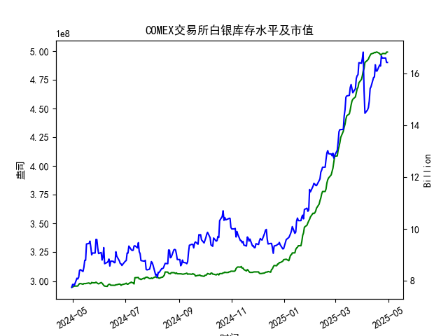

|            |   comex白银库存量 |   comex白银库存市值(billion) |   伦敦银现货价 |   上海金交所白银现货价 |   美元兑人民币汇率 |
|:-----------|------------------:|-----------------------------:|---------------:|-----------------------:|-------------------:|
| 2025-04-03 |       4.84931e+08 |                       31.625 |         32.475 |                   8263 |             7.1889 |
| 2025-04-04 |       4.90077e+08 |                       29.515 |         31.34  |                   8263 |             7.1889 |
| 2025-04-07 |       4.92042e+08 |                       29.65  |         30.325 |                   7606 |             7.198  |
| 2025-04-08 |       4.92994e+08 |                       29.775 |         30.315 |                   7689 |             7.2038 |
| 2025-04-09 |       4.94816e+08 |                       30.17  |         30.18  |                   7746 |             7.2066 |
| 2025-04-10 |       4.96236e+08 |                       31.05  |         30.925 |                   7939 |             7.2092 |
| 2025-04-11 |       4.97475e+08 |                       31.115 |         31.27  |                   7984 |             7.2087 |
| 2025-04-14 |       4.98195e+08 |                       31.8   |         32.275 |                   8107 |             7.211  |
| 2025-04-15 |       4.98847e+08 |                       31.8   |         32.31  |                   8139 |             7.2096 |
| 2025-04-16 |       4.98569e+08 |                       32.755 |         32.955 |                   8230 |             7.2133 |
| 2025-04-17 |       4.99104e+08 |                       32.23  |         32.31  |                   8143 |             7.2085 |
| 2025-04-18 |       4.99104e+08 |                       32.23  |         32.31  |                   8142 |             7.2069 |
| 2025-04-21 |       4.97895e+08 |                       32.785 |         32.31  |                   8227 |             7.2055 |
| 2025-04-22 |       4.96698e+08 |                       32.785 |         32.61  |                   8154 |             7.2074 |
| 2025-04-23 |       4.96891e+08 |                       33.55  |         32.96  |                   8191 |             7.2116 |
| 2025-04-24 |       4.97741e+08 |                       33.325 |         33.395 |                   8295 |             7.2098 |
| 2025-04-25 |       4.97908e+08 |                       33.325 |         33.335 |                   8270 |             7.2066 |
| 2025-04-28 |       4.97746e+08 |                       33.325 |         33.01  |                   8173 |             7.2043 |
| 2025-04-29 |       4.99098e+08 |                       32.89  |         33.225 |                   8197 |             7.2029 |
| 2025-04-30 |       4.99098e+08 |                       32.89  |         33.225 |                   8197 |             7.2014 |

### 分析与判断：近期白银市场套利机会和策略

#### 概述
基于提供的数据，我们分析了近一年COMEX白银库存量、库存市值、伦敦市场白银现货价格、上海金交所白银现货价格以及美元兑人民币汇率的动态，重点聚焦于最近一个月（约2025-03-31至2025-04-30）的仓单变化。COMEX白银库存量最近显示出轻微上升趋势，这可能反映了市场供应的增加或需求放缓。结合价格差异和汇率因素，我们评估了可能的套利机会。套利策略主要包括跨市场价格差异（如伦敦与上海）、库存变化驱动的价格波动，以及汇率套利。

- **关键数据摘要（聚焦最近一个月）**：
  - **COMEX白银库存量**：从2025-04-24的4.977407e+08盎司上升至2025-04-30的4.990984e+08盎司，增幅约0.28%。这表明库存在短期内稳定增加，可能由于新供应入库或持仓调整。
  - **COMEX白银库存市值**：最近数据（如10.75至11.86亿美元）显示波动，但整体向上，反映了白银价格的上涨。
  - **伦敦市场白银现货价格**：从2025-04-24的33.395美元/盎司降至2025-04-30的33.225美元/盎司，总体小幅下行，显示短期价格压力。
  - **上海金交所白银现货价格**：从2025-04-24的8295.0人民币/单位（假设为/公斤）降至2025-04-30的8197.0人民币/单位，显示类似下行趋势。
  - **美元兑人民币汇率**：从2025-04-24的7.2098升至2025-04-30的7.2014，汇率小幅贬值（美元相对强势）。

库存量的轻微增加可能预示短期供应过剩，从而抑制价格上涨，但跨市场价格差异为套利提供了机会。以下是详细分析。

#### 近期仓单变化分析
- **库存趋势**：COMEX白银库存在最近一个月内从约4.97e+08盎司逐步升至4.99e+08盎司，增幅虽小（不到1%），但这可能是季节性需求放缓或新矿产供应入库的信号。库存增加往往会增加市场供应压力，导致价格短期回调（如伦敦价格从33.395美元/盎司降至33.225美元/盎司）。
- **对价格的影响**：库存市值数据显示，白银整体价值在上涨（例如，最近市值从10.75亿美元升至11.86亿美元），这与全球白银需求（如工业和投资需求）有关。但库存上升可能抵消部分上涨势头，特别是在COMEX市场。
- **潜在风险**：如果库存继续增加，可能会加剧价格波动，投资者需关注是否出现突发事件（如地缘政治风险）导致需求反弹。

#### 可能存在的套利机会
基于数据，我们识别出以下套利机会，主要聚焦跨市场差异和库存驱动策略。套利需考虑交易成本、汇率风险和流动性。

1. **跨市场价格套利（伦敦 vs. 上海）**：
   - **价格差异分析**：伦敦市场白银价格（美元/盎司）在最近一个月稳定在33-33.4美元/盎司，而上海金交所价格（假设为人民币/公斤）需转换为美元/盎司以比较。
     - 转换计算示例：以2025-04-30为例，上海价格为8197.0人民币/公斤，汇率为7.2014美元/人民币。
       - 先转换为美元/公斤：8197.0 / 7.2014 ≈ 1138.2美元/公斤。
       - 再转换为美元/盎司（1公斤 ≈ 32.1507盎司）：1138.2 / 32.1507 ≈ 35.41美元/盎司。
     - 结果：上海等值价格（35.41美元/盎司）高于伦敦价格（33.225美元/盎司），差异约6.6%。这表明上海市场相对高估，可能由于本地需求（如中国工业用银）或进口限制。
   - **套利策略**：买入伦敦市场白银（低价），并在上海市场卖出（高价）。这是一种经典的跨市套利，但需通过期货或现货合约执行。预计收益：如果差异维持，单笔交易可获利约3-5%，但需扣除运输、仓储和手续费（约2-3%）。
   - **可行性**：库存增加可能放大伦敦价格的下行压力，进一步扩大差异。建议在汇率稳定时操作，避免美元强势导致上海价格（经转换）进一步上涨。

2. **库存变化驱动的套利**：
   - **机会来源**：COMEX库存上升可能导致短期供应过剩，压低伦敦价格。如果上海市场未同步调整，价格差异将扩大。
     - 例如，库存从4.97e+08盎司增至4.99e+08盎司，暗示潜在抛售压力。结合市值数据，白银价值上涨但库存增加，可能形成“买低卖高”机会。
   - **策略**：采用“库存套利”——在COMEX库存高位时买入白银（预期价格反弹），并在上海市场卖出以锁定利润。短期内，如果库存稳定，投资者可通过期权合约对冲风险。
     - 潜在收益：如果库存增幅导致伦敦价格下跌1-2%，而上海价格相对坚挺，套利空间可达4%。

3. **汇率相关套利**：
   - **汇率影响**：美元兑人民币汇率从7.2098升至7.2014，美元相对强势，这可能放大上海价格的美元等值（使之更具吸引力）。如果汇率继续波动，投资者可利用这一差异。
     - 例如，如果人民币贬值，上海价格（人民币/公斤）转换为美元后更低，从而逆转跨市差异。
   - **策略**：结合跨市场套利，使用外汇掉期（如买入美元、卖出人民币）锁定汇率。近期汇率小幅变化（约0.1%），适合短期套利操作。预计收益：如果汇率波动1%，可额外获利1-2%。

#### 风险与限制
- **市场风险**：库存增加可能只是短期现象，如果全球需求反弹（如电动汽车行业对白银需求），价格可能快速上涨，逆转套利机会。
- **交易成本**：跨市场套利需考虑仓储费、运输费和税费，这些可能侵蚀利润（尤其在中美贸易摩擦下）。
- **监管与流动性**：COMEX和上海市场的交易规则不同，流动性较低时套利难度增大。

#### 看法与建议
- **总体看法**：近期COMEX库存轻微上升为套利提供了窗口，特别是跨市场价格差异明显。伦敦价格相对低迷，而上海价格（经转换）较高，建议优先关注“买入伦敦、卖出上海”的策略。库存变化表明短期供应压力可能持续，但如果需求回暖，价格反弹将是新机会。
- **具体建议**：
  1. **监控指标**：每日跟踪COMEX库存和价格差异。如果库存增幅超过0.5%或伦敦-上海价差扩大至5%以上，立即启动套利。
  2. **策略执行**：采用小额测试交易（如1-5手合约），并使用止损订单控制风险。优先选择期货合约以降低现货持有成本。
  3. **风险管理**：结合汇率套利，使用多头/空头对冲（如在COMEX做多、在上海做空）。若汇率波动加剧，考虑美元避险工具。
  4. **长期视角**：库存上升可能预示市场顶部，建议在3-6个月内逐步退出套利，转向多头持仓以捕捉潜在反弹。

通过这些策略，投资者可利用近期市场不均衡获利，但需保持谨慎，实时调整基于最新数据。