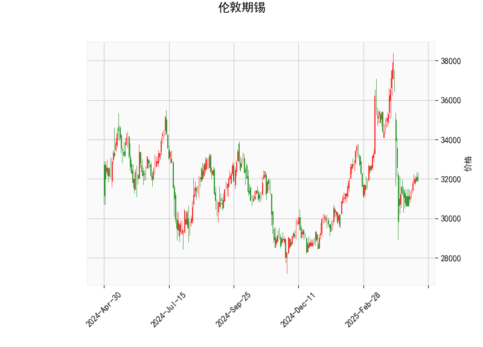

### 伦敦期锡技术分析结果解读

#### 1. 对技术分析结果的详细分析
基于提供的伦敦期锡技术指标数据，我们可以从多个维度对当前市场状况进行解读。以下是对关键指标的逐一分析：

- **当前价格（Current Price）**: 价格为31919.0，表明锡价目前处于相对稳定的区间。该价格位于Bollinger Bands的中轨（33072.38）附近，显示市场波动性适中，没有出现极端超买或超卖情况。这可能反映出投资者情绪较为谨慎，等待进一步的市场信号。

- **RSI（Relative Strength Index）**: RSI值为46.42，这是一个中性水平（RSI通常在30-70范围内视为中性）。低于50的RSI暗示轻微的弱势，可能表示近期卖方力量稍占上风，但尚未进入超卖区域（RSI<30）。如果RSI继续上升至50以上，将可能转为中性偏强，预示潜在反弹。

- **MACD（Moving Average Convergence Divergence）**: MACD线为-513.67，信号线为-617.13，柱状图（MACD Hist）为103.46（正值）。MACD线高于信号线（尽管两者均为负值），这显示短期内可能出现看涨信号，因为柱状图的正值表示MACD线正逐步向信号线靠拢或向上交叉。如果这一趋势持续，可能会确认价格反弹；反之，如果MACD线回落，可能加剧下行压力。目前的负值整体反映出市场仍处于弱势，但柱状图的正向变化是潜在的转折点。

- **Bollinger Bands（布林带）**: 上轨为37019.86，中轨为33072.38，下轨为29124.91。当前价格（31919.0）位于中轨和下轨之间，偏向中轨，这表明价格处于一个相对均衡的波动范围内。Bollinger Bands的宽度显示当前市场波动性中等（未过度扩张）。如果价格进一步接近下轨，可能进入超卖区域，增加反弹机会；反之，如果突破上轨，将是强势信号。

- **K线形态（CDLMATCHINGLOW）**: 这是一个经典的看涨形态，通常表示价格可能在低点附近形成双底或类似结构，暗示短期内潜在的向上反弹。该形态常与市场底部相关，结合其他指标（如MACD的正柱状图），可能强化买入信号。但需注意，这是一个短期信号，需结合整体趋势验证其可靠性。

总体而言，当前技术面呈现中性偏弱的格局：RSI显示轻微弱势，MACD暗示潜在反转，Bollinger Bands反映波动稳定，K线形态提供看涨线索。市场可能正处于一个关键转折点，如果外部因素（如全球经济数据或供应需求变化）支持，短期内锡价可能企稳反弹。

#### 2. 近期可能存在的投资或套利机会和策略判断
基于上述分析，我们可以从投资和套利角度评估近期机会。伦敦期锡作为大宗商品，其价格受全球经济、供应链和地缘政治影响，因此策略需结合技术面与宏观因素。以下是针对当前数据的判断和建议：

- **可能的投资机会**:
  - **短期反弹机会**: K线形态（CDLMATCHINGLOW）和MACD柱状图的正值共同暗示潜在买入点。如果RSI从当前水平向上反弹（例如突破50），价格可能测试中轨或上轨（33072.38-37019.86）。投资者可考虑在价格接近下轨（29124.91）时布局多头头寸，特别是在全球锡需求（如电子和新能源行业）回暖的背景下。
  - **风险因素**: 市场仍处于弱势（RSI<50和MACD负值），若全球经济下行或供应过剩，价格可能进一步下探至下轨附近。因此，投资机会更多适用于短期交易，而非长期持有。

- **可能的套利机会**:
  - **跨市场套利**: 伦敦金属交易所（LME）锡价与上海期货交易所（SHFE）或其他区域市场的价差可能存在套利空间。例如，如果LME价格相对SHFE偏低（当前价31919.0处于中低位），投资者可通过买入LME锡并卖出SHFE锡来锁定价差收益。需监控全球库存数据（如LME库存水平），如果库存减少，价差可能扩大。
  - **跨品种套利**: 锡与其他金属（如铜或铝）的相关性较高。如果锡价相对其他金属（如铜）出现低估（基于历史相关系数），可考虑锡-铜价差套利策略，例如在锡价反弹预期下买入锡并卖出铜。

- **推荐策略**:
  - **买入策略**: 在RSI向上突破50且MACD线正式交叉信号线时，考虑买入多头头寸。初始目标位可设在中轨（33072.38）附近，止损位设在下轨（29124.91）下方10-15%的范围内，以控制风险。适合风险偏好中等的投资者。
  - **卖出或观望策略**: 如果RSI跌破40或MACD柱状图转负，建议空头操作或离场观望。短期内，价格若未突破中轨，可采用区间震荡策略（如在下轨买入、上轨卖出）。
  - **风险管理与整体建议**: 所有策略应结合基本面分析（如全球锡矿供应和需求动态），并使用适当的资金管理（如仓位不超过总资金的10%）。当前市场中性，适合短线交易者，但长期投资者需等待更明确的技术确认。建议结合实时数据（如COT报告）监控，避免单一指标决策。

总之，近期伦敦期锡的投资机会主要源于技术面的潜在反弹信号，但套利机会需依赖市场间价差。投资者应保持谨慎，结合多因素分析以优化策略。