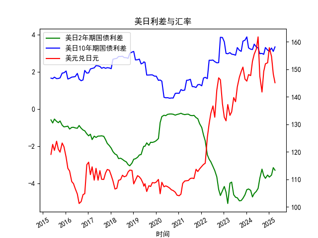

|            |   美元兑日元 |   美国10年期国债收益率 |   日本10年期国债收益率 |   美国2年期国债收益率 |   日本2年期国债收益率 |   每日美日2年期国债利差 |   每日美日10年期国债利差 |
|:-----------|-------------:|-----------------------:|-----------------------:|----------------------:|----------------------:|------------------------:|-------------------------:|
| 2023-09-12 |       147.12 |                  3.875 |                  0.716 |                 0.033 |                  4.98 |                   3.159 |                   -4.947 |
| 2023-10-11 |       149.17 |                  3.875 |                  0.776 |                 0.058 |                  4.99 |                   3.099 |                   -4.932 |
| 2023-11-08 |       150.77 |                  4.5   |                  0.852 |                 0.117 |                  4.93 |                   3.648 |                   -4.813 |
| 2023-12-11 |       146.41 |                  4.5   |                  0.798 |                 0.088 |                  4.71 |                   3.702 |                   -4.622 |
| 2024-01-10 |       145.68 |                  4.5   |                  0.621 |                 0.025 |                  4.37 |                   3.879 |                   -4.345 |
| 2024-02-07 |       148.04 |                  4     |                  0.714 |                 0.101 |                  4.41 |                   3.286 |                   -4.309 |
| 2024-03-12 |       147.69 |                  4     |                  0.783 |                 0.197 |                  4.58 |                   3.217 |                   -4.383 |
| 2024-04-10 |       152.9  |                  4     |                  0.801 |                 0.233 |                  4.97 |                   3.199 |                   -4.737 |
| 2024-05-08 |       155.42 |                  4.375 |                  0.887 |                 0.288 |                  4.84 |                   3.488 |                   -4.552 |
| 2024-06-11 |       157.32 |                  4.375 |                  1.035 |                 0.372 |                  4.81 |                   3.34  |                   -4.438 |
| 2024-07-10 |       161.73 |                  4.375 |                  1.093 |                 0.343 |                  4.62 |                   3.282 |                   -4.277 |
| 2024-08-07 |       147.42 |                  3.875 |                  0.899 |                 0.27  |                  4    |                   2.976 |                   -3.73  |
| 2024-09-11 |       141.72 |                  3.875 |                  0.886 |                 0.38  |                  3.62 |                   2.989 |                   -3.24  |
| 2024-10-09 |       149.2  |                  3.875 |                  0.936 |                 0.402 |                  3.99 |                   2.939 |                   -3.588 |
| 2024-11-05 |       151.96 |                  4.25  |                  0.944 |                 0.455 |                  4.19 |                   3.306 |                   -3.735 |
| 2024-12-11 |       152.34 |                  4.25  |                  1.083 |                 0.591 |                  4.15 |                   3.167 |                   -3.559 |
| 2025-01-07 |       157.82 |                  4.25  |                  1.148 |                 0.632 |                  4.3  |                   3.102 |                   -3.668 |
| 2025-02-12 |       154.62 |                  4.625 |                  1.346 |                 0.799 |                  4.36 |                   3.279 |                   -3.561 |
| 2025-03-12 |       148.32 |                  4.625 |                  1.527 |                 0.85  |                  4.01 |                   3.098 |                   -3.16  |
| 2025-04-09 |       145.09 |                  4.625 |                  1.284 |                 0.611 |                  3.91 |                   3.341 |                   -3.299 |

# 1. 判断文章观点的准确性

文章认为，日元汇率与美日国债利差经常背离，且日元贬值对日本股市有利，主要因为许多日本上市公司的利润来自海外，当日元贬值时，这些海外利润折算成日元的价值会上升，这与日本与其他国家的经济结构不同。基于历史数据和经济原理，我对这一观点进行判断。

首先，从数据观察，美日2年期和10年期国债利差显示出显著波动。例如，2年期利差从-0.589%到-4.947%不等，10年期利差则从1.496%到3.879%不等。这表明利差并非始终稳定，且汇率（美元兑日元）也表现出独立性，例如汇率从104左右波动到160以上。这部分支持了“汇率和利差经常背离”的观点。传统汇率理论（如未覆盖利率平价）假设高利率货币（如美元）应相对于低利率货币（如日元）升值，从而导致日元贬值。但实际中，日本央行长期宽松货币政策（如量化宽松）可能导致汇率偏离利差，出现背离现象。

其次，关于日元贬值对日本股市的有利影响，这一点是准确的。日本经济高度依赖出口，许多大型公司（如丰田、本田和索尼）的收入主要来自海外市场。当日元贬值时，这些公司的海外收入（如以美元计价）在换算回日元时会增加，从而提升企业利润和股票估值。这与许多其他国家（如美国或欧洲国家，其经济更依赖国内消费）不同，日本的这一特性使得日元贬值往往成为股市上涨的催化剂。历史数据显示，例如在汇率升至140以上时，日本股市（如日经225指数）经常表现出韧性或上涨趋势。这反映了日本经济的出口导向型特征，因此文章的这一观点是合理的。

总体而言，文章观点准确，但需注意，这是一种简化描述。汇率背离可能受多种因素影响，如全球风险情绪、央行干预或通胀预期，而股市反应并非总是线性（例如，如果贬值过快，可能引发通胀或进口成本上升的负面影响）。

# 2. 分析判断近期可能存在的投资或套利机会和策略

基于提供的数据（美日国债利差和美元兑日元汇率的月频历史数据），我分析了近期趋势，并判断潜在的投资或套利机会。数据显示，2年期利差持续为负（美国利率高于日本），10年期利差波动但整体偏正，汇率则呈贬值趋势（日元对美元走弱，从约104升至160以上）。这反映了美国加息周期与日本宽松政策的对比，可能带来套利空间。但需强调，市场充满不确定性，任何策略均需考虑风险，如汇率波动或地缘政治事件。

### 关键观察
- **利差趋势**：2年期利差从-0.589%恶化到-4.947%，表明美国短期利率远高于日本；10年期利差虽正但有回落（如从3.879%降至2.939%），这可能预示利差收窄。
- **汇率趋势**：美元兑日元从约104升至160以上，日元显著贬值，这与利差扩大相符，但也显示背离期（例如某些月份汇率未随利差急剧变化）。
- **潜在机会**：日元贬值可能持续，如果美国利率维持高位，而日本维持宽松政策，则carry trade和相关策略有机会。

### 可能的投资或套利机会
- **Carry Trade策略**：
  - **机会描述**：借入低利率货币（日元）并投资高利率货币（美元资产）。鉴于2年期利差为负（约-1%到-5%），投资者可借日元买入美元债券或股票，赚取利差收益。同时，汇率数据表明日元持续贬值，这可能放大回报（例如，如果日元进一步贬值，归还日元债务时成本降低）。
  - **策略建议**：短期内（1-3个月），在利差维持的情况下，进行小额carry trade。例如，投资美元计价的美国短期债券，同时持有日元头寸。如果汇率保持在140以上，此策略收益可观。基于数据，汇率从2022年底开始加速贬值，这为近期执行提供了支撑。
  - **风险**：如果日元意外升值（如日本央行干预或全球避险需求），可能导致损失。建议使用止损机制，并控制仓位不超过总资产的10-20%。

- **利差套利机会**：
  - **机会描述**：利用美日10年期利差的波动进行套利。例如，10年期利差从2.487%升至3.879%再回落，显示波动性。如果利差进一步收窄（数据中已有迹象，如从-4.947%的2年期利差向中性靠拢），可通过卖出美元买入日元资产获利。
  - **策略建议**：采用“利差交易”：买入日本国债（低利率）并做空美国国债（高利率），或通过外汇掉期合约锁定汇率。如果汇率数据显示日元贬值放缓（例如从最近的160回落），这可能是一个信号。近期数据中，汇率在150-160区间波动，暗示如果利差稳定，此策略可在3-6个月内执行。
  - **风险**：利差可能继续扩大（如美国通胀压力），导致套利失败。建议结合技术分析（如移动平均线）监控趋势。

- **日本股市投资机会**：
  - **机会描述**：如文章所述，日元贬值有利于日本出口股。因此，如果汇率维持高位（如160以上），日本股市（如日经指数）可能上涨。数据显示，汇率贬值期（如从114到160）往往与股市活跃相伴。
  - **策略建议**：买入日本出口导向型股票ETF（如EWJ或以丰田为代表的个股），并在日元贬值预期下加仓。结合利差数据，如果2年期利差保持负值，此策略可在近期（1-6个月）执行，以捕捉利润增长。
  - **风险**：全球经济放缓可能影响出口需求。建议多元化，例如结合期权保护（买入看跌期权对冲汇率风险）。

### 总体策略建议
- **时机判断**：基于数据，近期（未来1-3个月）利差和汇率的背离可能持续，提供carry trade和股市投资机会。但如果10年期利差进一步回落，套利窗口可能缩小。
- **风险管理**：所有策略应结合止损、头寸控制和多样化。监控宏观因素，如美联储政策和日本央行动态。
- **注意事项**：以上分析基于历史数据推断，并非投资建议。实际操作需考虑实时市场和个人风险偏好。