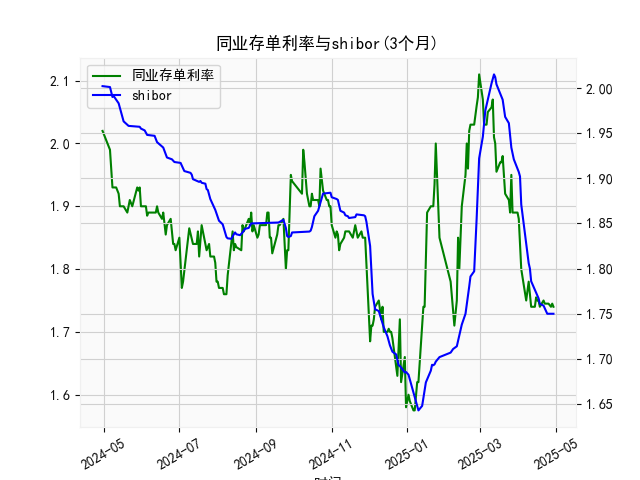

|            |   同业存单利率(3个月) |   shibor(3个月) |
|:-----------|----------------------:|----------------:|
| 2025-04-02 |                 1.85  |           1.902 |
| 2025-04-03 |                 1.8   |           1.871 |
| 2025-04-07 |                 1.75  |           1.824 |
| 2025-04-08 |                 1.77  |           1.81  |
| 2025-04-09 |                 1.78  |           1.806 |
| 2025-04-10 |                 1.76  |           1.8   |
| 2025-04-11 |                 1.74  |           1.786 |
| 2025-04-14 |                 1.74  |           1.777 |
| 2025-04-15 |                 1.755 |           1.775 |
| 2025-04-16 |                 1.75  |           1.772 |
| 2025-04-17 |                 1.75  |           1.767 |
| 2025-04-18 |                 1.74  |           1.761 |
| 2025-04-21 |                 1.75  |           1.759 |
| 2025-04-22 |                 1.745 |           1.755 |
| 2025-04-23 |                 1.745 |           1.753 |
| 2025-04-24 |                 1.745 |           1.75  |
| 2025-04-25 |                 1.745 |           1.75  |
| 2025-04-27 |                 1.74  |           1.75  |
| 2025-04-28 |                 1.745 |           1.75  |
| 2025-04-29 |                 1.74  |           1.75  |

### 1. 同业存单利率和SHIBOR的相关性及影响逻辑

同业存单利率（AAA, 3个月）和SHIBOR（3个月）作为中国银行间市场的关键基准利率，通常呈现出高度正相关性。这意味着二者往往同步波动，相关系数可能接近0.9或更高。根据提供的数据，从2023年初到2024年初的日频数据显示，两者均从约2.0%水平波动至1.7-1.8%区间，再伴随一些短期上升和下降，体现了类似的趋势。

**相关性的主要原因：**
- **市场基础一致**：两者都受中国银行间市场的流动性影响。SHIBOR是银行间拆借利率，直接反映银行短期资金借贷成本，而同业存单利率是银行发行的短期债务工具利率，通常以SHIBOR作为参考基准。因此，当银行间资金需求增加时，SHIBOR上升，同业存单利率也会随之上涨以吸引投资者。
  
- **货币政策影响**：中国人民银行（央行）的政策是核心驱动因素。例如，央行通过公开市场操作（如逆回购或MLF）调整流动性时，会同时影响SHIBOR和同业存单利率。如果央行收紧货币政策（如提高利率或减少流动性投放），两者均可能上升；反之，宽松政策（如降准）会推动二者下降。

**影响逻辑的详细分析：**
- **短期流动性因素**：SHIBOR更直接反映即时资金供求，而同业存单利率作为债券式工具，可能稍滞后于SHIBOR，但二者通常在同一天或相邻几天内保持紧密联动。例如，在数据中，SHIBOR从1.99%降至1.75%，同业存单利率也从1.93%降至1.74%，显示出同步的下降趋势。
  
- **经济环境影响**：宏观经济数据（如CPI、GDP增长）和全球因素（如美联储政策）也会间接作用。如果经济放缓，央行可能注入流动性，导致两者下行；反之，经济复苏或通胀压力会推高利率。
  
- **风险溢价差异**：虽然相关性强，但同业存单利率（AAA级）可能略高于SHIBOR，因为它涉及信用风险（尽管AAA级风险较低）。数据中，同业存单利率平均略高于SHIBOR（约0.01-0.05%），这反映了投资者对信用和流动性的额外需求。

总体而言，这种正相关性使得SHIBOR可作为同业存单利率的领先指标，帮助投资者预测市场变化。

### 2. 近期可能存在的投资或套利机会和策略

基于提供的数据（近一年日频数据），同业存单利率和SHIBOR在2023年末至2024年初呈现出整体下行趋势，但伴随波动（如从1.8%降至1.7%后小幅反弹）。当前（数据末尾），同业存单利率约1.74%，SHIBOR约1.75%，二者利差微小（约0.01%）。这表明银行间市场流动性相对宽松，但潜在机会仍存在于利率波动和利差变化中。以下是针对近期（基于数据末尾趋势）的分析和建议：

**可能的投资机会：**
- **低利率环境下的债券投资**：当前利率处于较低水平（约1.7-1.8%），适合投资者增加固定收益资产配置。例如，购买AAA级同业存单或相关债券产品，以锁定稳定收益。如果预期央行继续宽松，利率可能进一步下行，带来资本增值机会（如债券价格上涨）。
  
- **流动性管理策略**：对于银行或机构投资者，SHIBOR的稳定（末尾约1.75%）暗示短期资金成本较低，可考虑增加杠杆进行资产配置，如投资于高于SHIBOR的资产（如企业债或股票），以赚取利差收益。

**可能的套利机会：**
- **利差套利**：观察同业存单利率与SHIBOR的利差（当前约0.01%）。如果利差扩大（如过去数据中 occasional 出现0.05%以上的差异），可进行跨市场套利。例如：
  - **正向套利**：如果同业存单利率显著高于SHIBOR，投资者可借入SHIBOR资金购买同业存单，实现无风险收益。
  - **反向套利**：如果SHIBOR高于同业存单利率（较少见），则可卖出SHIBOR相关合约或借出资金。
  - 数据显示，利差在某些时期波动（如从1.89% vs 1.88%），如果未来政策变化（如央行操作）导致利差扩大至0.03%以上，套利窗口可能出现。

**投资策略建议：**
- **短期观察策略**：监控央行政策（如5月或6月的LPR调整）和经济数据（如PMI）。如果利率继续下行，建议买入期限为3个月的同业存单作为低风险投资，目标收益率约1.7-1.8%。
  
- **套利组合策略**：构建利差交易组合，例如，同时持有SHIBOR期货和同业存单。如果利差收窄，获利了结。风险控制点：设置止损线（如利差逆转0.02%），并考虑市场波动性。
  
- **风险与注意事项**：近期机会基于历史数据推断，但存在不确定性，如全球通胀反弹或国内经济下行可能导致利率上升。建议结合实时数据（如Wind或Bloomberg平台）动态调整，并优先选择低风险工具。总体策略应以分散化和短期为主，避免过度杠杆。