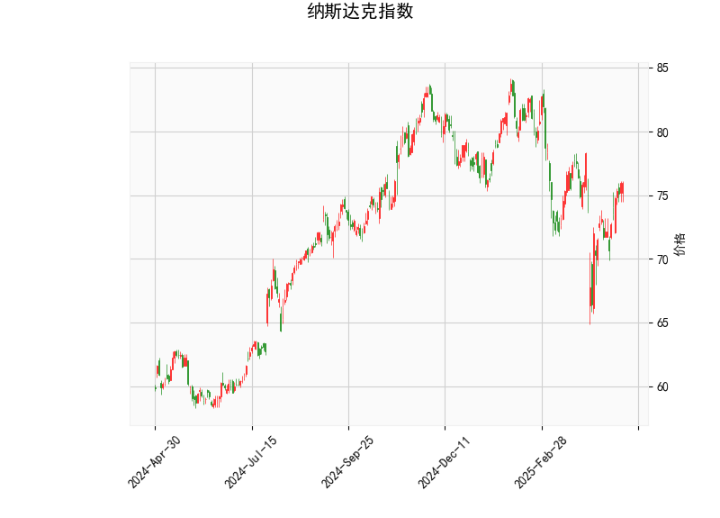

### 纳斯达克指数技术分析

#### 1. 对技术分析结果的详细分析
以下是对给定纳斯达克指数技术分析结果的逐项解读，这些指标反映了市场的当前状态和潜在趋势。整体来看，该指数显示出中性偏向的短期信号，但未出现极端情况。

- **当前价（75.94）**：  
  当前价格位于75.94美元，接近布林带的中轨（75.97）。这表明指数处于相对稳定的位置，并未偏离主要趋势。如果价格维持在这一水平，市场可能继续横盘整理或等待新催化剂推动突破。

- **RSI（55.79）**：  
  RSI（相对强弱指数）当前为55.79，处于中性区域（通常50-70）。这表示市场没有明显的超买（RSI>70）或超卖（RSI<30）信号，暗示投资者情绪相对平衡。近期，RSI的稳定可能意味着指数将继续积累动能，而非急剧反转。如果RSI升至60以上，可能预示短期买入兴趣增强。

- **MACD指标**：  
  - MACD线（0.06655）和信号线（-0.59403）：MACD线高于信号线，且直方图（0.66058）为正值，这是一个典型的看涨信号。MACD直方图的正值表明短期移动平均线正在向上穿越长期移动平均线，暗示潜在的上行趋势。然而，MACD线的数值相对较小，表明这一信号可能还处于初期阶段，并非强烈确认。如果MACD线继续扩大与信号线的差距，可能会强化多头（买入）动力。
  - 总体MACD分析：当前指标显示短期多头优势，但需警惕可能的回调，因为信号线仍为负值（表示前期弱势尚未完全消除）。

- **布林带（Bollinger Bands）**：  
  - 上轨（83.71）、中轨（75.97）和下轨（68.24）：当前价格（75.94）紧邻中轨，表明指数处于布林带的中间区域，波动率较低（带宽较窄）。这通常代表市场处于盘整期，而非强势趋势。如果价格向上突破上轨（83.71），可能触发进一步上涨；反之，如果跌破下轨（68.24），则可能出现修正。当前位置的中性特征意味着短期内缺乏强烈方向性，但潜在的上行空间较大。

- **K线形态**：  
  K线形态为空（[]），表示近期未形成明显的经典形态（如吞没看涨或锤头线）。这可能意味着市场缺乏强烈的价格反转信号，或数据采样期内未捕捉到特定形态。投资者应结合其他指标，避免仅凭K线进行决策。

总体而言，技术指标显示纳斯达克指数处于中性偏多头的状态。RSI和布林带的中性水平提供了稳定性，而MACD的看涨信号则暗示了潜在的上行机会。但整体波动较小，市场可能需要外部事件（如经济数据或企业财报）来确认趋势。

#### 2. 近期可能存在的投资或套利机会和策略判断
基于上述分析，纳斯达克指数的当前技术面显示出一些短期机会，但风险需谨慎管理。以下是针对近期可能的投资和套利策略的判断和建议：

- **潜在投资机会**：  
  - **买入机会（多头策略）**：MACD的看涨信号（直方图正值）是当前最明显的积极因素，结合RSI的中性水平，建议考虑在价格稳定时买入。短期内，如果指数突破布林带上轨（83.71），可能迎来5-10%的上行空间（基于历史波动率）。例如，投资者可关注科技股主导的纳斯达克反弹，特别是在美联储政策宽松或企业业绩超预期的背景下。
  - **卖出或观望机会**：如果RSI升至70以上或价格接近上轨，市场可能进入超买区，增加回调风险。此时，建议持有现金或轻仓观望，避免追高。
  - **风险：** 市场不确定性较高（如地缘政治事件），价格可能回落至下轨（68.24）附近，带来10%以上的潜在损失。

- **套利机会和策略**：  
  - **跨市场套利**：纳斯达克作为科技驱动指数，可能与美股其他板块（如道琼斯或S&P 500）存在价差。当前中性指标暗示低波动期，投资者可通过统计套利（如基于MACD差异的量化模型）在纳斯达克与S&P 500间进行套利。例如，如果纳斯达克相对S&P 500的估值偏低（当前价位支持这一判断），可买入纳斯达克相关ETF（如QQQ）并卖出S&P 500 ETF（如SPY），待价差收敛获利。预计套利窗口在1-3个月内。
  - **期权或衍生品策略**：利用布林带的窄幅波动进行波动率套利。例如，购买看涨期权（Call Option）以捕捉MACD的上行信号，同时卖出虚值期权来降低成本（铁蝶式策略）。如果价格维持在中轨附近，波动率较低的环境将使这种策略盈利，但需设定止损（如价格跌破下轨时平仓）。
  - **整体策略建议**：  
    - **短期策略**：采用“买入并持有”结合止损（例如设置在72.00附近），目标价位为80.00以上。适合风险偏好中等的投资者。
    - **中长期策略**：监测RSI和MACD的持续变化，如果指标强化看涨信号，可增加仓位。结合基本面（如科技股盈利预期），构建多元化投资组合。
    - **风险管理**：始终设置止盈止损（如10%的利润目标或5%的损失阈值），并结合宏观经济数据（如CPI或就业报告）调整策略。避免过度杠杆，以防范市场突发行情。

总之，近期纳斯达克指数的投资机会主要基于MACD的看涨信号，但需警惕RSI和布林带的潜在中性逆转。投资者应结合个人风险承受能力和市场新闻进行决策，优先选择低成本工具如ETF来执行策略。