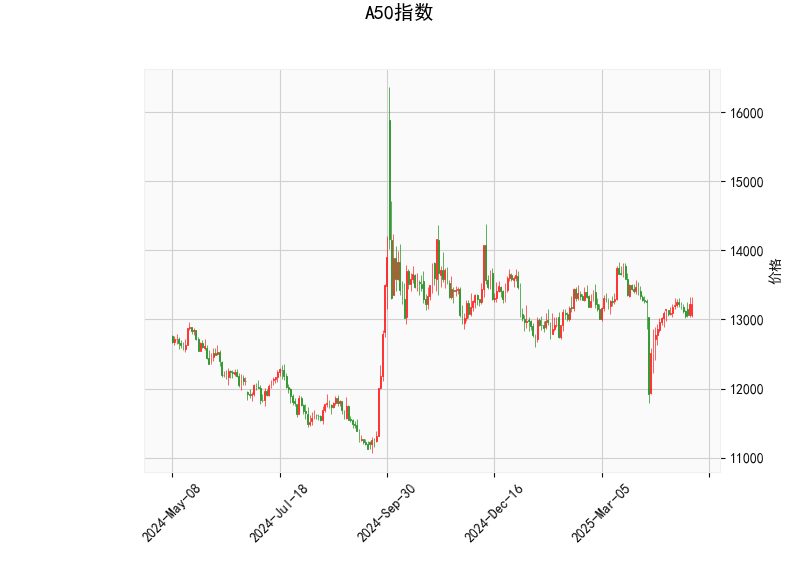

### A50指数技术分析结果详解

#### 1. 对技术分析结果的整体分析
A50指数当前价格为13226.0点，基于提供的指标，我们可以从多个维度对其进行评估，以判断市场的短期趋势和潜在风险。以下是对关键指标的逐一解读和综合分析：

- **RSI（相对强弱指数）**：当前RSI值为53.58。这是一个中性水平，处于30-70的正常区间内，表明市场尚未出现超买或超卖状态。RSI略高于50，暗示近期买方力量稍占上风，但力度并不强劲。如果RSI继续上升至70以上，可能预示短期超买风险；反之，如果跌至30以下，则可能出现超卖反弹机会。

- **MACD（移动平均收敛散度）**：MACD线值为5.75，信号线为-16.34，柱状图（MACD Hist）为22.09。这显示MACD线已处于信号线上方，形成了一个正的柱状图，这通常被视为一个看涨信号，表明短期内多头动能正在增强。然而，信号线仍为负值，暗示市场可能刚刚从弱势转为中性，整体趋势仍需进一步确认。如果MACD柱状图持续扩大，可能会推动价格向上突破；反之，如果柱状图开始缩小或转为负值，则需警惕潜在回调。

- **Bollinger Bands（布林带）**：上轨为13798.10，中轨为13219.62，下轨为12641.13。目前价格（13226.0）非常接近中轨，这反映了市场的波动率相对稳定，没有明显偏离均值。价格处于中轨附近表明当前处于一个中性区间，可能预示着短期内价格将围绕中轨震荡。如果价格向上突破上轨（13798.10），可能触发强势上涨；反之，如果跌破下轨（12641.13），则可能出现显著回调。布林带的宽度（上轨与下轨的差距）显示当前波动率中等，市场可能正处于积累阶段。

- **K线形态**：提供的K线形态列表为空，这意味着近期未观察到明显的经典K线模式（如锤头线、吞没形态等）。这可能表示市场缺乏强烈的短期信号，更多依赖其他指标的指引。

**综合评估**：整体来看，A50指数的技术指标显示出中性偏看涨的态势。RSI和MACD的组合暗示多头力量在逐步积累，但尚未进入强势阶段。Bollinger Bands的定位表明价格处于相对平衡点，短期内可能出现小幅波动或向上测试上轨。投资者应密切关注后续指标变化，以避免潜在的假突破风险。如果外部因素（如经济数据或全球市场情绪）支持，指数可能向上拓展空间；反之，任何负面催化剂都可能导致回调。

#### 2. 近期可能存在的投资或套利机会和策略
基于上述分析，我们可以进一步判断A50指数的潜在投资机会。当前市场环境相对中性，但MACD的正向信号为短期操作提供了些许乐观基础。以下是针对近期可能的机会和策略的分析，重点考虑风险控制和实际可行性。

##### 可能的投资机会
- **看涨机会**：RSI处于中性水平且MACD柱状图为正，暗示短期内可能存在向上突破的潜力。例如，如果价格突破布林带上轨（13798.10），这可能触发更广泛的买盘，推动指数向13500-14000点区间上涨。这类机会适合于趋势跟踪型投资者，尤其在全球股市回暖或中国经济数据向好的背景下。
  
- **回调买入机会**：价格接近布林带中轨，如果出现小幅回落至13000点附近（但未跌破下轨），这可能是一个低风险买入点。RSI未显示超卖状态，但如果回落时RSI跌至45以下，结合MACD的正向动能，这将是一个经典的“逢低吸纳”机会。

- **套利机会**：A50指数作为期货产品，可能存在跨市场或跨品种套利空间。例如：
  - **期货与现货套利**：如果A50期货与现货指数（如沪深300或相关ETF）之间出现价差扩大（如由于市场情绪波动），投资者可以通过无风险套利（如期货多头+现货空头）来捕捉。例如，当前价格在中轨附近，如果期货溢价率较高（基于历史数据判断），则可考虑反向套利。
  - **跨期套利**：如果近期A50期货合约与远期合约之间价差异常（如近期合约被高估），则可利用价差收敛进行套利。但需注意，当前指标未显示明显异常，套利机会可能较隐蔽，需要实时监控。

总体机会评估：近期机会主要偏向中短期交易，而非长期持仓。看涨信号较弱，因此高风险投资者可关注突破点，低风险投资者宜等待确认。

##### 推荐策略
- **买入策略**： 
  - **条件**：等待价格突破布林带上轨（13798.10）并RSI升至60以上时入场。初始买入规模控制在总仓位的20-30%，止损设在下轨附近（12641.13以下）。
  - **目标**：短期目标为13500-13800点，若MACD柱状图持续扩大，可加仓至14000点。
  - **风险管理**：结合RSI超买信号（>70）设置止盈，例如在RSI达65时部分获利了结。

- **卖出或观望策略**：
  - **条件**：如果价格跌破中轨（13219.62）并MACD柱状图转为负值，建议卖出或转向空头操作。短期卖出目标可设在12800-12600点区间。
  - **观望建议**：对于保守投资者，当前中性指标建议暂不行动，待K线形态出现（如未来形成看涨形态）再决策。同时，可使用期权（如买入看涨期权）作为低成本试探工具。

- **套利策略**：
  - **基本套利**：利用A50期货与相关指数（如恒生指数期货）的价差。如果A50相对恒生出现低估（基于历史相关性），可进行多A50空恒生的跨市场套利。操作周期控制在1-3周，需实时追踪价差变化。
  - **高级策略**：结合波动率（如Bollinger Bands宽度扩大），进行波动率套利。例如，如果布林带收窄后快速扩张，可在低波动期建立中性仓位（如期权价差策略），待波动率上升时获利。
  - **注意事项**：套利需具备专业工具和资金优势，风险包括交易成本和市场突发事件。建议在模拟环境中测试策略。

**总体风险提醒**：A50指数受全球经济、地缘政治和国内政策影响较大。当前指标虽中性，但潜在回调风险不可忽视。建议投资者结合基本面分析（如经济数据发布），并控制仓位（不超过50%）。若无专业经验，优先选择ETF或基金跟踪指数，而非直接交易期货。定期复盘指标变化，以调整策略。