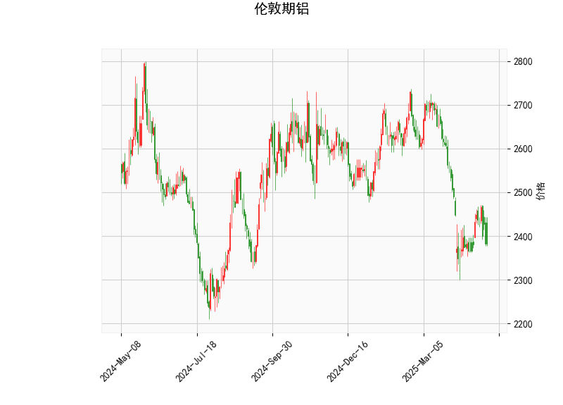

### 伦敦期铝技术分析结果分析

#### 1. 关键指标概述
基于提供的伦敦期铝技术分析数据，我们可以对当前市场状况进行评估。当前价格为2382.5，处于相对较低水平，显示出一些潜在的超卖信号。以下是对各指标的详细分析：

- **RSI (相对强弱指数)**: 当前值为40.26。这表明铝价处于轻微超卖区域（RSI低于40通常被视为超卖）。这可能暗示短期内价格有反弹潜力，但如果RSI进一步下降，可能加剧下行压力。
  
- **MACD (移动平均收敛散度)**: MACD线值为-29.41，信号线值为-37.39，MACD柱状图为7.98（正值）。MACD线高于信号线，这是一个看涨信号，表明短期动量可能正在转向向上。然而，整体MACD仍为负值，显示多头力量尚未完全主导市场。如果柱状图继续扩大，可能预示价格反弹。

- **Bollinger Bands (布林带)**: 上轨为2802.42，中轨为2541.3，下轨为2280.18。目前价格2382.5位于中轨下方且接近下轨，这往往表示价格处于超卖状态。Bollinger Bands的收窄或价格触及下轨后反弹，通常是潜在买点，但如果价格跌破下轨，可能进一步下探。

- **K线形态**: 检测到"CDLMATCHINGLOW"形态，这是一个经典的看涨反转信号。它通常出现在价格见底时，暗示短期内可能出现反弹或向上突破。如果后续K线确认这一形态，市场情绪可能转为积极。

总体而言，这些指标显示伦敦期铝当前处于弱势但可能见底的阶段。RSI的超卖、MACD的看涨交叉以及K线形态的信号共同指向短期反弹的可能性。然而，价格仍低于中轨，需警惕进一步下跌的风险。

#### 2. 近期投资或套利机会和策略判断
基于上述技术分析，伦敦期铝市场可能存在短期投资机会，特别是针对潜在反弹。但需注意，技术分析仅为参考，实际决策应结合基本面（如全球经济、供需动态）和风险管理。以下是针对近期可能的投资或套利机会的分析和建议：

- **潜在投资机会**:
  - **短期反弹机会**: 当前指标显示超卖状态（RSI和Bollinger Bands），结合CDLMATCHINGLOW的看涨形态，铝价可能在短期内反弹至中轨（约2541.3）或更高。如果全球需求回暖（如制造业复苏），这将进一步支撑价格。投资者可考虑在当前价位附近买入多头头寸，目标设在2400-2500区间。
  
  - **风险因素**: 如果价格跌破下轨（2280.18），可能触发进一步下跌，因此需密切关注全球经济不确定性（如通胀、地缘政治事件）对金属市场的冲击。

- **投资策略建议**:
  - **多头策略**: 在2380附近买入期铝期货或相关ETF，设置止损在下轨以下（例如2300以下）。一旦RSI回升至50以上或MACD柱状图转为更强，可逐步加仓。退出点可设在中轨附近或当RSI超过70时以避免超买风险。
  
  - **波段交易策略**: 利用Bollinger Bands的波动性进行买卖。当前价格接近下轨，可等待反弹后在接近上轨时卖出，实现短期获利。建议使用1-3天的短周期操作，以捕捉技术反弹。
  
  - **套利策略**: 如果存在相关资产（如LME其他金属期货或铝相关股票），可考虑跨品种套利。例如，如果铝价与铜价或锌价的相关性高，可在铝价反弹时进行反向套利（买入铝、卖出相关金属）。此外，期现套利机会可能存在：如果现货价格与期货价格偏离，可在当前低价期铝买入的同时卖出高价现货，但需监控库存和交割风险。

- **总体风险与注意事项**:
  - **风险管理**: 铝价易受宏观因素影响，如美联储加息或中国需求变化。建议控制仓位不超过总资金的10%，并使用技术指标（如RSI>70时减仓）作为预警。
  - **时机判断**: 短期内（1-2周），如果K线形态得到确认，投资机会较大；中期（1-3个月），需观察RSI和MACD是否持续改善。
  - **适合对象**: 此策略更适用于经验丰富的交易者。初学者应优先选择模拟交易或低杠杆产品。

总之，近期伦敦期铝可能迎来技术反弹的投资窗口，但需谨慎操作，结合实时市场数据调整策略。始终强调，投资涉及风险，建议咨询专业顾问。