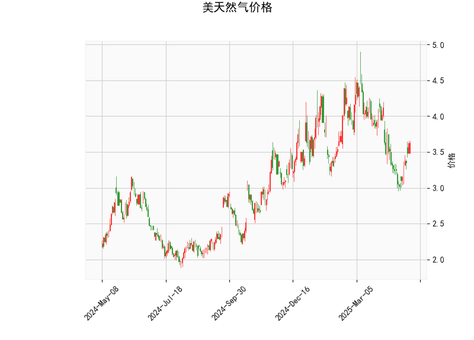

### 美天然气价格的技术分析结果分析

#### 1. 对技术指标的详细分析
基于提供的美天然气价格数据（当前价为3.626），我们对各个技术指标进行逐一解读，以评估市场趋势和潜在信号。

- **RSI（Relative Strength Index，相对强弱指数）**: 当前RSI值为55.24。这表明市场处于中性区域（RSI通常在30-70范围内），略高于50的中轴线，暗示短期内价格可能有轻微的上行势头，但尚未进入超买状态（RSI >70）。这反映出买方力量在逐渐增强，但整体动能仍需进一步确认。

- **MACD（Moving Average Convergence Divergence，移动平均收敛散度）**: MACD线为-0.0777，信号线为-0.1496，直方图为0.07197。正直方图值表明MACD线正在向上接近信号线，这是一个潜在的看涨信号（金叉可能即将出现）。然而，MACD线目前仍为负值，意味着短期内可能存在一些下行压力，但整体趋势正从弱势转向中性。如果MACD线成功交叉信号线，将可能强化多头信号。

- **Bollinger Bands（布林带）**: 
  - 上带（Upper Band）：4.621
  - 中带（Middle Band）：3.809
  - 下带（Lower Band）：2.998
  当前价格3.626位于中带附近（略低于中带），这表明价格处于波动区间的中心，市场相对稳定，没有明显的突破或逆转信号。价格远离上带，意味着尚未超买；同时，距离下带较远，短期内下行风险较低。如果价格向上突破中带并接近上带，可能预示上行趋势；反之，向下触及下带则可能触发卖出。

- **K线形态**: 形态包括“CDLBELTHOLD”（腰带持有形态）和“CDLLONGLINE”（长线形态）。
  - “CDLBELTHOLD”通常是一个看涨模式，表示市场强势，价格可能在短期内维持或反弹，常见于趋势延续阶段。
  - “CDLLONGLINE”暗示较大的价格波动，可能反映出市场不确定性或强势拉升/跳水。结合当前指标，这两个形态整体偏向中性偏多，建议关注后续K线确认信号。

总体而言，技术指标显示美天然气价格处于中性偏看涨状态。RSI和MACD的信号较为积极，但Bollinger Bands的中心位置表明市场波动有限。短期内，价格可能小幅上行，但需警惕全球能源需求、地缘政治等外部因素干扰。

#### 2. 近期可能存在的投资或套利机会和策略判断
基于上述分析，我们评估近期投资（交易）和套利机会。当前市场信号中性偏多，但不确定性较高，因此策略应以风险控制为主。以下是关键机会和建议：

- **投资机会评估**:
  - **潜在上行机会**: RSI接近强势区、MACD直方图正值以及K线形态的看涨暗示，短期内（如1-2周）可能存在价格反弹机会，尤其是如果全球天然气需求上升（如冬季取暖需求）。当前价3.626低于中带3.809，提供了相对低位的买入点。
  - **潜在下行风险**: 如果MACD线未成功交叉，或价格跌破下带2.998，则可能触发回调，特别是在经济放缓或供应过剩的背景下。
  - **总体判断**: 近期投资机会中等，适合短期交易者而非长期持有者。预计价格可能在3.50-4.50区间波动。

- **套利机会评估**:
  - **跨市场套利**: 美天然气与欧洲或亚洲天然气期货价格存在价差（如Henry Hub与TTF期货的差价）。当前美天然气价格相对稳定，如果全球价格波动加剧（如地缘事件导致欧洲价格上涨），可考虑跨市场套利策略，例如在美天然气低位买入，同时在高位市场卖出相关衍生品。但需注意当前价差不大（基于历史数据），短期套利机会有限。
  - **技术套利**: 利用Bollinger Bands的波动性进行区间套利。例如，在价格接近下带时买入，在接近上带时卖出。RSI和MACD的交叉信号可作为触发点，但全球市场联动性强，需结合基本面（如OPEC动态）。

- **推荐策略**:
  - **买入策略**: 如果MACD线向上交叉信号线（看涨金叉）并价格突破中带3.809，可考虑在3.50-3.70区间买入多头头寸。目标位设在中带以上（如4.00附近），止损置于下带2.998以下，以控制风险。
  - **卖出策略**: 若RSI升至70以上或价格未突破上带，建议观望或轻仓卖出空头。短期内，如果K线形态显示弱势（如新低点出现），可考虑在3.80以上卖出。
  - **套利策略**: 采用“均值回归”套利——在价格偏离Bollinger Bands中带时进行反向交易。例如，低位买入后等待回归中带获利。结合期权合约，可构建保护性套利（如买入看涨期权、卖出看跌期权），以应对波动。
  - **风险管理建议**: 所有策略需设置严格止损（例如5%损失阈值），并监控宏观因素（如天气、库存数据）。资金分配应不超过总仓位的20%，优先选择流动性强的交易所（如CME）。如果市场无明显信号，建议持有现金观望。

总之，近期美天然气市场存在小幅投资机会，但套利空间有限。投资者应结合实时数据和基本面进行调整，避免过度杠杆。保持谨慎，关注后续指标变化。