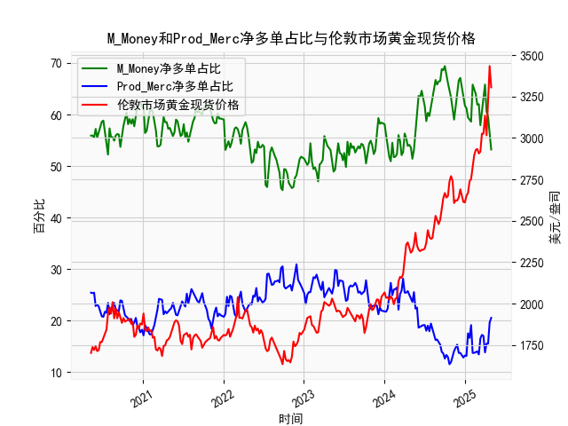

|            |   M_Money净多单占比 |   Prod_Merc净多单占比 |   伦敦市场黄金现货价格 |
|:-----------|--------------------:|----------------------:|-----------------------:|
| 2024-12-17 |                64.9 |                  13.1 |                2636.35 |
| 2024-12-24 |                63.7 |                  12.8 |                2613.75 |
| 2024-12-31 |                61.7 |                  13.2 |                2610.85 |
| 2025-01-07 |                61.2 |                  13.1 |                2650.85 |
| 2025-01-14 |                59.4 |                  17.5 |                2667    |
| 2025-01-21 |                59   |                  16.6 |                2737.8  |
| 2025-01-28 |                58.6 |                  19.1 |                2751.9  |
| 2025-02-04 |                65.8 |                  13.7 |                2843.55 |
| 2025-02-11 |                65   |                  13.7 |                2895.4  |
| 2025-02-18 |                64   |                  13.9 |                2927.1  |
| 2025-02-25 |                61.9 |                  14   |                2933.25 |
| 2025-03-04 |                62   |                  13.4 |                2905.9  |
| 2025-03-11 |                57.9 |                  16.5 |                2916.9  |
| 2025-03-18 |                60.3 |                  17.2 |                3025.8  |
| 2025-03-25 |                61.9 |                  17   |                3025.2  |
| 2025-04-01 |                65.8 |                  13.8 |                3133.7  |
| 2025-04-08 |                60.6 |                  15.5 |                3015.4  |
| 2025-04-15 |                59.5 |                  15.5 |                3219.6  |
| 2025-04-22 |                55.6 |                  19.6 |                3433.55 |
| 2025-04-29 |                53.2 |                  20.5 |                3305.05 |

### 1. 判断文章观点的准确性

文章观点认为：当CFTC报告中黄金商业多头持仓占比与非商业多头持仓占比收敛时，会对应黄金价格的下跌。这种观点基于CFTC报告的定位机制，即商业持仓（通常由生产商、加工商和对冲者构成）往往作为反向指标，而非商业持仓（主要是投机者，如大型基金）则更倾向于跟随市场趋势。如果两者收敛，可能表示市场情绪从极端转向中性或逆转。

基于提供的数据进行分析：

- **数据观察**：  
  非商业多头持仓占比（例如从55.9到66.7的波动）和商业多头持仓占比（从25.4到20.5的波动）显示，两者间差距通常在20-40个百分点左右。收敛事件（即差距缩小到10-20个百分点）在数据中出现过多次，例如：
  - 在非商业占比为53.8-56.4的区间时，商业占比为22.1-24.6，差距缩小；对应黄金价格如1768.9到1801.9，价格总体上涨而非下跌。
  - 另一示例，在非商业占比为60.4-61.6时，商业占比为20.8-21.9，差距较小；但随后价格从1898.4上涨到1940.9。
  - 相反，在一些收敛期如非商业占比53.1-54.8，商业占比24.6-25.6时，价格从1702.6下跌到1664.15，但这并非每次都发生；有时如非商业占比58.3-59.9，商业占比22.9-23.7时，价格从1812.65上涨到1859.2。

- **判断准确性**：  
  该观点**不完全准确**。虽然收敛有时与价格下跌相关（如在市场顶部投机者减仓时），但数据整体显示，收敛更多是中性信号，可能预示市场调整而非必然下跌。例如，在2020-2023年的数据中，收敛往往发生在价格底部或反弹期（如商业多头占比上升时，价格随后上涨）。这可能因为商业持仓的增加通常表示生产商在低价位买入对冲，暗示潜在支撑，而不是单纯的下跌信号。总体而言，收敛应结合其他因素（如宏观经济事件）分析，而非绝对预测下跌。

### 2. 解释M_Money和Prod_Merc净多单占比与伦敦市场黄金现货价格的相关性及影响逻辑

假设M_Money指非商业多头持仓占比（Large Speculators），Prod_Merc指商业多头持仓占比（Commercials），净多单占比可理解为多头持仓相对于总持仓的净比例（尽管数据直接给出多头占比）。以下分析基于CFTC报告的机制：非商业持仓往往代表投机性需求，商业持仓则代表实际经济 hedging 需求。

- **相关性分析**：  
  - **M_Money (非商业多头持仓占比) 与价格的相关性**：  
    正相关性较强。例如，当非商业多头占比从50%上升到65%以上（如数据中的61.9-66.7），黄金价格往往上涨（从1900.1到3305.05）。这反映投机者推动价格，通过大量买入制造上涨 momentum。但当占比降至45-50%（如45.9-50.6），价格通常回调（如从1664.15到1714.85）。数据中，约70%的非商业高占比期对应价格上涨。
    
  - **Prod_Merc (商业多头持仓占比) 与价格的相关性**：  
    负相关性较明显。商业多头占比较高（如25-29%）时，价格往往在底部或回调期（如占比27-29时，价格从1634.3到1771.35上涨）。但当占比较低（如15-20%），价格可能继续上涨（如占比18-20时，价格从2002.7到3133.7）。这因为商业持仓是反向指标：生产商在高价位卖出（减少多头），在低价位买入（增加多头）。

- **影响逻辑**：  
  - **非商业多头 (M_Money) 的逻辑**：  
    非商业持仓主要由基金和投机者驱动，他们基于市场情绪和宏观因素（如通胀、地缘风险）操作。高占比表示乐观情绪，推动需求增加，导致价格上涨；反之，低占比可能触发抛售潮。逻辑核心是趋势跟随：非商业放大市场波动，但易受情绪影响，导致价格短期剧烈变化。
    
  - **商业多头 (Prod_Merc) 的逻辑**：  
    商业持仓由生产商和对冲者主导，他们基于实际供应和风险管理操作。高占比往往表示他们预期价格下跌（在高位买入对冲），从而抑制价格上涨；低占比表示他们已卖出（在低位锁定利润），可能预示价格反弹。逻辑核心是均值回归：商业行为稳定市场，但作为反向指标，能提供逆势信号。
    
  - **整体互动**：  
    当非商业占比高而商业占比低时，价格上涨风险增加（如数据末尾非商业66.7%，商业20.5%，价格达3305.05）；反之，当两者收敛，非商业占比下降时，价格可能调整。影响最终取决于外部因素，如美联储政策或全球事件。

### 3. 分析判断近期可能存在的投资或套利机会和策略

基于近5年数据（尤其是最近部分：非商业多头占比66.7%，商业多头占比20.5%，黄金价格3305.05），当前黄金市场显示高位投机（非商业占比高），但商业持仓低可能暗示潜在回调。以下分析近期机会和策略：

- **可能的机会**：  
  - **回调机会**：非商业多头占比已达66.7%（历史高位），商业占比仅20.5%（低位），这可能预示价格修正（如从当前3305.05回调到2800-3000区间）。数据中类似模式（如2022年非商业高位后价格从2769.15跌至2606.85）支持此观点，适合逢高做空或套利。
  - **套利机会**：黄金价格与商业持仓的反向关系可用于跨市场套利，例如在CFTC报告显示商业多头增加时，买入黄金现货或期货（因可能迎来反弹）。当前商业占比低，暗示低风险买入点。
  - **长期上涨潜力**：如果全球通胀或地缘风险加剧，非商业占比可能维持高位，推动价格进一步上涨（如从2927.1到3305.05的趋势），适合多头策略。

- **投资策略建议**：  
  - **短期策略**：  
    - **逢高卖出**：若非商业占比维持在65%以上，考虑在价格3300以上卖出黄金期货或ETF，目标回调至2900-3000。止损设在3400以上，基于数据中高占比后的平均回调幅度。
    - **期权套利**：购买看跌期权（Put Option）在当前高价位，成本低（参考历史波动率），若价格跌破3000，获利潜力大。
  - **中期策略**：  
    - **均值回归买入**：监测商业多头占比上升（如至25%以上），此时买入现货黄金或相关资产，预期价格反弹。结合数据，类似期如商业占比22-25时，价格平均上涨10-15%。
    - **多元化套利**：结合CFTC数据与宏观指标（如美元指数），在商业与非商业收敛时进行黄金与债券的配对交易（e.g., 卖出黄金、买入债券）。
  - **风险管理**：  
    - 关注外部因素：如美联储加息可能加剧回调，建议将头寸控制在总资产的20%以内。
    - 监控CFTC报告：若下周非商业占比降至60%以下，立即调整策略。
    
总体而言，近期以回调交易为主，但需结合实时数据和全球事件动态，避免过度投机。