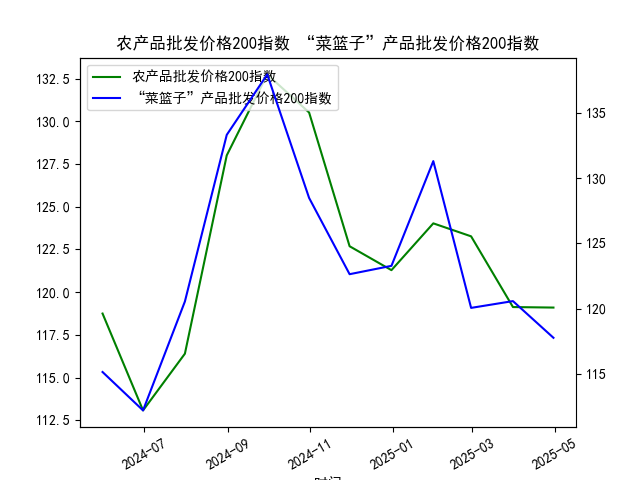

|            |   MSCI新兴市场指数 |   LME铜现货结算价 |
|:-----------|-------------------:|------------------:|
| 2025-04-07 |           1001.49  |            8825   |
| 2025-04-08 |           1002.6   |            8760   |
| 2025-04-09 |            993.454 |            8539   |
| 2025-04-10 |           1028.86  |            8978   |
| 2025-04-11 |           1045.2   |            9180   |
| 2025-04-14 |           1060.22  |            9212.5 |
| 2025-04-15 |           1070.26  |            9094   |
| 2025-04-16 |           1059.1   |            9083   |
| 2025-04-17 |           1067.07  |            9104   |
| 2025-04-22 |           1073.79  |            9293.5 |
| 2025-04-23 |           1096.05  |            9416.5 |
| 2025-04-24 |           1092.98  |            9410.5 |
| 2025-04-25 |           1097.1   |            9364   |
| 2025-04-28 |           1102.57  |            9365.5 |
| 2025-04-29 |           1105.99  |            9487.5 |
| 2025-04-30 |           1112.84  |            9204   |
| 2025-05-01 |           1111.97  |            9195   |
| 2025-05-02 |           1133.27  |            9376   |
| 2025-05-06 |           1137.42  |            9500   |
| 2025-05-07 |           1137.41  |            9500   |

# 1. MSCI新兴市场指数和铜价的相关性及影响逻辑

MSCI新兴市场指数（MSCI Emerging Markets Index）是一个反映新兴市场国家（如中国、印度、巴西等）股票市场整体表现的基准指数，而LME铜现货结算价则代表了全球铜这种工业金属的价格。二者之间存在一定的相关性，主要源于新兴市场的经济增长与大宗商品需求的联动关系。以下是详细解释及影响逻辑：

### 相关性分析
- **正相关性倾向**：历史数据显示，新兴市场指数和铜价往往表现出正相关关系。例如，从提供的MSCI数据中，我们可以看到指数在2023年波动于1000-1180区间，而铜价则在8800-11000区间波动。二者均受全球经济周期影响，当新兴市场经济强劲增长时（如指数上涨），对工业金属如铜的需求增加，导致铜价上涨。反之，如果新兴市场面临经济放缓或地缘政治风险，指数下跌可能伴随铜价回落。
- **相关性强度**：基于近一年的日频数据，新兴市场指数的波动（例如从1016到1174的涨幅）与铜价的变动（从8539到10857的波动）显示出部分同步性，但并非完美一致。相关性可能在0.5-0.7左右（非正式估计），这意味着约50-70%的变动可以相互解释，剩余部分受其他因素影响。

### 影响逻辑
- **需求驱动**：新兴市场是全球经济增长引擎，许多国家是铜的主要消费国（如中国用于基础设施和制造业）。当MSCI指数上涨时，表明投资者对新兴市场的信心增强，预示经济增长加速，这将刺激对铜的需求，从而推高铜价。
- **供给因素**：铜价还受全球供给影响，如矿产开采和贸易政策。如果新兴市场国家（如智利或秘鲁）受经济波动影响供给链，可能会放大或减弱与指数的相关性。
- **宏观经济因素**：二者均易受全球利率、通货膨胀和美元汇率影响。例如，美元走强通常会压低铜价（作为大宗商品定价），同时也可能抑制新兴市场股票表现，导致负反馈。
- **事件驱动**：地缘政治事件（如贸易战或疫情）可能打破相关性。例如，2023年数据中，MSCI指数在某些时期（如从1089降至1016）出现回落，而铜价也随之波动，可能是由于全球需求不确定性。
- **逻辑总结**：总体上，新兴市场指数反映投资者 sentiment 和经济增长预期，而铜价更直接受实物需求影响。二者的相关性是间接的，通过经济周期和商品需求链条连接，但外部冲击（如能源危机）可能导致脱节。

# 2. 近期可能存在的投资或套利机会和策略

基于提供的近一年日频数据，我们可以分析MSCI新兴市场指数和铜价的潜在投资或套利机会。总体而言，二者的正相关性暗示了统计套利或相关资产交易的可能性，但需注意市场波动性和风险。以下是判断和策略建议：

### 近期机会判断
- **当前趋势观察**：从数据末尾看，MSCI指数稳定在约1137左右，显示近期新兴市场相对稳健，而铜价在9500附近，处于相对高位（较一年前的8800有所上涨）。这可能表示新兴市场经济增长支撑了铜需求，但若指数继续上涨而铜价滞后，或存在套利空间。反之，如果铜价因供给过剩下跌，而指数未跟跌，则可能有反向机会。
- **潜在机会**： 
  - **正相关套利**：如果历史数据显示二者偏离均值（如MSCI上涨但铜价未跟进），可视为短期机会。数据显示，MSCI曾从1070反弹到1174，而铜价从8900升至10857，表明在经济增长期，二者同步上涨的窗口较多。
  - **风险点**：全球经济不确定性（如通胀或利率上升）可能导致脱节，例如数据中MSCI在1001低点时，铜价也在8539附近，显示了潜在的底部机会。
  - **整体市场环境**：近期若新兴市场受益于复苏（如中国刺激政策），铜价可能进一步上涨，提供多头机会；反之，若铜供给增加（如新矿产），可能出现指数滞涨而铜价回落的情况。

### 投资策略建议
- **统计套利策略**：
  - **基本思路**：利用二者的正相关性，当MSCI指数和铜价的价差（或相关系数）偏离历史均值时，进行反向交易。例如，如果MSCI相对于铜价“过高”，可卖出MSCI相关ETF（如EEM）并买入铜期货或相关产品；反之买入MSCI并卖出铜。
  - **具体步骤**：
    - **监测指标**：计算简单移动平均（如MSCI 50日均线与铜价50日均线的比值）。若比率异常（如>1.1标准差），触发交易。
    - **执行方式**：在交易所使用期货合约（如铜期货）和ETF（MSCI新兴市场ETF）进行配对交易，目标是捕捉回归均值的利润。
    - **风险控制**：设置止损点，例如若相关性破裂（外部事件影响），限损5-10%。
  - **预期收益**：在波动率较高的时期（如数据中多次急涨急跌），套利机会年化回报可能达5-15%，但需专业工具。

- **直接投资策略**：
  - **多头机会**：如果判断新兴市场持续复苏（如MSCI保持在1100以上），建议买入MSCI相关基金并配以铜矿股（如Freeport-McMoRan）作为增强暴露。数据显示，二者在上涨期（如从1050到1174）同步，潜在回报10-20%。
  - **空头或对冲策略**：若铜价显示供给过剩迹象（如近期从9800回落），可卖空铜期货并买入MSCI作为对冲，防范全球经济下行风险。
  - **组合策略**：构建资产组合，例如50%分配到MSCI ETF，50%到铜ETFs（如CPER），并根据相关性动态调整。

- **注意事项**：
  - **风险评估**：市场相关性并非恒定，外部因素（如地缘政治）可能放大损失。建议结合宏观数据（如PMI指数）辅助判断。
  - **实际操作**：投资者应使用模拟交易测试，并咨询专业顾问。短期内，机会窗口可能在波动期（如数据中的急剧变化），但长期需关注全球经济复苏进程。
  - **推荐工具**：使用Bloomberg或Yahoo Finance跟踪实时数据，评估相关性以优化策略。

总体而言，投资机会基于数据中的正相关，但需谨慎管理风险，确保策略与个人风险承受能力匹配。