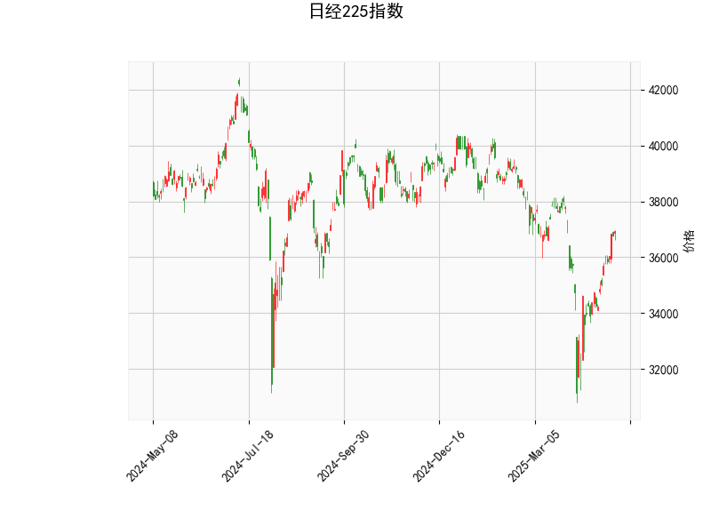

### 日经225指数技术分析结果分析

#### 1. 对技术指标的详细分析
基于提供的日经225指数数据，我们可以从多个技术指标入手，评估当前市场的态势。以下是对各指标的解读和整体市场状况的分析：

- **当前价格（Current Price）**: 日经225指数当前报价为36928.63。这一水平高于中长期平均值，表明指数处于相对强势的区间，但尚未触及历史高点（如布林带上轨）。这可能反映出近期市场乐观情绪，但也需警惕潜在回调风险。

- **RSI（Relative Strength Index，相对强弱指数）**: 当前RSI值为60.13。这是一个中性偏强的信号，通常RSI在70以上表示超买（可能即将回调），而在30以下表示超卖（可能即将反弹）。60.13的水平表明日经225指数最近几天有较强的买盘支撑，但尚未进入过度买入的区域。这暗示市场可能还有上行空间，但如果RSI继续上升，应密切关注超买风险。

- **MACD（Moving Average Convergence Divergence，移动平均收敛散度）**: 
  - MACD线值为206.30，信号线值为-193.01，MACD直方图（Histogram）值为399.31。
  - MACD线高于信号线，且直方图为正值，这是一个典型的看涨信号，表明短期内多头力量占优，价格可能继续上涨。直方图的正值（399.31）反映了买入动量的增强，通常被视为短期买入机会。然而，如果MACD线开始回落，可能预示着动量减弱和潜在回调。

- **布林带（Bollinger Bands）**: 
  - 上轨（Upper Band）：40141.13
  - 中轨（Middle Band）：36425.84
  - 下轨（Lower Band）：32710.55
  - 当前价格（36928.63）位于中轨和上轨之间，接近上轨。这表明指数处于波动正常范围内的强势位置，通常暗示价格可能继续向上轨推进（看涨），但也存在向中轨回落的风险。如果价格突破上轨，可能触发进一步上涨；反之，若跌破中轨，则可能进入修正阶段。整体而言，布林带显示市场波动性适中，没有极端超买或超卖迹象。

- **K线形态（K线 Patterns）**: 该数组为空，意味着近期未观察到明显的K线形态（如锤子线、吞没模式或十字星）。这可能表示市场缺乏强烈的短期反转信号，趋势更依赖于其他指标的指引。目前的K线数据中性，建议结合其他指标进行决策。

**整体市场解读**: 从以上指标来看，日经225指数呈现出轻度看涨的态势。RSI和MACD都支持短期多头，布林带显示价格在合理波动范围内。日经225作为日本主要股指，其表现可能受全球经济复苏、日元汇率和日本央行政策影响。目前，指数的强势可能源于全球股市反弹和日本企业盈利改善，但需警惕地缘政治或通胀等外部因素导致的波动。

#### 2. 近期可能存在的投资或套利机会和策略
基于上述技术分析，我们可以判断日经225指数的潜在机会。以下是针对短期（1-3个月）和中期的投资或套利策略建议。请注意，市场充满不确定性，实际操作应结合风险管理（如止损设置）和个人财务状况。

##### 潜在投资机会
- **看涨机会**: 
  - MACD的正直方图和RSI的温和强势表明，指数可能继续上行，目标指向布林带上轨（约40141.13）。如果全球股市保持乐观（如美联储降息预期），日经225有潜力测试新高。
  - **推荐策略**: 考虑买入日经225指数ETF（如EWJ或相关衍生品），或选择日本蓝筹股（如Toyota或Sony）。入场点可设在当前价附近，目标价位设为38000-40000。短期持有，预计回报率5-10%。

- **回调机会（均值回归）**:
  - 价格接近布林带上轨，RSI若升至65以上，可能引发小幅回调（回落到中轨36425.84附近）。这为逢低买入提供机会。
  - **推荐策略**: 如果RSI超过65，采用“买进回调”策略：在回调确认时（e.g., 价格跌破37000）买入，止损设在中轨下方（约36000）。这适合风险厌恶型投资者，潜在回报为3-5%。

##### 套利策略建议
套利策略通常利用市场 inefficiencies或相关资产间的价差，以降低风险。基于当前数据，以下列出可行的选项：
- **跨市场套利**: 日经225与全球股指（如纳斯达克或恒生指数）相关性较高。如果日经225相对 undervalued（如当前价未跟上全球涨势），可通过“指数差价套利”操作。例如，买入日经225 ETF的同时卖出空头头寸的全球股指期货，待价差收窄获利。预计机会窗口在短期波动中，潜在收益2-4%。
  
- **期权套利**: 利用布林带的波动性，构建“牛市价差期权策略”。例如，买入日经225看涨期权（strike price 37000）和卖出更高strike的看涨期权（e.g., 40000）。如果价格向上突破上轨，收益可放大；若回调，损失有限。风险较低，适合经验丰富的投资者。

- **趋势跟随套利**: 基于MACD的看涨信号，采用“动量跟踪”策略。买入日经225指数期货或CFD，同时设置动态止盈（e.g., 跟踪RSI变化）。如果MACD直方图保持正值，可在上涨中逐步获利平仓。潜在风险：若市场逆转（如经济数据不佳），需快速退出。

##### 风险与注意事项
- **风险因素**: 日经225易受日元贬值、全球通胀或日本国内政策影响（如利率变动）冲击。如果RSI突破70，MACD直方图转负，或价格跌破中轨，可能触发卖出信号。
- **总体建议**: 采用多元化组合（如结合现金或债券 hedging），并监控关键事件（如日本央行会议）。初学者应从模拟交易开始，避免全仓操作。实际投资前，咨询专业顾问以获取最新数据。