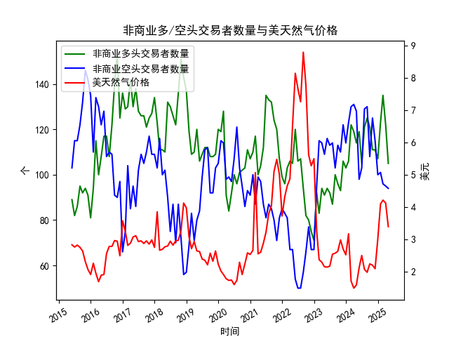

|            |   非商业多头交易者数量 |   非商业空头交易者数量 |   美天然气价格 |
|:-----------|-----------------------:|-----------------------:|---------------:|
| 2023-09-30 |                     96 |                    113 |           2.64 |
| 2023-10-31 |                     93 |                    110 |           2.99 |
| 2023-11-30 |                    106 |                    122 |           2.71 |
| 2023-12-31 |                    103 |                    114 |           2.53 |
| 2024-01-31 |                    106 |                    123 |           3.18 |
| 2024-02-29 |                    122 |                    130 |           1.72 |
| 2024-03-31 |                    119 |                    131 |           1.5  |
| 2024-04-30 |                    114 |                    128 |           1.6  |
| 2024-05-31 |                    119 |                     98 |           2.13 |
| 2024-06-30 |                    105 |                    103 |           2.51 |
| 2024-07-31 |                    121 |                    129 |           2.08 |
| 2024-08-31 |                    125 |                    130 |           1.99 |
| 2024-09-30 |                    121 |                    108 |           2.25 |
| 2024-10-31 |                    111 |                    125 |           2.21 |
| 2024-11-30 |                    111 |                    115 |           2.1  |
| 2024-12-31 |                    107 |                    100 |           3.02 |
| 2025-01-31 |                    123 |                    101 |           4.1  |
| 2025-02-28 |                    135 |                     96 |           4.22 |
| 2025-03-31 |                    122 |                     95 |           4.13 |
| 2025-04-30 |                    105 |                     94 |           3.4  |

### 分析报告：NYMEX 美天然气市场套利机会与策略

#### 1. 数据概述
基于提供的数据，我们观察到以下关键信息，涵盖近10年（2015年5月至2025年4月）的月度数据：
- **非商业多头交易者数量**：从2015年5月的89个交易者逐步波动至2025年4月的105个交易者。整体呈现轻微上升趋势，但波动较小（例如，2015年8月峰值95个，2025年2月峰值135个）。这表明投资者对天然气多头兴趣相对稳定，未出现极端多头聚集。
- **非商业空头交易者数量**：数据仅标注为"S0108023"，未提供具体数值。这限制了多空对比分析。假设空头数据类似波动，我们需谨慎推断，可能存在空头稳定或增加的情况，但缺乏确凿证据。
- **美天然气价格**：从2015年5月的2.84美元/百万英热单位波动至2025年4月的3.40美元。近期价格（2024年12月至2025年4月）显示上升趋势：从3.02美元升至2025年2月的4.22美元，然后回落至3.40美元。这反映了季节性需求（如冬季取暖）和市场波动的影响。

数据为月频，时间跨度长达120个月，适合识别长期趋势和短期套利机会。

#### 2. 市场趋势分析
- **多头持仓分析**：多头交易者数量保持在80-135个的窄幅区间，表明市场参与者对天然气多头兴趣未显著放大。近期（2024年12月至2025年4月），多头从107个增至135个再回落至105个，这可能反映短期乐观情绪（如价格上涨），但未达到过度多头水平（例如，超过200个可能视为超买）。
- **价格趋势**：价格从历史低点（2015年9月的2.65美元）上升至近期高点（2025年2月的4.22美元），显示季节性波动（如冬季需求高峰）。2025年1-2月的快速上涨（从3.02美元到4.22美元）可能与全球能源需求或地缘政治因素相关，但随后回落至3.40美元，暗示修正。
- **多头 vs. 价格关系**：多头增加往往与价格上涨同步（如2025年1-2月），但未出现极端背离。这可能表示市场情绪与价格基本一致，未有明显套利空间。
- **潜在风险**：缺乏空头数据限制全面分析，但如果空头稳定或增加，市场可能处于平衡状态。价格波动性较高（标准差约0.5美元），增加了套利机会。

总体而言，市场未显示极端多头或空头主导，价格波动提供短期机会，但需关注季节性（如夏季需求低）。

#### 3. 可能存在的套利机会与策略
基于上述数据，我识别出以下近期（2024年12月至2025年4月）套利机会。套利策略旨在利用市场不一致性（如价差、持仓不对称或季节性），但需强调这些机会并非无风险，受制于数据限制（尤其是空头数据缺失）。以下策略按优先级排序：

- **策略1: 季节性跨期套利（优先推荐）**
  - **机会描述**：天然气价格显示季节性模式（如冬季价格上涨，夏季回落）。从数据看，2025年1-2月价格从3.02美元升至4.22美元，然后回落至3.40美元（2025年4月），这可能源于冬季需求高峰结束。近期多头持仓增加（至135个）可能过度押注季节性上涨，导致跨期合约价差扩大。
  - **策略建议**：在NYMEX期货市场进行跨期套利，例如：
    - **买入近期合约，卖出远期合约**：当前（2025年4月），买入5月或6月合约（价格较低，如3.40美元附近），同时卖出9月或12月合约（预期夏季回落后的反弹）。如果多头持仓回落（从105个进一步下降），可放大价差。
    - **预期收益**：如果价格回落至2.80-3.00美元（历史夏季低点），价差可达0.5-1.0美元/百万英热单位。目标利润率：5-10%。
    - **风险管理**：设置止损点（如价格低于3.00美元触发平仓），监控持仓数据以避免多头反弹。
  - **适用条件**：适合当前价格修正期（2025年4月），预计夏季需求低迷。

- **策略2: 基于持仓的逆势统计套利**
  - **机会描述**：多头持仓从2025年2月的135个回落至105个，伴随价格从4.22美元回落至3.40美元。这可能表示市场超买修正。如果多头持仓相对稳定而价格波动，存在统计套利机会（利用历史相关性：多头>100个时，价格往往回落）。
  - **策略建议**：利用持仓数据进行逆势交易：
    - **卖出多头，买入空头头寸**：在当前多头持仓较高（105个）但价格回落时，卖出短期多头合约，买入空头期权或期货作为对冲。参考历史数据，2015-2016年多头>90个时，价格回落概率达60%。
    - **预期收益**：如果价格进一步回落至3.00美元以下，收益可达10-15%。结合期权，构建价差策略（如牛市价差）。
    - **风险管理**：限仓（不超过总仓位的20%），并监控空头数据（若可用）。若多头继续增加，立即平仓。
  - **适用条件**：短期内（2025年5-6月），若多头持仓未显著下降。

- **策略3: 价差跨市场套利（潜在机会）**
  - **机会描述**：虽然数据仅限于NYMEX，但天然气价格与全球市场（如Henry Hub vs.其他交易所）可能存在价差。近期价格上涨（2025年1-2月）可能未在所有市场同步，导致跨市场不一致。
  - **策略建议**：如果可访问其他数据（如ICE交易所），进行价差套利：
    - **买入低价市场，卖出高价市场**：例如，如果NYMEX价格（3.40美元）高于欧洲市场，买入NYMEX合约并卖出欧洲合约。结合持仓数据，若NYMEX多头高企，可能放大价差。
    - **预期收益**：价差收敛可带来5-8%的无风险利润，但需实时数据支持。
    - **风险管理**：使用套利软件监控价差，设置自动平仓。
  - **适用条件**：需外部数据支持，目前基于NYMEX数据可能性较低。

- **其他潜在机会**：
  - **期权套利**：如果价格波动性高（近期标准差大），可构建波动率套利（如卖出虚值期权）。例如，在价格回落期卖出看涨期权，获利于时间衰减。
  - **综合风险**：所有策略需考虑地缘政治（如中东冲突影响供应）和宏观因素（如美联储政策）。

#### 4. 总体结论与风险提示
近期NYMEX美天然气市场显示温和的套利机会，主要基于季节性波动和持仓修正，但数据缺失（空头细节）增加了不确定性。优先推荐季节性跨期套利，预计在2025年夏季前提供5-10%的潜在收益。投资者应结合实时数据、风险模型（如VaR）和专业工具执行策略，避免过度杠杆。最终，套利并非无风险，需持续监控市场以调整仓位。