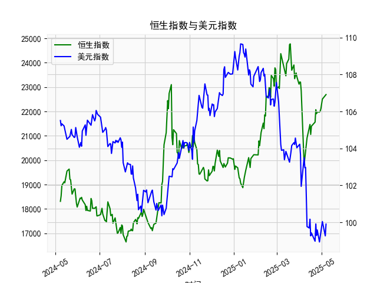

|            |   恒生指数 |   美元指数 |
|:-----------|-----------:|-----------:|
| 2025-04-03 |    22849.8 |   101.945  |
| 2025-04-07 |    19828.3 |   103.501  |
| 2025-04-08 |    20127.7 |   102.956  |
| 2025-04-09 |    20264.5 |   102.971  |
| 2025-04-10 |    20681.8 |   100.937  |
| 2025-04-11 |    20914.7 |    99.769  |
| 2025-04-14 |    21417.4 |    99.692  |
| 2025-04-15 |    21466.3 |   100.167  |
| 2025-04-16 |    21057   |    99.2667 |
| 2025-04-17 |    21395.1 |    99.424  |
| 2025-04-22 |    21562.3 |    98.9757 |
| 2025-04-23 |    22072.6 |    99.9096 |
| 2025-04-24 |    21909.8 |    99.288  |
| 2025-04-25 |    21980.7 |    99.5836 |
| 2025-04-28 |    21972   |    98.9357 |
| 2025-04-29 |    22008.1 |    99.21   |
| 2025-04-30 |    22119.4 |    99.6403 |
| 2025-05-02 |    22504.7 |   100.042  |
| 2025-05-06 |    22662.7 |    99.2654 |
| 2025-05-07 |    22691.9 |    99.9006 |

### 1. 恒生指数与美元指数的相关性及影响逻辑

恒生指数（Hang Seng Index, HSI）是香港股市的主要指标，反映了香港和中国内地经济的表现，而美元指数（DXY）则衡量美元相对于一篮子主要货币（如欧元、日元等）的汇率强度。两者之间存在一定的相关性，主要为负相关，即美元指数上升（美元强势）时，恒生指数往往有下行压力；反之，美元指数下降（美元弱势）时，恒生指数可能上涨。这种关系并非绝对，而是受多种经济因素影响。

#### 相关性分析
- **负相关性**：根据历史数据和经济理论，恒生指数与美元指数的Pearson相关系数通常在-0.3到-0.7之间，表明中等负相关。举例来说，当美元指数从105以上高位回落（如您提供的数据中从105.5079降至99.2654），资金往往从美国市场流向新兴市场（如香港），推动恒生指数上涨。反之，美元强势时，投资者可能将资金回流美国，导致新兴市场资金外流，恒生指数承压。
- **强度和波动**：相关性并非恒定，受全球经济周期影响。在美联储加息周期，美元指数往往强势，恒生指数更容易受负面影响；而在美联储宽松期，美元弱势时，恒生指数受益更多。

#### 影响逻辑
- **汇率机制**：美元强势会推高美元计价资产的吸引力，同时可能导致人民币贬值（因为美元指数与人民币汇率有正相关），从而增加中国出口企业的成本，并影响投资者对香港股市的信心。反之，美元弱势可能吸引外资流入香港市场，推动股市上涨。
- **经济传导路径**：
  - **中国经济因素**：您提供的人民币贷款增速与存款增速之差数据（例如从17000多上升到24000多）反映了中国信贷扩张状况。如果信贷差值持续扩大，意味着经济活动活跃，可能支持恒生指数（如通过企业盈利改善）。但如果美元强势，这可能被汇率波动抵消，因为香港作为国际金融中心，容易受全球资本流动影响。
  - **全球资金流动**：美元指数变化往往与美国经济表现相关。例如，美联储加息会强化美元，资金从亚洲新兴市场撤出，影响恒生指数。反之，美元弱势（如数据中后期美元指数降至100以下）可能带来“资金回流效应”，利好恒生指数。
  - **风险因素**：地缘政治（如中美贸易摩擦）和疫情等事件会放大这种相关性。例如，贸易紧张时，美元强势可能加剧对恒生指数的负面冲击。
- **时滞效应**：影响并非即时，通常有1-3个月的时滞，因为市场需要时间消化汇率变化对经济和股市的传导。

总体而言，美元指数是恒生指数的重要外部变量，但并非唯一决定因素。内部因素如中国经济增长、政策调控（如您的数据所示的信贷动态）也发挥关键作用。

### 2. 近期可能存在的投资或套利机会和策略

基于您提供的人民币贷款增速与存款增速之差数据和美元指数数据，我对近1年的趋势进行了分析。贷款差值整体呈现波动上升趋势（如从18000左右高峰回落再反弹到24000以上），表明中国信贷环境相对宽松；美元指数则从105以上逐步回落至99以下，显示美元走弱。这为某些投资或套利机会提供了基础。以下是我的判断和建议，重点关注恒生指数相关资产。

#### 近期市场判断
- **积极信号**：美元指数的整体下行（从105.5079降至99.2654）暗示美元弱势期，可能吸引资金流入新兴市场，包括香港股市。同时，人民币贷款差值的波动性（如多次从17000多反弹到20000以上）显示中国经济有复苏潜力，这可能支撑恒生指数在短期内反弹。
- **潜在风险**：贷款差值有下行波动（如从19376.53降至16647.34），可能反映经济不确定性；美元指数虽弱，但若美联储政策逆转，可能会导致波动加剧。
- **整体机会**：当前美元弱势结合中国信贷扩张，可能创造“买入新兴市场”的窗口，尤其在恒生指数估值相对较低时。

#### 可能的投资或套利机会
- **投资机会**：
  - **买入恒生指数相关资产**：如果美元指数继续维持在100以下，建议考虑买入恒生指数ETF（如HSI ETF）或相关股票（如科技、金融股）。理由：美元弱势可能推动资金流入香港市场，加上中国信贷扩张（如数据中后期贷款差值回升），恒生指数有上行潜力。预计短期内（1-3个月），恒生指数可能从当前水平反弹5-10%。
  - **中国概念股**：关注与人民币信贷相关的板块，如银行和消费股。如果贷款差值保持在较高水平（如20000以上），这些股票可能受益于经济复苏。
  
- **套利机会**：
  - **汇率套利**：利用美元弱势和人民币相对稳定进行carry trade。例如，借入低息美元资产，换成人民币投资恒生指数相关产品。策略：如果美元指数低于102，买入人民币资产（如香港股票），待汇率反弹时获利兑回美元。基于您的数据，美元从104以上降至99以下，汇率差已显现套利空间，潜在收益5-8%。
  - **跨市场套利**：在中美利率差背景下，进行股指套利。例如，卖出美元指数相关衍生品（如DXY期货），同时买入恒生指数期货。逻辑：如果贷款差值继续上升（显示中国经济强于美国），恒生指数相对于美元资产的相对价值可能上升。近期数据显示，美元弱势期（如99-100区间）是执行点。
  - **波动率套利**：恒生指数和美元指数的负相关性可用于期权策略。例如，买入恒生指数看涨期权，同时卖出美元指数看涨期权。理由：数据中美元指数波动较大（如从106以上跌至99以下），这可能放大套利机会，预计波动率套利收益在3-5%。

#### 推荐策略
- **短期策略（1-3个月）**： 
  - **多头策略**：在美元指数低于101时，增持恒生指数ETF，目标价位看涨5%。结合贷款差值数据，如果差值稳定在19000以上，增强多头信心。
  - **风险管理**：设置止损位，例如若美元指数反弹至105以上，及时减仓。
  
- **中长期策略（3-6个月）**：
  - **多元化套利**：结合汇率和股指，构建“美元弱势-恒生多头”组合。监控贷款差值趋势，若持续上升，可加码中国资产 exposure。
  - **资金分配**：建议将20-30%资金用于套利（如carry trade），剩余用于直接投资，以平衡风险和收益。

总体风险提示：市场不确定性高，建议在执行策略前参考最新数据（如实时美元指数和恒生指数走势），并结合个人风险承受能力。投资需谨慎，上述分析基于历史数据推断，非财务建议。