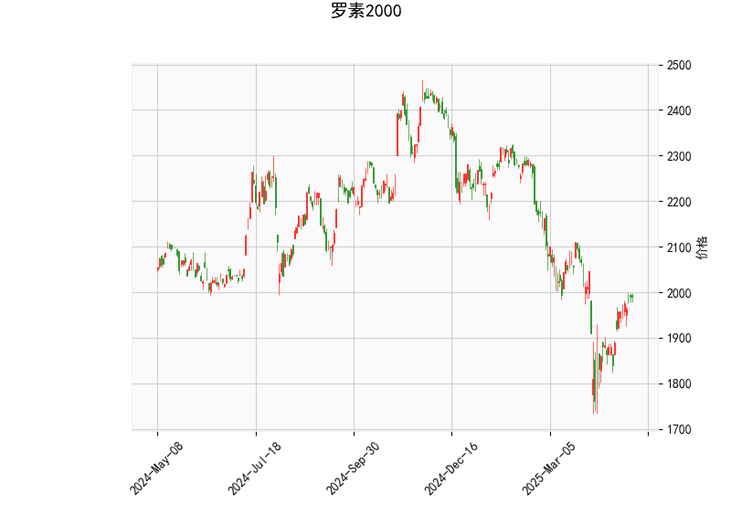

### 罗素2000指数技术分析结果解读

#### 1. 对技术分析结果的详细分析
基于提供的罗素2000指数数据，我们可以从多个技术指标入手，评估当前市场的动向。以下是对各指标的逐一分析：

- **当前价格（1989.6611）**: 当前价格处于Bollinger Bands的中轨（2024.3265）下方，但高于下轨（1778.1899）。这表明指数可能处于一个盘整或轻微看跌的阶段，价格尚未触及超卖区域，但也未出现强势反弹。如果价格继续接近中轨，可能预示着潜在的向上突破。

- **RSI（相对强弱指数，54.64）**: RSI值位于中性区间（30-70），具体偏向于轻微多头状态（高于50）。这显示市场目前没有明显的超买或超卖信号，短期内可能维持平衡。但如果RSI继续上升至70以上，将可能进入超买区域，提示潜在回调风险。

- **MACD（移动平均收敛散度）**: 
  - MACD线（-2.72）高于信号线（-21.65），且MACD直方图（18.93）为正值，这是一个看涨信号，表明短期内多头动能可能正在增强。尽管MACD线本身为负（表示整体趋势仍偏弱），但直方图的正值暗示了潜在的金叉（MACD线向上穿越信号线），这可能预示着反转或反弹机会。
  - 然而，需要警惕如果MACD线回落至信号线以下，将转为看跌。

- **Bollinger Bands（布林带）**:
  - 上轨（2270.4632）、中轨（2024.3265）和下轨（1778.1899）。
  - 当前价格位于中轨和下轨之间，这通常表示市场处于波动区间。价格远离上轨（未超买），但接近下轨区域，暗示可能存在支撑位。如果价格反弹至中轨以上，可能会测试上轨阻力；反之，若跌破下轨，可能触发进一步下行。

- **K线形态（['CDLMATCHINGLOW', 'CDLSPINNINGTOP']）**:
  - **CDLMATCHINGLOW（见底模式）**: 这是一个看跌后的潜在见底信号，通常出现在价格低点附近，暗示市场可能已触及短期底部，并可能酝酿反弹。但这需要后续K线确认。
  - **CDLSPINNINGTOP（陀螺顶部）**: 这是一个中性模式，表示市场不确定性较高，买卖力量均衡。常见于趋势转折点，可能预示盘整或方向不明朗的阶段。

总体而言，技术指标显示罗素2000指数当前处于一个中性偏多的状态。RSI和MACD的信号较为积极（潜在反弹），但Bollinger Bands和K线形态提醒了市场的波动性与不确定性。如果后续价格向上突破中轨，结合MACD金叉，可能形成短期多头趋势；反之，若价格下破下轨，可能会加剧看跌压力。

#### 2. 近期可能存在的投资或套利机会和策略判断
基于上述分析，罗素2000指数短期内可能存在一些投资机会，特别是反弹或套利空间，但需结合市场整体环境（如经济数据、利率变化）谨慎操作。以下是针对近期可能的机遇和策略的评估：

- **可能的投资机会**:
  - **反弹机会**: MACD直方图为正且K线形态显示见底迹象，暗示指数可能从当前水平反弹。如果RSI继续上升并维持在50以上，短期上涨概率较高。预计价格可能测试中轨（2024.33）或上轨（2270.46），这为多头投资者提供进场点。
  - **套利机会**: 由于罗素2000指数代表小型股，其波动性较高，可能存在基于衍生品（如期货或期权）的套利空间。例如，利用MACD的潜在金叉进行跨期套利（买入现货或期货，同时卖出看跌期权），或在Bollinger Bands收缩时进行波动率套利。但当前中性RSI和K线不确定性增加了风险，套利需等待更明确信号。
  - **风险点**: 如果全球经济放缓或利率上升，指数可能进一步下行，K线中的不确定性可能放大回调。

- **推荐的投资策略**:
  - **多头策略（买入持仓）**: 如果MACD线向上穿越信号线（金叉确认），建议在当前价格附近买入ETF或指数基金（如IWM），目标位设在中轨（2024.33）以上。止损位可设在下轨（1778.19）附近，以控制风险。结合RSI未超买，这适合短期交易者。
  - **盘整策略（区间交易）**: 鉴于K线形态的中性，采用区间操作：在价格接近下轨时买入，在接近中轨时卖出。这可以利用Bollinger Bands的波动性获利，但需监控RSI避免超买。
  - **套利策略（风险中性）**: 
    - **期权套利**: 买入看涨期权（Call）并卖出看跌期权（Put）组合，针对MACD潜在反弹。如果波动率较低（如当前价格在中轨以下），这可锁定收益。
    - **跨市场套利**: 比较罗素2000与大型股指数（如S&P 500）的价差，如果小盘股反弹更快，可能存在指数间套利机会。
  - **风险管理建议**: 所有策略应控制仓位（不超过总仓位的20-30%），并设置动态止损（如基于Bollinger Bands）。此外，结合基本面分析（如就业数据或通胀预期），避免单纯依赖技术信号。

总之，近期罗素2000指数的投资机会以短期反弹为主，策略应以趋势跟踪和风险控制为核心。但市场不确定性较高，建议投资者在执行前验证更多数据，并咨询专业顾问。