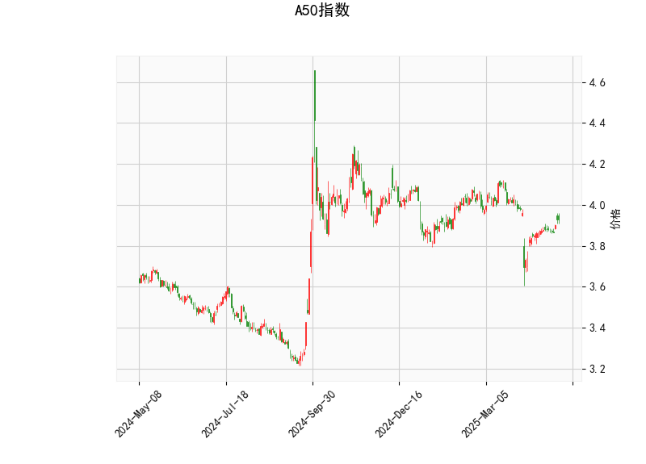

### A50指数技术分析结果分析

#### 1. 对技术分析结果的详细解读
基于提供的A50指数技术指标数据，我们可以从多个维度对其当前市场态势进行评估。以下是对关键指标的逐一分析：

- **当前价格（Current Price）**: A50指数当前价格为3.927。这表明指数处于相对稳定的区间，与中短期移动平均线（如布林带中轨）接近，暗示市场可能在盘整或酝酿方向性变化。

- **RSI（Relative Strength Index）**: RSI值为55.41，这是一个中性水平（RSI在50以上表示强势，但未达到70的超买阈值）。这意味着A50指数近期未出现过度买入或卖出行为，市场力量相对平衡，短期内可能维持震荡或缓慢上行。

- **MACD指标（Moving Average Convergence Divergence）**:
  - MACD线值为-0.0093（负值，表示短期均线低于长期均线）。
  - MACD信号线值为-0.0221（也为负值，但MACD线高于信号线）。
  - MACD直方图（Histogram）值为0.0128（正值），这表明MACD线正在上穿信号线（金叉信号），是一个潜在的看涨信号。总体上，MACD指标显示短期内可能有向上动能，但整体趋势仍需确认，避免假突破。

- **布林带（Bollinger Bands）**:
  - 上轨（Upper Band）：4.157
  - 中轨（Middle Band）：3.962
  - 下轨（Lower Band）：3.767
  当前价格（3.927）位于中轨附近，这反映出市场波动性适中，没有极端偏离（如价格未触及上轨或下轨）。中轨附近的价格位置通常表示盘整状态，如果价格向上突破上轨，可能预示强势上涨；反之，向下测试下轨可能引发回调。

- **K线形态（K线模式）**: 检测到"CDLMATCHINGLOW"模式，这是一种看涨K线形态，通常表示市场在低位形成匹配低点（两个连续的低点相似），暗示可能的底部反转或反弹信号。这与MACD的金叉信号相呼应，表明短期内存在向上修正的潜力。

总体而言，A50指数的技术面显示出中性偏多的态势。RSI和布林带表明市场未过度极端，而MACD和K线形态的看涨信号建议短期可能出现反弹。但需注意，指标尚未出现强烈确认（如RSI超买或价格突破上轨），因此市场仍可能维持盘整，投资者应警惕外部因素（如宏观经济数据或全球事件）的影响。

#### 2. 近期可能存在的投资或套利机会和策略判断
基于上述技术分析，我们可以推断A50指数的近期机会，主要聚焦于短期趋势交易和风险控制。以下是针对投资和套利的潜在机会及策略建议：

- **投资机会**:
  - **潜在多头机会**: MACD金叉和CDLMATCHINGLOW模式暗示短期反弹可能，因此A50指数相关资产（如ETF、期货或期权）存在买入机会。当前价格接近中轨，RSI中性水平提供了一个相对安全的入场点。如果价格向上突破布林上轨（4.157），可能触发更强的上行趋势，目标可设在4.200附近。
  - **风险点**: 若价格跌破下轨（3.767），可能转为空头，增加回调风险。近期机会主要适合短期投资者，预计1-2周内观察反弹。

- **套利机会**:
  - **跨期套利**: A50指数期货可能存在跨期价差机会。例如，如果近期合约价格低于远期合约，且技术面显示向上趋势，可以考虑买入近期合约并卖出远期合约，以捕捉价差收敛（尤其在MACD信号确认后）。
  - **期权套利**: 通过牛市价差策略（如买入看涨期权、卖出更高行权价的看涨期权），利用MACD和K线信号捕捉潜在上涨。当前波动率适中（从布林带宽度判断），这为低成本套利提供机会，但需监控RSI是否升至超买区以避免逆转。
  - **指数与个股套利**: 如果A50指数反弹，而其成分股（如科技或金融股）未跟进，可能出现股指与个股价差套利机会，例如买入指数期货并卖出相关个股。

- **推荐策略**:
  - **多头策略**: 在当前价格附近买入A50相关资产，设置止损在布林下轨（3.767）以下约5%的位置。目标位可设在中轨上方（4.000-4.200）。结合RSI监控，避免在超买区（RSI>70）加仓。
  - **风险控制策略**: 采用仓位管理，如总仓位不超过30%，并使用MACD直方图作为辅助信号（直方图保持正值时持仓）。如果K线形态进一步确认（如出现阳线），可适度加仓。
  - **套利策略**: 对于经验丰富的投资者，建议在低波动期执行跨期或期权策略，确保风险中性（如Delta中性）。总体上，近期策略应以短期为主，结合基本面（如中国经济数据）验证，避免单靠技术面决策。
  - **总体风险提示**: 技术信号虽看涨，但A50指数受全球市场影响较大（如美股波动或地缘事件），建议结合其他分析工具（如基本面或资金流向）使用，并保持灵活性。

总之，A50指数短期内可能存在小幅反弹的投资机会，但套利需谨慎操作。投资者应根据个人风险偏好调整策略，并持续监控市场动态。