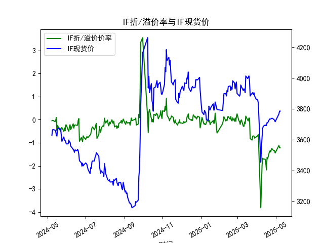
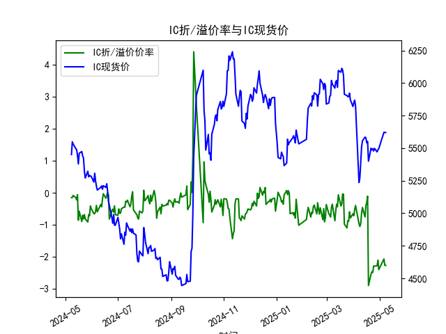
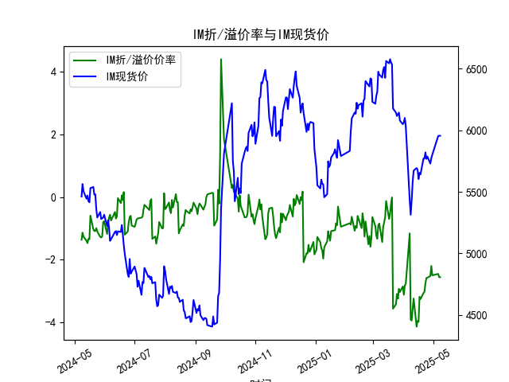

|            |   IF折/溢价率 |   IF现货价 |   IH折/溢价率 |   IH现货价 |   IC折/溢价率 |   IC现货价 |   IH折/溢价率 |   IH现货价 |
|:-----------|--------------:|-----------:|--------------:|-----------:|--------------:|-----------:|--------------:|-----------:|
| 2025-04-08 |      -2.92977 |     3543.8 |     -1.04965  |     5271   |     -1.04965  |     5271   |      -3.91353 |     5313.6 |
| 2025-04-09 |      -1.97446 |     3614   |     -0.96643  |     5387.2 |     -0.96643  |     5387.2 |      -3.9405  |     5429.6 |
| 2025-04-10 |      -1.663   |     3673   |     -0.632471 |     5509   |     -0.632471 |     5509   |      -3.56785 |     5578.2 |
| 2025-04-11 |      -1.70421 |     3686.6 |     -0.457211 |     5555.8 |     -0.457211 |     5555.8 |      -3.2409  |     5672.2 |
| 2025-04-14 |      -1.71162 |     3694.8 |     -0.752381 |     5584.8 |     -0.752381 |     5584.8 |      -4.13446 |     5693   |
| 2025-04-15 |      -1.88329 |     3690.4 |     -0.402211 |     5580   |     -0.402211 |     5580   |      -3.95041 |     5680.4 |
| 2025-04-16 |      -2.17398 |     3690.8 |     -0.296286 |     5540.4 |     -0.296286 |     5540.4 |      -3.98173 |     5603   |
| 2025-04-17 |      -1.63358 |     3710.6 |     -0.104562 |     5551.2 |     -0.104562 |     5551.2 |      -3.18113 |     5653.8 |
| 2025-04-18 |      -1.68913 |     3708.8 |     -2.89029  |     5400   |     -2.89029  |     5400   |      -3.25269 |     5642   |
| 2025-04-21 |      -1.36545 |     3733.2 |     -2.52696  |     5499.8 |     -2.52696  |     5499.8 |      -3.06818 |     5770   |
| 2025-04-22 |      -1.34653 |     3733   |     -2.45739  |     5486   |     -2.45739  |     5486   |      -3.02072 |     5769.6 |
| 2025-04-23 |      -1.39646 |     3734   |     -2.48358  |     5495   |     -2.48358  |     5495   |      -2.75012 |     5820   |
| 2025-04-24 |      -1.25668 |     3736.8 |     -2.28117  |     5478   |     -2.28117  |     5478   |      -2.58556 |     5767.4 |
| 2025-04-25 |      -1.26205 |     3739.2 |     -2.28499  |     5498.6 |     -2.28499  |     5498.6 |      -2.57433 |     5786.6 |
| 2025-04-28 |      -1.34913 |     3730.6 |     -2.27382  |     5471   |     -2.27382  |     5471   |      -2.51923 |     5729   |
| 2025-04-29 |      -1.33181 |     3724.8 |     -2.10005  |     5487.2 |     -2.10005  |     5487.2 |      -2.19842 |     5773.6 |
| 2025-04-30 |      -1.44197 |     3716.2 |     -2.39398  |     5497   |     -2.39398  |     5497   |      -2.49939 |     5801.4 |
| 2025-05-06 |      -1.11177 |     3766.2 |     -2.06144  |     5622   |     -2.06144  |     5622   |      -2.45329 |     5953.2 |
| 2025-05-07 |      -1.2169  |     3785   |     -2.26234  |     5620.2 |     -2.26234  |     5620.2 |      -2.55739 |     5955.2 |
| 2025-05-08 |      -1.2169  |     3785   |     -2.26234  |     5620.2 |     -2.26234  |     5620.2 |      -2.55739 |     5955.2 |

# 1. 股指期货折/溢价率与现货价的相关性及影响逻辑

股指期货的折/溢价率（Basis Percent）是期货价格相对于现货价格的百分比差异，通常通过公式（期货价格 - 现货价格）/现货价格来计算。负值表示期货折价（期货价格低于现货价格），正值表示溢价（期货价格高于现货价格）。以下分析其与现货价的相关性及影响逻辑：

### 相关性
- **正相关但非直接同步**：股指期货的折/溢价率与现货价存在动态相关性。现货价是期货定价的基础，因为期货本质上是现货的未来交割或现金结算形式。数据显示（如IF合约，现货价从3628.6上涨至3785.0），现货价波动往往会带动期货价格调整，从而影响折/溢价率。例如，在现货价上涨期间，如果期货价格跟涨不足，折价率可能加深；反之，现货价下跌时，期货折价率可能缩小。
- **短期波动性**：从提供的数据看，折/溢价率（如IH合约从-0.15%到-2.26%）与现货价（从5450.6到5620.2）均呈现波动性，但并非完全一致。相关性系数需通过具体数据计算（如相关分析），但总体上，折价率往往在现货价上涨时扩大（期货未能完全跟上），而在市场不确定性增加时加剧。
- **长期均衡**：理论上，折/溢价率应围绕零值波动，因为无风险套利机制（如正向或反向套利）会促使价格回归合理水平。但实际中，市场情绪、流动性等因素可能导致偏差。

### 影响逻辑
- **基本理论基础**：根据成本-收益模型，期货价格 = 现货价格 + 持有成本（包括融资利率、股息调整等） - 预期收益。折/溢价率的形成主要受以下因素影响：
  - **持有成本**：如果现货持有成本较高（如利率上升），期货可能折价，以反映未来持有现货的额外费用。
  - **市场预期**：现货价上涨可能源于乐观预期，但如果投资者对未来经济不确定（如通胀或政策风险），期货价格可能滞后，导致折价率扩大（如IC合约在2025年折价率达-2.39%）。
  - **流动性与供需**：期货市场流动性不足或大量卖空现货时，折价率可能加深；反之，现货市场波动大时，期货作为 hedging 工具的需求增加，可能缩小折价。
  - **宏观因素**：利率、股息率和市场情绪直接影响。数据显示，近期折价率整体加深（如IM合约从-1.36%到-2.56%），可能反映投资者对经济下行或政策变化的担忧，从而拉低期货价格。
- **影响路径**：现货价变动首先驱动期货价格调整，但折/溢价率的最终水平取决于套利行为的介入。如果折价过大，投资者可通过正向套利（买入期货、卖出现货）推动价格回归；溢价过大时，反向套利（买入现货、卖出期货）会起作用。这形成了一个反馈循环：现货价变化 → 期货定价调整 → 折/溢价率波动 → 套利行为 → 市场均衡。

总之，折/溢价率是现货价与期货价互动的晴雨表，反映了市场对未来预期的定价偏差。

# 2. 近期可能存在的投资或套利机会和策略

基于提供的数据（覆盖2024-05-08至2025-05-08，涉及IF、IH、IC和IM合约），折/溢价率整体为负且有加深趋势（如IF从-0.04%到-1.22%，IH到-2.26%），这表明期货价格普遍低于现货价格。以下分析近期投资或套利机会，并提出策略。

### 判断可能的机会
- **当前市场特征**：数据显示，折/溢价率在过去一年中逐步加深，尤其在2025年上半年（如2025-05-08，IM折价-2.56%）。这可能源于市场对经济放缓或政策不确定性的担忧，导致期货价格被低估。现货价虽有上涨（如IF从3628.6到3785.0），但期货未能充分跟进，形成套利空间。
- **潜在机会**：
  - **正向套利机会**：折价率过高（如IH和IC合约超过-2%）暗示无风险套利潜力。投资者可买入折价期货、卖出现货，待折价收窄获利。近期数据显示，折价率已从年初的-0.1%~-0.5%扩大到-1%~-2.5%，表明机会可能在短期内存在，但需警惕市场波动。
  - **投资机会**：如果折价率反映过度悲观情绪，现货价持续上涨（如IH现货从5450.6到5620.2）可能带动期货反弹，适合多头策略。但如果折价加深至异常水平（如IM-2.56%），这可能预示市场修正，带来短期反弹机会。
  - **风险因素**：折价率加深可能并非永久套利窗口，还受合约到期（需滚动）、市场流动性或突发事件影响。数据显示，折价趋势在2025年更明显，暗示短期内机会大于长期。

### 推荐策略
- **正向套利策略**：
  - **操作步骤**：针对折价率较高的合约（如IH或IM），买入期货合约（如IH 2025-05-08折价-2.26%），同时卖出等量现货。持有至折价率收窄（目标低于-1%），然后平仓获利。基于数据，IF和IM的折价率相对稳定，可优先考虑。
  - **风险控制**：设置止损阈值（如折价率扩大至-3%时退出），并监控合约到期日（避免交割风险）。资金管理上，分配10%-20%资金用于套利，以降低整体风险。
  - **预期收益**：从数据看，折价率波动较大（如IC从-0.22%到-2.39%），短期套利收益可能在0.5%-2%之间，但需结合市场环境。
  
- **投资组合策略**：
  - **多头加套利组合**：在现货价上涨趋势下（如IF现货持续上行），建立多头头寸（买入现货或期货），并结合正向套利锁定收益。例如，买入IH现货并卖出期货，利用折价作为保护。
  - **动态调整**：定期监测折/溢价率（如每周复盘数据），如果折价率开始缩小（如从-2%回升至-1%），及时转向观望或反向操作。结合宏观指标（如利率变动），在经济复苏信号出现时加仓。

总体而言，近期正向套利机会较为突出，但需谨慎评估市场风险。建议结合实时数据和专业工具（如量化模型）优化策略，避免盲目操作。

