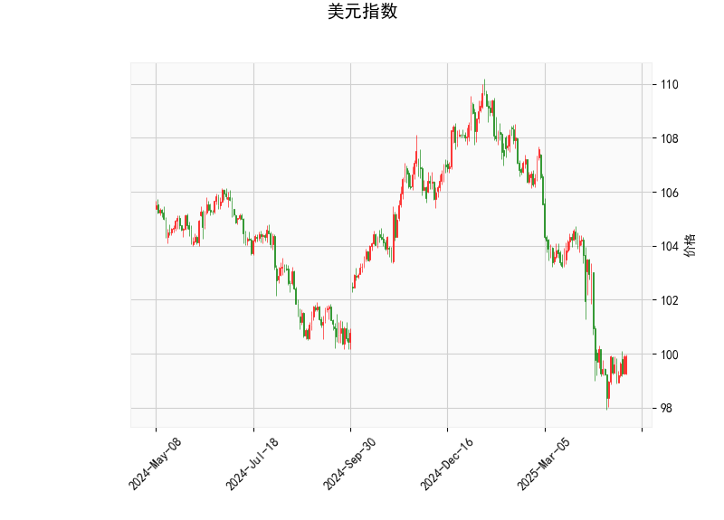

### 1. 对美元指数的技术分析结果进行分析

美元指数当前位于99.9006点，整体显示出弱势特征，但也存在潜在的短期反弹信号。以下是对关键指标的详细解读：

- **RSI（相对强弱指数）**：当前值为43.62，处于中性偏弱区域（RSI通常在30以下为超卖，70以上为超买）。这个水平暗示美元指数可能已接近超卖状态，短期内可能出现技术性反弹，但缺乏足够的强势动能来推动趋势反转。

- **MACD指标**：MACD线为-0.9456，信号线为-1.1719，直方图（MACD Hist）为0.2264。正值直方图表明MACD线正逐步接近信号线，尽管整体仍为负值（显示空头趋势）。这可能预示着短期看涨信号，即卖家动能正在减弱，买家可能开始介入，但整体趋势仍偏向空头。

- **布林带（Bollinger Bands）**：上轨为108.48，中轨为103.01，下轨为97.54。当前价格99.90接近下轨，表明美元指数处于相对低位，价格波动可能加大。这种位置通常表示超卖状态，潜在反弹机会较高，但如果价格跌破下轨，则可能进一步下行。

- **K线形态**：形态包括CDLBELTHOLD（腰带线，表示趋势持稳，可能为整理期）、CDLCLOSINGMARUBOZU（收盘大阳线或大阴线，显示强势但可能为反转信号）、CDLLONGLINE（长线，暗示大波动）和CDLMARUBOZU（大阳线或大阴线，强调强势趋势）。这些形态结合其他指标，表明近期美元指数可能经历了剧烈波动，当前形态偏向看涨调整，但整体弱势未改。

综合分析，美元指数短期内可能出现技术反弹（例如测试中轨103.01附近），但中长期趋势仍偏空。这可能是由于全球经济不确定性、美联储政策预期等因素导致的。如果反弹失败，价格可能进一步向下轨97.54测试。

### 2. 分析判断近期A股港股可能存在的投资或套利机会和策略

美元指数的弱势通常利好新兴市场股票，如A股和港股，因为它可能促使资金从美元资产流出，转向高增长市场。同时，弱势美元往往会推升大宗商品价格（如大宗商品进口国中国受益），进一步支撑相关股票。但如果美元指数反弹，可能导致资金回流美国市场，对A股和港股形成压力。基于上述分析，以美元指数潜在短期反弹为前提，以下是近期可能的投资和套利机会及策略：

#### 投资机会
- **A股机会**：
  - **科技和消费板块潜力**：A股（如上证指数或深证指数）可能受益于美元弱势，尤其是科技股（如半导体、互联网）和消费股（如家电、零售），因为这些板块对全球资金流入敏感。如果美元指数反弹受限，A股短期内可能延续反弹趋势（如上证指数测试3500点以上）。当前A股估值相对合理（市盈率中枢较低），建议关注低估值蓝筹股，如腾讯控股或阿里巴巴ADR在港股的对应品种。
  - **风险因素**：如果美元指数反弹至中轨以上，可能触发A股回调，投资者需警惕地缘政治风险（如中美贸易摩擦）。

- **港股机会**：
  - **互联互通和外资流入**：港股（如恒生指数）作为A股的“桥头堡”，更容易吸引外资。美元弱势可能推动港股反弹，尤其是恒生科技指数中的中概股（如拼多多、京东）。近期港股估值较低（整体市盈率约12-15倍），提供买入机会。如果美元保持弱势，港股可能测试18000点水平。
  - **风险因素**：港股对全球流动性更敏感，若美元反弹，可能导致外资撤出。

#### 套利机会和策略
- **跨市场套利策略**：
  - **A股 vs. 港股套利**：利用沪港通/深港通机制，进行A股和港股同股不同价的套利。例如，如果某中概股在港股价格低于A股（常见于腾讯或阿里），可在美元弱势期买入港股版本，同时卖出A股版本，待价格收敛获利。预计短期内，这种价差可能扩大（由于外资流入港股），目标价差在5-10%以内。
  
- **汇率相关套利**：
  - **美元/人民币汇率套利**：美元弱势可能推升人民币汇率（USD/CNY跌破7.0）。投资者可考虑通过外汇衍生品（如期权）或QDII基金进行套利，例如买入人民币资产（如A股ETF）同时卖出美元资产。策略：若美元指数反弹至100以上，快速转向空头头寸以对冲风险，目标收益率为3-5%。

- **整体投资策略建议**：
  - **短期策略**：采取“多头偏向”的操作，如配置50%资金到A股科技股和港股蓝筹股，剩余资金用于观察美元指数反弹信号。一旦RSI升至50以上或MACD转正，考虑减仓。
  - **中长期策略**：关注主题投资，如“绿色能源”或“数字经济”板块，这些在美元弱势环境下更具韧性。风险管理：设置止损（如A股跌破关键支撑位），并结合宏观数据（如美联储会议）调整。
  - **注意事项**：投资机会基于技术分析推断，实际受经济数据（如CPI、GDP）和政策影响。建议结合基本面分析，并咨询专业顾问，以控制波动风险。