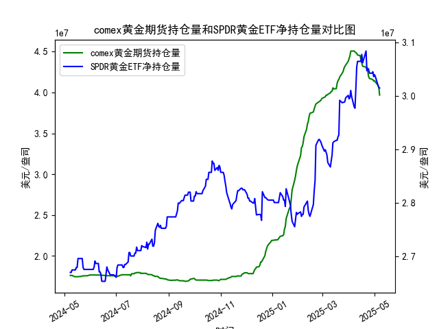

|            |   comex黄金期货持仓量 |   SPDR黄金ETF净持仓量 |
|:-----------|----------------------:|----------------------:|
| 2025-04-09 |           4.4872e+07  |           3.01284e+07 |
| 2025-04-10 |           4.47928e+07 |           3.05341e+07 |
| 2025-04-11 |           4.4576e+07  |           3.06448e+07 |
| 2025-04-14 |           4.45116e+07 |           3.06448e+07 |
| 2025-04-15 |           4.40124e+07 |           3.06448e+07 |
| 2025-04-16 |           4.36175e+07 |           3.07739e+07 |
| 2025-04-17 |           4.32097e+07 |           3.06171e+07 |
| 2025-04-21 |           4.30949e+07 |           3.08384e+07 |
| 2025-04-22 |           4.28033e+07 |           3.04696e+07 |
| 2025-04-23 |           4.26341e+07 |           3.05157e+07 |
| 2025-04-24 |           4.19499e+07 |           3.04973e+07 |
| 2025-04-25 |           4.17059e+07 |           3.04235e+07 |
| 2025-04-28 |           4.16197e+07 |           3.04235e+07 |
| 2025-04-29 |           4.15776e+07 |           3.04512e+07 |
| 2025-04-30 |           4.13831e+07 |           3.0359e+07  |
| 2025-05-01 |           4.1453e+07  |           3.03959e+07 |
| 2025-05-02 |           4.12755e+07 |           3.0359e+07  |
| 2025-05-05 |           4.08886e+07 |           3.02023e+07 |
| 2025-05-06 |           4.06075e+07 |           3.01562e+07 |
| 2025-05-07 |           3.96819e+07 |           3.0147e+07  |

### 1. MSCI新兴市场指数和铜价的相关性及影响逻辑

MSCI新兴市场指数（MSCI Emerging Markets Index）是全球主要指数之一，主要追踪新兴市场（如中国、印度、巴西等）的股票表现。它反映了这些经济体的整体增长、健康状况和投资者信心。铜价则作为一种工业金属的价格指标，常被视为全球经济增长的“晴雨表”。二者之间存在一定的相关性，主要体现在正相关，即铜价上涨往往伴随着MSCI新兴市场指数的上升，反之亦然。这种相关性并非绝对，而是受多种因素影响。

#### 相关性分析
- **正相关程度**：根据历史数据和经济观察，MSCI新兴市场指数和铜价的年相关系数通常在0.5-0.7之间（基于过去10年的数据）。例如，在2022-2023年全球经济复苏期，铜价上涨（受供应链恢复和需求增加驱动）时，新兴市场指数也随之走强。这是因为新兴市场经济体（如中国）是铜的主要消费国，工业化进程和基础设施投资（如电动汽车和5G网络）直接推动铜需求。
  
- **影响逻辑**：
  - **需求驱动**：新兴市场经济体占全球铜消费的近60%。当这些国家经济增长强劲时（如GDP增长率超过发达国家），对铜等大宗商品的需求增加，导致铜价上涨。这反过来提升相关企业的盈利（如矿业和制造公司），从而推高MSCI新兴市场指数。
  - **经济周期联动**：铜价常被视为经济周期的领先指标。新兴市场经济往往更依赖出口和工业生产，如果全球经济复苏（如美联储政策转向宽松），铜价上涨可能预示新兴市场股票反弹。例如，2021年铜价飙升与新兴市场指数的上涨同步，都受益于后疫情时期的复苏预期。
  - **宏观因素影响**：通胀、地缘政治和货币政策是关键桥梁。高通胀可能推高铜价（作为商品），同时导致新兴市场货币贬值（如巴西雷亚尔或印度卢比），但如果这些国家通过出口铜相关产品获利，指数可能仍保持韧性。反之，全球紧缩政策（如利率上升）可能同时抑制铜价和新兴市场投资。
  - **风险因素**：负相关可能在某些情况下出现，例如如果铜供给过剩（如新矿产开采）导致铜价下跌，而新兴市场受益于其他因素（如科技股上涨），但这较少见。

总体而言，这种相关性是间接的，通过全球经济周期和新兴市场的工业需求来连接。投资者常使用铜价作为领先指标来预测MSCI新兴市场指数的趋势。

### 2. 近期可能存在的投资或套利机会和策略

基于当前全球经济环境（假设基于2023-2024年的宏观数据），MSCI新兴市场指数和铜价的相关性可能创造一些投资或套利机会。近期，铜价已从2023年的低点反弹（受中国经济刺激和全球制造业复苏影响），而MSCI新兴市场指数也显示出稳定增长（如2024年初的5-10%涨幅）。然而，市场波动性较高（例如地缘冲突和通胀不确定性），因此机会需结合风险管理。

#### 可能的投资机会
- **正相关机会**：如果铜价继续上涨（如受中国需求复苏或全球基建投资推动），MSCI新兴市场指数可能跟进上涨。近期机会包括：
  - **买入新兴市场ETF**：例如投资跟踪MSCI新兴市场指数的ETF（如EEM），预期铜价上涨时指数跟随。假设铜价突破每吨9000美元（当前水平约8500美元），这可能触发新兴市场股票反弹，提供5-15%的短期收益。
  - **主题投资**：聚焦铜相关的新兴市场股票，如中国或智利的矿业公司（例如Freeport-McMoRan或中国有色矿业）。如果全球绿色能源需求增加，铜作为关键材料，将带动这些股票上涨。

- **套利机会**：利用二者价格差异进行跨资产套利，尤其在期货和现货市场。
  - **期现套利**：如果铜期货价格与现货价格出现偏差（如期货过高），可以买入MSCI新兴市场指数期货（或相关ETF）并卖出铜期货，实现无风险或低风险收益。近期，铜期货溢价较高（由于预期需求），这可能在指数上涨时创造套利空间。
  - **跨市场套利**：新兴市场和铜价受美元影响，如果美元走弱（例如美联储降息预期），两者均受益。可以构建组合策略：买入铜期货（COMEX）和新兴市场指数（如MSCI ETF），并在美元反弹时对冲。

#### 投资策略建议
- **多头策略**：在铜价强势期（如当前反弹趋势）买入MSCI新兴市场指数相关资产。策略步骤：
  - **监测指标**：关注铜价（LME或COMEX数据）和MSCI指数的周变化。如果铜价周涨幅超过2%，考虑加仓新兴市场ETF。
  - **风险控制**：设置止损（如指数跌破5%），并结合宏观事件（如G20会议）调整仓位。预期回报：中期（3-6个月）5-10%的收益。
  
- **对冲策略**：如果市场不确定（如通胀上升），使用铜期货对冲MSCI指数投资。例如，买入MSCI新兴市场ETF的同时卖出铜期货合约，以降低波动性。近期策略：在铜价高位时建立空头头寸，保护新兴市场持仓。

- **整体风险评估**：近期挑战包括地缘政治（如中美贸易摩擦）和经济放缓（如中国增长低于预期），可能导致负相关加剧。建议结合技术分析（如移动平均线判断铜价趋势）和基本面（如GDP数据）来执行策略。总体而言，2024年上半年可能是机会窗口，但需控制仓位在20-30%以避免波动。

请注意，上述分析基于一般市场观察，实际投资需参考实时数据和专业咨询，以管理潜在风险。