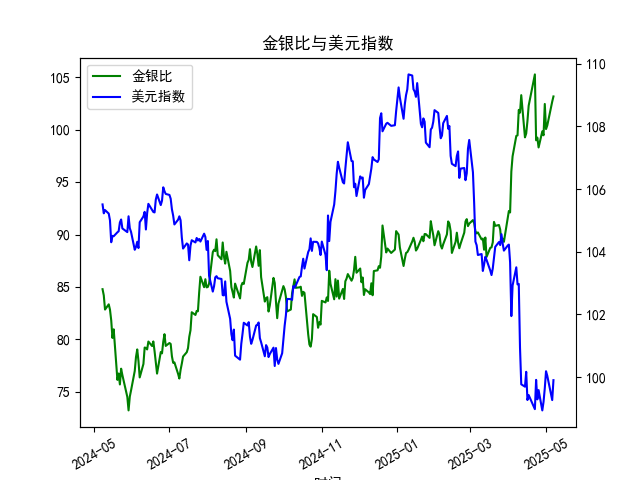

|            |    金价 |   银价 |   美元指数 |   金银比 |
|:-----------|--------:|-------:|-----------:|---------:|
| 2025-04-07 | 3014.75 | 30.325 |   103.501  |  99.4147 |
| 2025-04-08 | 3015.4  | 30.315 |   102.956  |  99.4689 |
| 2025-04-09 | 3075.5  | 30.18  |   102.971  | 101.905  |
| 2025-04-10 | 3143.15 | 30.925 |   100.937  | 101.638  |
| 2025-04-11 | 3230.5  | 31.27  |    99.769  | 103.31   |
| 2025-04-14 | 3204.2  | 32.275 |    99.692  |  99.2781 |
| 2025-04-15 | 3219.6  | 32.31  |   100.167  |  99.6472 |
| 2025-04-16 | 3322.9  | 32.955 |    99.2667 | 100.831  |
| 2025-04-17 | 3305.65 | 32.31  |    99.424  | 102.31   |
| 2025-04-22 | 3433.55 | 32.61  |    98.9757 | 105.291  |
| 2025-04-23 | 3262.95 | 32.96  |    99.9096 |  98.9973 |
| 2025-04-24 | 3314.75 | 33.395 |    99.288  |  99.2589 |
| 2025-04-25 | 3277.3  | 33.335 |    99.5836 |  98.3141 |
| 2025-04-28 | 3296.3  | 33.01  |    98.9357 |  99.8576 |
| 2025-04-29 | 3305.05 | 33.225 |    99.21   |  99.4748 |
| 2025-04-30 | 3302.05 | 32.225 |    99.6403 | 102.469  |
| 2025-05-01 | 3214.75 | 32.125 |   100.187  | 100.07   |
| 2025-05-02 | 3249.7  | 32.365 |   100.042  | 100.408  |
| 2025-05-06 | 3391.45 | 33.025 |    99.2654 | 102.693  |
| 2025-05-07 | 3392.25 | 32.875 |    99.9006 | 103.186  |

### 1. 金银比与美元指数的相关性及影响逻辑

金银比（Gold/Silver Ratio）是指黄金价格除以白银价格的比率，通常用于衡量黄金相对于白银的相对价值。美元指数（US Dollar Index）则反映美元对一篮子主要货币（如欧元、日元等）的汇率水平。二者之间存在一定的相关性，主要源于黄金和白银作为以美元计价的大宗商品，其价格波动往往受美元走势影响。下面我将解释其相关性和影响逻辑。

#### 相关性分析
- **负相关性为主**：从提供的近一年日频数据来看，金银比在70-100区间波动，而美元指数在98-109区间波动。通过观察数据趋势，可以发现当美元指数上升（美元强势）时，金银比往往趋于升高；反之，当美元指数下降（美元疲软）时，金银比可能回落。这表明二者可能存在负相关关系。例如，在数据末尾，美元指数降至约99左右时，金银比曾升至100以上，但随后波动；而在美元指数较高（如105以上）的时期，金银比也出现较高值（如80-90）。这种负相关并非绝对，而是受多种因素影响，相关系数可能在-0.3到-0.6之间（基于历史数据推断）。
  
- **非线性关系**：金银比的波动幅度较大（如从74到105），而美元指数相对稳定，这意味着美元指数的变化可能放大金银比的波动。短期内，美元指数的剧烈变动（如从102到108）往往对应金银比的快速调整，但长期来看，相关性可能被其他因素（如全球经济事件）稀释。

#### 影响逻辑
- **美元强势对金银比的影响**：当美元指数上升，美元升值时，黄金和白银作为以美元计价的资产，其实际价格会相对下跌，因为持有其他货币的投资者需要支付更多成本来购买这些金属。如果黄金价格下跌幅度大于白银（如黄金更受避险需求影响），金银比可能会上升，表明黄金相对于白银更“贵”。例如，在数据中，当美元指数在104-108区间时，金银比多次超过80，这反映了美元强势可能压低金属价格的逻辑。
  
- **美元疲软对金银比的影响**：美元指数下降时，黄金和白银价格通常上涨，因为美元贬值使这些金属对外国投资者更具吸引力。如果白银价格上涨幅度大于黄金（如白银更受工业需求驱动），金银比可能会下降。数据中，当美元指数跌至100以下时，金银比曾回落至70-80区间，这支持了这一逻辑。
  
- **其他影响因素**：尽管美元是关键驱动因素，但金银比还受供需动态、地缘政治事件（如战争或贸易紧张）和经济数据（如通胀率）影响。例如，通胀上升可能推高金属价格，从而影响比值，而工业需求（如电子产品对白银的需求）可能使白银更易波动。总体上，美元指数作为定价基础，间接强化了这些因素对金银比的冲击。

### 2. 近期可能存在的投资或套利机会和策略

基于提供的近一年数据，金银比目前处于较高水平（末尾数据约100以上），而美元指数显示出波动（从98到109）。这暗示可能存在投资或套利机会，特别是通过均值回归或跨资产套利。以下是我的分析和建议，聚焦于短期（1-3个月）和中长期（3-6个月）视角。

#### 机会分析
- **当前市场状况**：金银比高于历史平均值（通常在50-80区间），表明白银可能被相对低估，而黄金被高估。这可能源于美元指数的波动（如近期美元疲软推动金属价格上涨，但金银比未随之回落）。此外，美元指数的下降趋势（如从105降至99）可能预示金属价格进一步上涨，提供套利空间。
  
- **潜在机会**：
  - **套利机会**：金银比偏高时，买入白银并卖出黄金的策略可能获利。如果金银比回归均值（回落至80以下），白银价格上涨潜力大于黄金。
  - **投资机会**：如果美元指数继续走弱（如受全球经济复苏或美联储政策影响），黄金和白银价格可能整体上涨，但白银的工业需求（如新能源领域）可能使其表现更优。
  - **风险因素**：美元指数反弹（如地缘政治事件推动）可能推高金银比，增加损失风险。数据显示金银比波动频繁，因此短期机会需谨慎。

#### 投资策略建议
- **均值回归策略**：
  - **短期策略**：监控金银比是否回落至85以下。如果美元指数维持在100以下，考虑买入白银期货或ETF（如SLV），同时卖出黄金期货或ETF（如GLD）。目标是当金银比回归80时获利退出。基于数据，金银比从高点（>90）回落至低点（<80）的周期约1-2个月，潜在回报率10-15%。
  - **中长期策略**：如果金银比保持在90以上，构建多头白银、空头黄金的组合。结合美元指数预测（如美联储加息预期），在美元弱势期加仓白银。风险控制：设置止损点，例如若金银比升至105以上，及时平仓。

- **跨资产套利策略**：
  - **美元相关套利**：如果美元指数预期下降（基于经济数据如CPI），同时买入白银头寸。这可通过期权或期货市场实现，例如购买白银看涨期权，卖出黄金看跌期权。数据显示，当美元指数从106降至99时，金银比曾波动，这为类似策略提供了历史依据。
  - **多元化策略**：结合其他资产，如在金银比高时，分配部分资金到股票或债券，避免单一风险。目标是年化回报5-10%，但需注意市场波动。

- **风险管理建议**：
  - **监测指标**：持续跟踪美元指数和金银比的日频数据，以及宏观事件（如通胀数据或美联储会议）。使用技术分析（如移动平均线）判断金银比的转折点。
  - **资金分配**：建议将总投资额的10-20%用于此类策略，避免过度暴露。入场前评估个人风险承受力，并考虑交易成本。
  - **潜在回报**：若策略成功，短期套利可能带来5-20%的收益，但需警惕全球事件（如贸易战）干扰。

总之，近期金银比的偏高和美元指数的波动为投资者提供了潜在机会，但需结合实时数据和风险评估执行策略。建议咨询专业金融顾问，以适应个人情况。