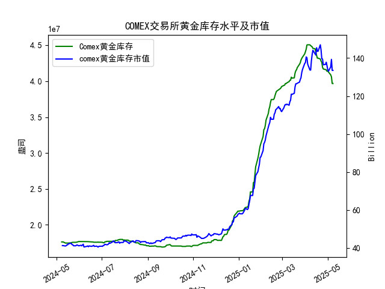

|            |   comex黄金库存量 |   comex黄金库存市值(billion) |   伦敦金现货价 |   上海金交所黄金现货价 |   美元兑人民币汇率 |
|:-----------|------------------:|-----------------------------:|---------------:|-----------------------:|-------------------:|
| 2025-04-11 |       4.4576e+07  |                       3233   |        3230.5  |                 757.1  |             7.2087 |
| 2025-04-14 |       4.45116e+07 |                       3195   |        3204.2  |                 762.47 |             7.211  |
| 2025-04-15 |       4.40124e+07 |                       3216.5 |        3219.6  |                 762.9  |             7.2096 |
| 2025-04-16 |       4.36175e+07 |                       3334.3 |        3322.9  |                 781.62 |             7.2133 |
| 2025-04-17 |       4.32097e+07 |                       3323.1 |        3305.65 |                 786    |             7.2085 |
| 2025-04-18 |       4.32097e+07 |                       3323.1 |        3305.65 |                 788.62 |             7.2069 |
| 2025-04-21 |       4.30949e+07 |                       3411.1 |        3305.65 |                 804.11 |             7.2055 |
| 2025-04-22 |       4.28033e+07 |                       3371.6 |        3433.55 |                 825.8  |             7.2074 |
| 2025-04-23 |       4.26341e+07 |                       3276.9 |        3262.95 |                 786.99 |             7.2116 |
| 2025-04-24 |       4.19499e+07 |                       3325.5 |        3314.75 |                 792.47 |             7.2098 |
| 2025-04-25 |       4.17059e+07 |                       3272.2 |        3277.3  |                 785.6  |             7.2066 |
| 2025-04-28 |       4.16197e+07 |                       3284.5 |        3296.3  |                 778.4  |             7.2043 |
| 2025-04-29 |       4.15776e+07 |                       3314.5 |        3305.05 |                 780.05 |             7.2029 |
| 2025-04-30 |       4.13831e+07 |                       3286.4 |        3302.05 |                 780.19 |             7.2014 |
| 2025-05-01 |       4.1453e+07  |                       3231   |        3214.75 |                 780.19 |             7.2014 |
| 2025-05-02 |       4.12755e+07 |                       3225   |        3249.7  |                 780.19 |             7.2014 |
| 2025-05-05 |       4.08886e+07 |                       3310.1 |        3249.7  |                 780.19 |             7.2014 |
| 2025-05-06 |       4.06075e+07 |                       3430.9 |        3391.45 |                 792.2  |             7.2008 |
| 2025-05-07 |       3.96819e+07 |                       3364.7 |        3392.25 |                 798.51 |             7.2005 |
| 2025-05-08 |       3.96819e+07 |                       3364.7 |        3392.25 |                 798.51 |             7.2073 |

### 近期COMEX黄金库存变化及套利机会分析

#### 1. 概述
基于提供的近一年数据（2024-05-08至2025-05-08），我将重点分析最近一个月（约2025-04-09至2025-05-08）的COMEX黄金库存量变化，并结合伦敦市场黄金现货价格、上海金交所黄金现货价格以及美元兑人民币汇率，评估潜在套利机会。COMEX库存量从2025-04-09左右的较高水平逐步下降，反映出市场需求的可能增加或供应紧缩，这可能与黄金价格上涨相关。套利机会主要源于跨市场价格差异（如伦敦 vs. 上海）和汇率波动，我将优先考虑现货市场的可操作性。

- **关键观察**：
  - COMEX库存量：最近一个月从约4.13e+07盎司（2025-04-09前后）下降到3.97e+07盎司（2025-05-08），下降幅度约1.6e+06盎司（约4%），表明库存消耗加速，可能由于全球需求上升或资金流入。
  - 黄金价格：伦敦市场从约3100 USD/oz（2025-04-09）上涨到3392.25 USD/oz（2025-05-08）；上海金交所从约740 CNY/g上涨到798.51 CNY/g。
  - 汇率：美元兑人民币从约7.20稳定微升到7.2073，略微影响了跨市场价格比较。
  - 库存市值：最近数据点显示市值在133-140亿美元区间波动，结合库存下降，暗示黄金价值的潜在上升。

库存下降通常预示市场紧缩，可能放大价格波动，从而创造套利空间。以下分析聚焦于跨市场套利机会。

#### 2. 最近一个月仓单变化分析
- **COMEX库存趋势**：
  - 2025-04-09至2025-05-08期间，库存量从约4.13e+07盎司（2025-05-02）快速降至3.97e+07盎司（2025-05-07/08），这反映了短期内库存出库加速。可能原因包括：
    - 全球投资者避险需求增加（如地缘政治事件或经济不确定性）。
    - 实物黄金交割增多，导致COMEX仓单减少。
    - 与价格上涨正相关：库存下降往往推动现货价格上行，伦敦价格从约3200 USD/oz升至3392.25 USD/oz，表明市场看涨。
  - **影响**：库存减少可能加剧供应短缺风险，如果持续，将进一步支撑黄金价格，并为跨市场套利提供基础。例如，上海市场的溢价可能扩大。

- **潜在风险**：如果库存下降过快，可能导致COMEX市场流动性紧张，增加交易成本或套利执行难度。短期内，库存稳定在3.97e+07盎司（2025-05-08），表明下降已放缓，但需监控后续数据。

#### 3. 价格差异及套利机会评估
跨市场套利机会主要基于伦敦和上海黄金价格的差异。经过汇率调整，上海价格显示出相对溢价，这可能是由于中国市场需求强劲或进口限制。以下是关键比较（基于最近一个月数据）：

- **价格转换计算**：
  - 上海金交所价格（单位：CNY/g）需转换为USD/oz以与伦敦比较。转换公式：  
    上海价格（USD/oz） = [上海价格（CNY/g） / 汇率（USD/CNY）] × 31.1035（g/oz）。
  - 示例（2025-05-08）：
    - 上海：798.51 CNY/g
    - 汇率：7.2073 USD/CNY
    - 转换：798.51 / 7.2073 ≈ 110.74 USD/g → 110.74 × 31.1035 ≈ 3443 USD/oz
    - 伦敦：3392.25 USD/oz
    - 差异：上海价格（3443 USD/oz）高于伦敦（3392 USD/oz），溢价约51 USD/oz（约1.5%）。

  - **最近一个月趋势**：
    - 2025-04-09：上海约740 CNY/g → 约740 / 7.20 × 31.1035 ≈ 3100 USD/oz（与伦敦3100 USD/oz大致持平）。
    - 2025-05-08：上海溢价扩大到约51 USD/oz。
    - 总体：上海相对伦敦的溢价在月末扩大，平均溢价约1-2%，这可能源于中国市场的季节性需求（如黄金饰品消费）或政策因素。

- **可能套利机会**：
  - **跨市场套利（伦敦 vs. 上海）**：
    - **策略**：如果上海价格持续高于伦敦价格（调整后），可以考虑“卖出上海黄金、买入伦敦黄金”的套利。例如，利用上海溢价卖出现货，然后在伦敦以较低价格买入，并通过汇率套利放大收益。
    - **可行性**：最近一个月，溢价虽小，但如果COMEX库存继续下降，伦敦价格可能进一步上涨，缩小溢价或反转套利方向。目前，溢价存在短期机会，但需考虑交易成本（约0.5-1%）和税收（如中国增值税）。
    - **风险**：汇率波动（美元升值可能放大上海溢价），以及市场波动导致价格迅速收敛。
    
  - **库存相关套利**：
    - COMEX库存下降可能推动全球黄金价格上涨，创造“现货-期货”或“库存-现货”套利。但数据中无期货细节，因此建议结合现货市场：如果库存紧缩加剧，伦敦价格领先上涨，可在上海市场卖出以锁定利润。
    
  - **汇率相关套利**：
    - 美元兑人民币汇率微升（7.20至7.2073），这可能放大上海溢价。如果汇率继续升值，伦敦相对更具吸引力，适合“买入伦敦、卖出上海”的策略。反之，如果人民币贬值，上海机会增加。

#### 4. 整体看法和建议
- **看法**：
  - 最近一个月的COMEX库存下降（约4%）表明市场供应趋紧，这与黄金价格上涨一致，可能预示短期内价格进一步走高。上海市场的溢价扩大反映了中国需求的相对强劲，但这也增加了套利风险，因为溢价可能随时收敛。
  - 总体市场环境：黄金作为避险资产，结合全球经济不确定性，库存变化可能持续影响价格。当前套利机会有限（溢价仅1-2%），但如果库存下降加剧，跨市场差异将放大。

- **建议**：
  - **短期策略**：
    - **监控并执行跨市场套利**：在上海价格溢价显著时（>1%），优先考虑卖出上海现货、买入伦敦现货。目标期限：1-5天，利用高流动性市场。建议设置止损点（如溢价低于0.5%时退出）。
    - **结合汇率对冲**：使用外汇衍生品对冲美元/人民币波动，降低风险。例如，如果预期美元升值，先买入伦敦黄金。
    
  - **风险管理**：
    - **多元化**：不要过度依赖单一市场；结合COMEX库存数据，如果下降速率加快，减少多头头寸。
    - **成本考虑**：交易手续费、存储费和税收可能侵蚀套利收益，确保净利至少1%以上。
    - **数据监控**：每日跟踪库存和价格变化；如果COMEX库存稳定或反弹，重新评估套利方向。
    
  - **长期建议**：等待更明显的库存信号（如连续下降>5%），并结合宏观因素（如美联储政策）制定策略。投资者应咨询专业顾问，以避免市场波动带来的损失。

总体而言，近期套利机会主要源于上海溢价，但需谨慎操作，聚焦数据驱动决策。