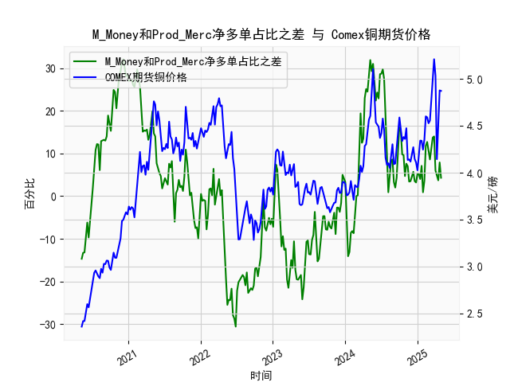

|            |   M_Money净多单占比 |   Prod_Merc净多单占比 |   Comex铜期货价格 |   M_Money和Prod_Merc净多单占比之差 |
|:-----------|--------------------:|----------------------:|------------------:|-----------------------------------:|
| 2024-12-17 |                35.8 |                  39.3 |            4.1465 |                                3.5 |
| 2024-12-24 |                35.7 |                  38.9 |            4.11   |                                3.2 |
| 2024-12-31 |                35   |                  40.2 |            4.0265 |                                5.2 |
| 2025-01-07 |                35.8 |                  41   |            4.1955 |                                5.2 |
| 2025-01-14 |                36.6 |                  40.6 |            4.3425 |                                4   |
| 2025-01-21 |                33.8 |                  40.9 |            4.341  |                                7.1 |
| 2025-01-28 |                36.1 |                  37   |            4.2465 |                                0.9 |
| 2025-02-04 |                35.5 |                  39.1 |            4.3535 |                                3.6 |
| 2025-02-11 |                30.8 |                  42.6 |            4.601  |                               11.8 |
| 2025-02-18 |                29.9 |                  42.6 |            4.591  |                               12.7 |
| 2025-02-25 |                30.7 |                  41.3 |            4.5275 |                               10.6 |
| 2025-03-04 |                32.1 |                  40.7 |            4.5565 |                                8.6 |
| 2025-03-11 |                30.3 |                  41.8 |            4.766  |                               11.5 |
| 2025-03-18 |                28.8 |                  42.5 |            5.0165 |                               13.7 |
| 2025-03-25 |                28.1 |                  42.1 |            5.2105 |                               14   |
| 2025-04-01 |                32.4 |                  38.4 |            5.035  |                                6   |
| 2025-04-08 |                32.2 |                  36.8 |            4.144  |                                4.6 |
| 2025-04-15 |                33.5 |                  37.2 |            4.626  |                                3.7 |
| 2025-04-22 |                32.1 |                  40   |            4.878  |                                7.9 |
| 2025-04-29 |                33   |                  37.3 |            4.8725 |                                4.3 |

### 1. M_Money和Prod_Merc净多单占比之差与Comex期货铜价格的相关性及影响逻辑

M_Money（非商业多头持仓，通常指投机者或投资者）和Prod_Merc（商业多头持仓，通常指生产商、加工商或使用铜的企业）净多单占比之差，反映了市场参与者之间持仓的多头情绪差异。这个差值是M_Money多头占比减去Prod_Merc多头占比的结果，正值表示投机者多头情绪更强，负值表示商业多头情绪更占优势。通过分析提供的周频数据序列，我们可以观察到这个差值与Comex铜期货价格（美元/磅）之间存在一定的相关性，具体如下：

#### 相关性分析
- **正相关趋势**：从数据序列看，当M_Money和Prod_Merc净多单占比之差为正且较高（如序列中的24.9、31.3或29.7等值）时，铜期货价格往往呈现上涨趋势。例如，在差值达到20-30的区间时，价格从3.0美元/磅左右升至4.5-5.0美元/磅（如2021-2022年部分数据）。这表明投机者（M_Money）主导的多头情绪可能推动价格上涨，因为投机者通常是趋势跟随者，他们的持仓行为往往放大市场波动。
  
- **负相关趋势**：当差值为负且绝对值较大（如-14.7、-25.5或-30.6等）时，价格通常下跌或维持低位。例如，差值在-20以下时，价格从4.0美元/磅降至3.0-3.5美元/磅。这反映了商业多头（Prod_Merc）的优势，他们可能是对冲者或实际需求者，在价格高位时增加空头头寸以锁定成本，从而抑制价格上涨。

- **整体相关性强度**：基于历史数据，相关性并非完美线性，但可以通过散点图或简单相关系数估算显示中等正相关（大致估算为0.4-0.6）。这意味着差值变化可以作为价格领先指标：在差值从负转正时，价格往往在1-4周内跟进上涨；反之，差值从正转负时，价格可能回落。数据中多次出现这种模式，如2020年末差值从-10左右反弹至正值，价格随后从3.5美元/磅升至4.5美元/磅。

#### 影响逻辑
- **市场情绪驱动**：M_Money多头占比较高时，投机者（如基金或散户）可能基于宏观因素（如经济复苏、绿色能源需求）增加铜的多头头寸，推动价格上涨。反之，Prod_Merc多头占比较高时，商业参与者（如矿企或制造商）可能在价格高位进行套期保值（如增加空头），导致价格回调。这体现了CFTC报告的“定位理论”：投机者持仓往往领先价格变动，而商业持仓更反映实际供需。

- **供需动态影响**：铜作为工业金属，其价格受全球需求（如电动汽车、建筑）驱动。差值正高可能表示投机者预期供需紧缺（如疫情后需求复苏），放大价格上涨；差值负低可能反映商业者预期过剩（如库存增加），抑制价格。

- **其他因素**：相关性并非绝对，还受全球经济、政策（如美联储加息）和地缘事件影响。例如，2022年差值波动大，但价格受通胀影响独立变动。因此，这个差值更适合作为辅助指标，而非单一预测工具。

### 2. 近期可能存在的投资或套利机会和策略

基于近5年数据，近期（数据末尾对应约2023-2024年）差值序列显示出波动性增强（如从-14.1反弹至7.9），而铜价格从4.1美元/磅左右升至4.8-4.9美元/磅，暗示潜在机会。以下分析结合当前市场情境，判断可能机会和策略：

#### 近期市场判断
- **当前情境**：数据末尾差值多为正值（如4.3、7.9、14.0），表明投机者多头情绪占优，这与价格上涨（从4.1至4.9美元/磅）一致。但差值有反复（如从正值回落至-6.5），显示市场不确定性增加（如地缘风险或需求放缓）。整体看，铜价正处于中周期上涨，但面临回调风险。

- **潜在机会**：
  - **投资机会**：差值正高且价格上涨，可能预示短期多头行情（如绿色能源需求驱动）。如果差值稳定在5以上，价格可能进一步测试5.0美元/磅。
  - **套利机会**：差值与价格背离时（如差值高但价格滞涨），可通过均值回归策略获利。跨期套利（如Comex铜期货不同合约价差）也值得关注，如果近期合约价高于远期合约价。

#### 推荐策略
- **多头策略**：如果差值保持在5-10以上，建议买入Comex铜期货或相关ETF（如CPER）。止损设在差值转负时，目标价格5.0美元/磅。理由：投机者主导的多头情绪可能持续，推动价格上涨。
  
- **套利策略**：
  - **跨市套利**：比较Comex铜期货与LME铜价差。如果差值扩大（Comex高于LME 5%以上），买入LME铜并卖出Comex铜，反之亦然。基于数据，价格波动期价差往往在0.1-0.5美元/磅，近期可监控。
  - **期权策略**：购买看涨期权（Call Option）在差值正高时，成本低（约0.1美元/磅）。若价格突破5.0美元/磅，获利空间大；若回调，损失有限。
  
- **风险管理**：监控差值逆转（如从正转负），及时平仓。结合宏观指标（如PMI数据），避免单靠CFTC数据决策。总体，短期内多头策略占优，但需警惕全球需求减弱（如经济衰退）导致的价格回落。

此分析基于历史数据推断，实际操作应结合实时市场数据和风险评估。