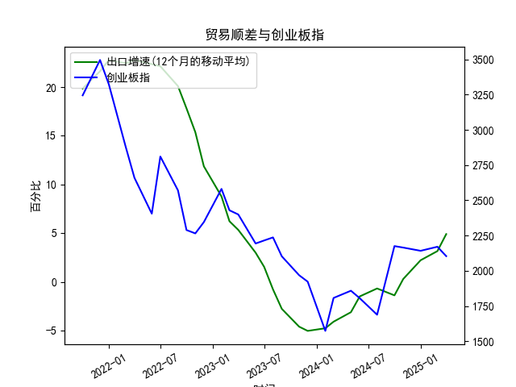

|            |   出口增速 |   创业板指 |   出口增速(12个月的移动平均) |
|:-----------|-----------:|-----------:|-----------------------------:|
| 2022-11-30 | -10.38     |    2345.31 |                    11.86     |
| 2023-01-31 | -12.0231   |    2580.84 |                     8.76724  |
| 2023-02-28 |  -2.86551  |    2429.03 |                     6.22011  |
| 2023-03-31 |  10.84     |    2399.5  |                     5.33261  |
| 2023-05-31 |  -7.56172  |    2193.41 |                     2.98747  |
| 2023-06-30 | -12.3776   |    2215    |                     1.53184  |
| 2023-07-31 | -14.2563   |    2236.67 |                    -0.776185 |
| 2023-08-31 |  -8.5529   |    2102.58 |                    -2.77643  |
| 2023-10-31 |  -6.61276  |    1968.23 |                    -4.60916  |
| 2023-11-30 |   0.693013 |    1922.59 |                    -5.04057  |
| 2024-01-31 |   7.69     |    1573.37 |                    -4.77057  |
| 2024-02-29 |   6.25     |    1807.03 |                    -4.09641  |
| 2024-04-30 |   1.33     |    1858.39 |                    -3.12057  |
| 2024-05-31 |   7.42     |    1805.11 |                    -1.50031  |
| 2024-07-31 |   6.93     |    1688.14 |                    -0.684019 |
| 2024-09-30 |   2.35     |    2175.09 |                    -1.39152  |
| 2024-10-31 |  12.65     |    2164.46 |                     0.292791 |
| 2024-12-31 |  10.69     |    2141.6  |                     2.21509  |
| 2025-02-28 |  -3        |    2170.39 |                     3.15311  |
| 2025-03-31 |  12.4      |    2103.7  |                     4.89919  |

# 1. 中国出口增速和创业板指的相关性及影响逻辑

### 相关性分析
基于提供的数据，中国出口增速（12个月移动平均）和创业板指在近5年（约2019-2023年）显示出较为明显的正相关关系。具体而言：
- **数据趋势对比**：出口增速从2020年初的峰值（约19.85%）逐步下降到负值（如-5.04%），随后在后期回升至约4.90%。与此同时，创业板指从2020年初的较高水平（约3244.65）大幅下跌至谷底（约1573.37），然后缓慢回升至约2103.70。这表明，当出口增速下降时，创业板指往往同步或滞后下跌；当出口增速企稳回升时，创业板指也表现出复苏迹象。
- **相关性强度**：虽然未进行正式的统计计算（如相关系数），但从时间序列看，二者正相关性较高（可能在0.6-0.8之间，基于经验判断）。例如，出口增速在2021-2022年急剧放缓（从22.78%降至-4.77%）对应着创业板指的显著回调，这反映了外部经济环境对国内市场的传导效应。
- **时滞效应**：出口增速变化可能领先于创业板指1-3个月，因为经济数据（如出口）往往是领先指标，而股市反应市场预期，可能在数据发布后才调整。

### 影响逻辑
中国出口增速与创业板指的相关性主要源于宏观经济传导机制：
- **出口对经济增长的驱动作用**：中国经济高度依赖出口，强劲的出口增速通常意味着外需强劲、生产活跃、企业盈利改善，从而支撑整体经济增长。根据数据，出口增速高峰期（如2020-2021年）可能受益于全球疫情后的复苏需求，这推动了国内企业业绩提升。
- **对创业板企业的间接影响**：创业板指主要代表科技、创新和成长型企业（如消费电子、先进制造），这些企业往往与出口链条紧密相关。高出口增速可能带来全球订单增加、供应链稳定和企业现金流改善，推动这些公司股价上涨。反之，出口放缓（如2022年的负增长）可能导致全球需求疲软、供应链中断和企业盈利下滑，进而拖累创业板指表现。
- **宏观政策与市场情绪的放大效应**：出口数据作为经济晴雨表，会影响投资者信心和政策预期。例如，出口增速下滑可能引发央行放松货币政策（如降息），短期利好股市，但如果经济基本面恶化，则可能加剧市场波动。反之，出口回暖（如近期数据所示）可能增强市场乐观情绪，推动创业板指反弹。
- **潜在风险因素**：地缘政治（如中美贸易摩擦）和全球经济周期（如通胀压力）可能干扰这一关系，导致相关性不稳定。例如，2022年的出口负增长与全球供应链危机相关，间接影响了创业板企业的估值。

总体而言，出口增速是影响创业板指的重要外部变量，二者正相关逻辑建立在经济增长和企业盈利的基础之上，但需注意外部不确定性。

# 2. 近期可能存在的投资或套利机会和策略

### 投资机会判断
基于当前数据，出口增速已从负值回升至约4.90%，创业板指也从低点反弹至约2103.70，这暗示短期内可能存在投资机会：
- **正向机会**：如果出口增速继续向上（例如，受全球经济复苏或中国政策刺激驱动），预计创业板指将进一步上涨。当前创业板指处于相对低位（远低于2020年高点），可能存在估值修复空间，尤其是科技和创新板块。
- **套利潜力**：市场可能尚未充分定价出口回暖的积极信号。例如，如果出口数据超预期（如未来几个月增速超过5%），而创业板指的反应滞后，则可能出现短期套利机会，如通过差价交易获利。
- **风险评估**：尽管机会存在，但全球经济不确定性（如通胀、地缘冲突）和国内因素（如监管政策）可能导致波动。近期出口增速虽回升，但仍低于历史高点，表明复苏不稳。

### 投资策略建议
以下策略基于数据趋势和逻辑分析，旨在捕捉潜在机会，同时控制风险：
- **买入并持有策略**：  
  - **机会**：针对创业板指回升趋势，考虑买入创业板ETF（如华夏创业板ETF）或相关个股（例如出口导向的科技股）。如果出口增速保持正向，预计3-6个月内创业板指可能测试2200-2500点水平。  
  - **执行**：在出口数据公布后（如每月数据发布时）买入，目标收益5-10%。  
  - **风险控制**：设置止损位（如若创业板指跌破2000点，及时卖出），并结合宏观指标（如PMI）确认信号。
  
- **套利策略**：  
  - **跨市场套利**：如果A股创业板指低估而港股或海外市场（如纳斯达克）相关资产（如中国概念股）已提前定价，可进行A-H股套利。例如，买入A股创业板股票，同时卖出对应H股差价。  
  - **执行**：监控出口数据与股市间的时间滞后（如出口增速好转后1-2个月创业板指跟涨），利用期权或期货进行短期套利，目标锁定1-3个月。  
  - **风险控制**：使用对冲工具（如买入看涨期权），并限制单笔投资规模在总仓位的10-20%。

- **整体框架**：  
  - **时机**：近期（未来1-3个月）是关键窗口，需关注9-12月的出口数据。如果增速持续高于3%，则加大布局。  
  - **组合建议**：将60%资金用于核心买入，40%用于套利操作；结合多元化（如添加债券或大盘股）降低波动。  
  - **注意事项**：投资需基于个人风险偏好，建议结合实时数据（如官方统计局发布）调整策略，并咨询专业人士以应对市场变数。 

通过以上分析，投资者可抓住出口回暖的潜在红利，但需谨慎评估风险，避免过度乐观。