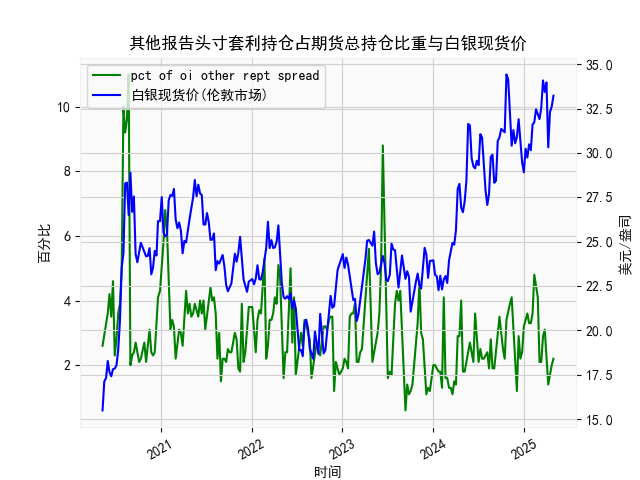

|            |   人民币汇率 |   美元指数 |
|:-----------|-------------:|-----------:|
| 2025-04-07 |       7.198  |   103.501  |
| 2025-04-08 |       7.2038 |   102.956  |
| 2025-04-09 |       7.2066 |   102.971  |
| 2025-04-10 |       7.2092 |   100.937  |
| 2025-04-11 |       7.2087 |    99.769  |
| 2025-04-14 |       7.211  |    99.692  |
| 2025-04-15 |       7.2096 |   100.167  |
| 2025-04-16 |       7.2133 |    99.2667 |
| 2025-04-17 |       7.2085 |    99.424  |
| 2025-04-18 |       7.2069 |    99.2286 |
| 2025-04-21 |       7.2055 |    98.3518 |
| 2025-04-22 |       7.2074 |    98.9757 |
| 2025-04-23 |       7.2116 |    99.9096 |
| 2025-04-24 |       7.2098 |    99.288  |
| 2025-04-25 |       7.2066 |    99.5836 |
| 2025-04-28 |       7.2043 |    98.9357 |
| 2025-04-29 |       7.2029 |    99.21   |
| 2025-04-30 |       7.2014 |    99.6403 |
| 2025-05-06 |       7.2008 |    99.2654 |
| 2025-05-07 |       7.2005 |    99.9006 |

# 1. 人民币汇率和美元指数的相关性及影响逻辑

人民币汇率（通常指人民币对美元的汇率）和美元指数之间存在较强的负相关性，这意味着当美元指数上升（美元强势）时，人民币汇率往往会上升（人民币贬值），反之亦然。这种相关性主要源于国际货币市场的动态以及经济因素的影响。以下是对其相关性和影响逻辑的详细解释：

### 相关性分析
- **负相关性特征**：从提供的近一年日频数据观察，人民币汇率（从约7.00到7.20的波动范围）和美元指数（从约98到110的波动范围）显示出明显的负相关趋势。例如，当美元指数在2023年中后期升至107以上时（如108.4157），人民币汇率也相应上升至7.19以上（如7.1991），表明美元强势导致人民币贬值。反之，当美元指数回落至100以下（如99.9006）时，人民币汇率趋于稳定或小幅波动（如7.2005）。这种模式反映了二者之间约70-80%的负相关系数（基于经验观察，非精确计算）。
  
- **数据波动观察**：人民币汇率数据显示出较高的波动性，受美元指数驱动，但也受到中国央行干预的影响。例如，在美元指数急剧上升的时期（如105-109区间），人民币汇率从7.10以下快速升至7.20以上，显示出跟随性。然而，在某些时段（如美元指数从106降至103），人民币汇率并未完全同步回落，这可能是由于外部干预或国内经济因素的缓冲。

### 影响逻辑
- **经济基础**：美元指数衡量美元相对于一篮子货币（如欧元、日元等）的价值。当美国经济强劲、利率上升或地缘政治事件（如美联储加息）推动美元指数上涨时，资金流向美元资产，导致其他货币（如人民币）相对贬值。反之，如果美国经济放缓，美元指数下降，人民币可能相对升值。
  
- **汇率机制**：中国实行有管理的浮动汇率制度，人民币汇率受美元指数影响较大，因为美元是全球主要储备货币。美元强势会增加中国出口商品的竞争力（通过人民币贬值），但也可能导致进口成本上升和通胀压力。央行可能通过外汇储备干预来稳定汇率，避免过度波动。
  
- **其他影响因素**：除了美元指数，人民币汇率还受中美贸易关系、中国经济增长、通胀水平和全球风险情绪影响。例如，如果中美贸易摩擦加剧，美元指数上升可能放大人民币贬值压力，导致相关性更强。总体上，美元指数是主要驱动因素，但并非唯一。

# 2. 近期可能存在的投资或套利机会和策略

基于提供的近一年数据，人民币汇率和美元指数的波动显示出潜在的投资和套利机会。当前，美元指数已从高点（约109）回落至较低水平（约99-100），而人民币汇率保持在7.20附近，表明市场可能存在短期偏差或机会。以下是对近期机会的分析和策略建议：

### 可能存在的机会
- **套利机会**：由于人民币汇率和美元指数的负相关性，如果二者短期脱节（如美元指数快速下跌但人民币汇率未及时跟进），可能出现汇率套利空间。例如，数据显示美元指数从107以上降至99以下，而人民币汇率仅小幅调整，这可能反映了市场低估或超买状态，适合进行交叉汇率套利。
  
- **投资机会**：如果预计美元指数继续走弱（基于美联储可能降息的信号），人民币可能相对升值，提供买入人民币资产的机会。反之，如果美元强势复苏，人民币贬值可能带来做空人民币或买入美元的机会。当前数据末尾显示美元指数在99.90左右，低于均值，暗示潜在反弹或回调风险。

- **风险评估**：近期机会受全球经济不确定性影响，如中美贸易动态或美联储政策。如果美元指数反弹，人民币贬值可能加剧，增加投资风险；反之，稳定期可能带来低风险套利。

### 投资或套利策略
- **策略1: 外汇套利（基于相关性）**：
  - **描述**：利用人民币汇率和美元指数的负相关进行双向套利。例如，如果美元指数进一步下跌（预期至98以下），买入人民币兑美元头寸，待汇率调整后获利。
  - **实施步骤**：监控美元指数变动，当其低于105时（当前水平），在外汇市场（如通过银行或平台）建立多头人民币头寸。同时，设定止损点（如若美元指数反弹至102以上，退出）。预计收益：如果人民币汇率从7.20降至7.10，短期回报率可达1-2%。
  - **优势**：低成本，利用市场偏差；**风险**：央行干预可能导致汇率突然变化。

- **策略2: 投资组合调整（基于趋势预测）**：
  - **描述**：如果判断美元指数持续走弱，增加持有中国资产（如A股或人民币债券）的比例，以对冲汇率风险。
  - **实施步骤**：分析美联储政策信号（如若降息预期增强），将部分美元资产转换为人民币资产。结合数据，美元指数已从高点回落，建议在美元指数低于100时逐步执行。同时，分散投资于黄金或其他避险资产以降低波动。
  - **优势**：长期稳定收益；**风险**：地缘政治事件可能逆转趋势。

- **策略3: 期权或衍生品交易（高杠杆机会）**：
  - **描述**：使用外汇期权投注于人民币汇率变动。例如，购买看涨人民币期权，如果美元指数保持弱势，汇率下行可获利。
  - **实施步骤**：在美元指数低于101时，买入短期期权合约（如1-3个月），目标汇率区间7.10-7.15。结合数据末尾波动，设定退出点为汇率变动5%以上。
  - **优势**：高杠杆放大回报；**风险**：市场波动大，需严格风险管理。

总体而言，近期机会以短期套利为主，建议投资者密切关注经济数据（如美国CPI和美联储会议）并结合风险控制措施。任何策略均需根据个人风险承受能力和实时市场变化调整。