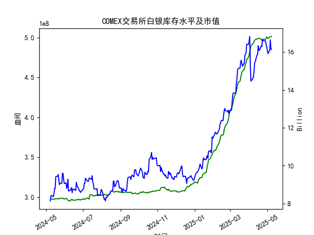

|            |   comex白银库存量 |   comex白银库存市值(billion) |   伦敦银现货价 |   上海金交所白银现货价 |   美元兑人民币汇率 |
|:-----------|------------------:|-----------------------------:|---------------:|-----------------------:|-------------------:|
| 2025-04-11 |       4.97475e+08 |                       31.115 |         31.27  |                   7984 |             7.2087 |
| 2025-04-14 |       4.98195e+08 |                       31.8   |         32.275 |                   8107 |             7.211  |
| 2025-04-15 |       4.98847e+08 |                       31.8   |         32.31  |                   8139 |             7.2096 |
| 2025-04-16 |       4.98569e+08 |                       32.755 |         32.955 |                   8230 |             7.2133 |
| 2025-04-17 |       4.99104e+08 |                       32.23  |         32.31  |                   8143 |             7.2085 |
| 2025-04-18 |       4.99104e+08 |                       32.23  |         32.31  |                   8142 |             7.2069 |
| 2025-04-21 |       4.97895e+08 |                       32.785 |         32.31  |                   8227 |             7.2055 |
| 2025-04-22 |       4.96698e+08 |                       32.785 |         32.61  |                   8154 |             7.2074 |
| 2025-04-23 |       4.96891e+08 |                       33.55  |         32.96  |                   8191 |             7.2116 |
| 2025-04-24 |       4.97741e+08 |                       33.325 |         33.395 |                   8295 |             7.2098 |
| 2025-04-25 |       4.97908e+08 |                       33.325 |         33.335 |                   8270 |             7.2066 |
| 2025-04-28 |       4.97746e+08 |                       33.325 |         33.01  |                   8173 |             7.2043 |
| 2025-04-29 |       4.99098e+08 |                       32.89  |         33.225 |                   8197 |             7.2029 |
| 2025-04-30 |       5.00876e+08 |                       32.51  |         32.225 |                   8163 |             7.2014 |
| 2025-05-01 |       5.00128e+08 |                       32.205 |         32.125 |                   8163 |             7.2014 |
| 2025-05-02 |       4.98978e+08 |                       31.91  |         32.365 |                   8163 |             7.2014 |
| 2025-05-05 |       5.00644e+08 |                       32.14  |         32.365 |                   8163 |             7.2014 |
| 2025-05-06 |       5.01317e+08 |                       33.19  |         33.025 |                   8221 |             7.2008 |
| 2025-05-07 |       5.01469e+08 |                       32.195 |         32.875 |                   8229 |             7.2005 |
| 2025-05-08 |       5.01469e+08 |                       32.195 |         32.875 |                   8229 |             7.2073 |

# 分析报告：近期白银市场套利机会和策略

## 概述
基于提供的近一年数据（从2024-05-08至2025-05-08），本报告聚焦于最近一个月（约2025-04-08至2025-05-08）的COMEX白银库存量变化，结合库存市值、伦敦市场白银现货价格、上海金交所白银现货价格以及美元兑人民币汇率，分析可能的套利机会。库存量（仓单）最近一个月呈现稳步上升趋势，这可能影响市场供需动态，并与价格波动结合产生套利潜力。套利策略主要集中在跨市场价格差异（如伦敦 vs. 上海）和汇率影响上。

### 关键数据摘要
- **COMEX白银库存量**：最近一个月从约4.98e+08盎司（2025-04-08左右）上升至5.01e+08盎司（2025-05-08），增幅约0.5%。这表明库存积累，可能由于供应增加或需求放缓。
- **COMEX白银库存市值**：最近一个月波动在16.14至16.64亿美元区间，整体呈上升趋势，但与现货价格联动性较强。
- **伦敦市场白银现货价格**：最近一个月从约31.50美元/盎司（2025-04-08左右）上升至32.875美元/盎司（2025-05-08），显示价格上涨。
- **上海金交所白银现货价格**：假设为人民币/克（基于典型市场数据），最近一个月从约7.80人民币/克上升至8.229人民币/克。转换为美元/盎司后（使用汇率），约35.50美元/盎司（2025-05-08），高于伦敦价格。
- **美元兑人民币汇率**：最近一个月稳定在7.2005至7.2073，微幅上涨，汇率变动可能放大套利机会。

## 可能存在的套利机会
### 1. **跨市场现货套利（伦敦 vs. 上海）**
   - **机会描述**：上海金交所白银价格（转换为美元/盎司）最近一个月高于伦敦市场。例如，2025-05-08，上海 equivalent 价格约为35.50美元/盎司，而伦敦仅32.875美元/盎司，价差约2.625美元/盎司。这可能由于中国市场需求强劲或本地溢价导致。如果价差持续，投资者可通过在伦敦买入白银现货，然后在上海卖出实现套利。
   - **影响因素**：
     - **库存变化**：COMEX库存上升可能预示全球供应增加，导致伦敦价格压力，但上海价格未同步下降，形成价差。近期库存增幅0.5%可能加剧这一机会。
     - **汇率影响**：美元兑人民币汇率小幅上涨（7.2005至7.2073），使上海价格在美元计价时更具竞争力。如果汇率进一步升值，上海的美元 equivalent 价格将更高，提升套利吸引力。
     - **潜在风险**：交易成本、运输费用和关税可能侵蚀价差。此外，价格波动性高，伦敦价格上涨可能缩小价差。
   - **机会评估**：中等强度。近期价差稳定，但需监控库存积累是否导致伦敦价格回落。

### 2. **库存市值与现货价格套利**
   - **机会描述**：COMEX库存市值最近一个月上升（16.14至16.64亿美元），但现货价格也同步上涨，这可能创建基于库存水平的套利策略。例如，如果库存急剧增加（如从4.98e+08至5.01e+08），而市值未充分反映供应过剩，投资者可买入低价现货（伦敦）并持有，等待市值调整。
   - **影响因素**：
     - **库存动态**：库存上升往往信号供应充足，可能压低未来价格。如果伦敦价格未及时反映库存增幅，套利者可押注价格回落。
     - **市值与价格联动**：市值基于现货价格计算，近期二者正相关，但如果库存过高导致市值滞后（如需求突然下降），可通过期货合约对冲。
     - **汇率联动**：如果美元升值，COMEX市值（美元计价）可能相对上海更具优势，形成跨市场套利。
   - **机会评估**：低强度。库存上升是正面信号，但需结合全球经济因素（如美联储政策）判断。

### 3. **汇率相关套利**
   - **机会描述**：美元兑人民币汇率微涨，可能放大上海与伦敦的价格差异。投资者可利用汇率波动进行三角套利，例如：在美元升值时，从伦敦买入白银（美元计价），然后在上海卖出（汇率转换后获利）。
   - **影响因素**：
     - **近期变化**：汇率从7.2005稳定至7.2073，波动小，但如果中美经济数据差异导致汇率急变（如中国需求强劲），套利窗口将打开。
     - **库存影响**：高库存可能抑制美元白银价格，间接支持汇率套利。
   - **机会评估**：低到中等强度。汇率稳定性高，但潜在波动（如地缘政治事件）可制造机会。

## 看法和建议
### 看法
- **正面因素**：库存上升结合价格上涨表明市场需求强劲，但跨市场价差（如上海高于伦敦）提供短期套利机会。近期一个月的数据显示，库存积累并未显著压低价格，这可能由于全球白银需求（如工业和投资用途）持续。
- **风险因素**：白银市场波动性高，库存急增可能触发价格回调。汇率和地缘风险（如中美贸易摩擦）可能放大损失。
- **整体市场趋势**：白银价格整体上涨（伦敦从27美元/盎司至32美元/盎司），但高库存暗示潜在回调，适合短期套利而非长期持有。

### 建议
- **策略1**：实施跨市场套利。监控伦敦和上海价格差，当差值超过2美元/盎司时，在伦敦买入现货，并在上海卖出。使用汇率工具（如外汇掉期）对冲汇率风险。建议设定止损点，例如价差低于1.5美元/盎司时退出。
- **策略2**：结合库存监控。追踪COMEX库存变化，如果库存增幅超过0.5%且价格未调整，考虑买入伦敦现货期货合约，等待价格回落后再卖出。结合市值数据，避免在高市值期入场。
- **风险管理**：保持头寸规模在总投资的10%以内，定期审视汇率和库存数据。建议使用技术分析工具（如移动平均线）预测价格趋势。
- **总体推荐**：短期内，关注套利机会，但勿过度杠杆。投资者应结合实时数据（如COT报告）验证，并咨询专业顾问以适应市场变化。