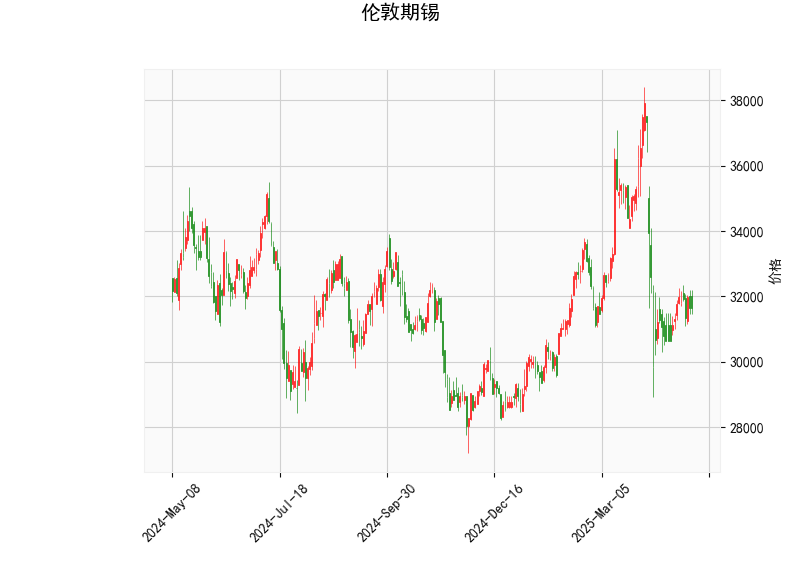

### 伦敦期锡技术分析结果详解

#### 1. 对技术分析结果的分析
以下是对提供的伦敦期锡技术指标的详细解读，这些指标基于当前价格为31636.0的实时数据，旨在评估市场的短期趋势、动量和潜在反转信号。

- **RSI（相对强弱指数）: 45.33**  
  RSI当前值为45.33，处于中性偏弱区域（低于50）。这表明市场可能正处于弱势整理阶段，买卖力量相对均衡，但有轻微的超卖风险。如果RSI进一步下降至30以下，将可能触发超买反弹信号。目前的RSI水平暗示短期内价格可能企稳或小幅回升，但缺乏强烈的多头动力。

- **MACD（移动平均收敛散度）指标: MACD线-439.67, 信号线-546.57, 直方图106.90**  
  MACD线高于信号线（直方图为正值106.90），这是一种潜在的看涨信号，尽管整体MACD值仍为负（表明熊市趋势尚未完全逆转）。这可能反映出短期内卖方势头在减弱，买方力量开始积累。如果MACD线继续向上穿越信号线，将强化多头信号；反之，如果直方图回落，可能预示进一步下行压力。目前，这一配置暗示市场可能从超卖区域反弹。

- **布林带指标: 上轨37023.30, 中轨33045.35, 下轨29067.39**  
  当前价格31636.0位于中轨（33045.35）和下轨（29067.39）之间，接近下轨区域。这通常表示价格处于相对低位，可能存在超卖情况，潜在反弹机会增加。上轨作为阻力位，如果价格向上突破中轨并逼近上轨（37023.30），可能确认多头趋势；反之，如果价格跌破下轨，将加剧看空风险。目前的布林带宽度显示市场波动性适中，支持短期波动交易。

- **K线形态: CDLMATCHINGLOW（低点匹配形态）**  
  这是一种典型的看涨K线形态，通常出现在价格底部，表明卖方力量耗尽，买方可能即将介入。具体表现为连续的低点匹配，暗示短期见底信号。如果后续K线确认向上突破（如形成阳线），这将增强多头信心；否则，可能只是短暂的假反弹。结合其他指标，这进一步支持市场潜在反转的观点。

总体而言，技术指标显示伦敦期锡当前处于弱势但可能反转的阶段。RSI和布林带指向潜在超卖反弹，MACD的正直方图和K线形态提供看涨线索，但整体市场仍需外部因素（如全球经济数据或锡矿供给）确认。

#### 2. 近期可能存在的投资或套利机会和策略判断
基于上述分析，伦敦期锡短期内可能存在反弹机会，但市场不确定性较高。以下是针对投资和套利的潜在机会及策略建议，这些基于技术面分析，并结合风险管理原则。需注意，实际操作应参考更多宏观因素，如全球锡需求（电子行业）和地缘政治影响。

- **潜在投资机会**  
  - **反弹买入机会**: 当前指标显示市场可能从超卖区域反弹，尤其是K线形态和MACD信号的看涨迹象。如果价格稳定在中轨以上（约33045.35），短期多头交易可期。预计价格可能测试上轨37023.30，若成功突破，将打开进一步上涨空间（目标位可能至34000-35000）。  
  - **风险点**: 如果RSI跌破40或价格跌破下轨29067.39，卖方可能主导，增加下行风险。近期机会更适合短期交易者，而非长期投资者。

- **潜在套利机会**  
  - **跨期套利**: 伦敦期锡作为全球基准，可与上海期锡或其他金属期货比较。如果伦敦期锡价格相对低估（当前接近下轨），可考虑在伦敦市场买入，同时在高估市场卖出（如如果上海期锡价格偏高）。例如，观察伦敦与上海价差，若价差扩大至历史异常水平（e.g., 超过500美元/吨），可进行反向套利。  
  - **技术套利策略**: 利用布林带波动进行区间套利。在当前价格区间（29067.39-33045.35）内，可采用“买入低卖出高”的策略，例如在下轨附近买入，目标卖出至中轨。但需监控MACD交叉信号，避免假突破。全球锡库存数据（如LME库存）若显示紧缩，也可增强套利信心。

- **推荐策略**  
  - **多头策略**: 入场条件—等待RSI回升至50以上或MACD线向上交叉信号线。买入点可设在当前价附近（31600-31800），止损设在下轨以下（约28800），目标位为中轨或上轨。适合风险偏好中等的投资者。  
  - **空头策略**: 若RSI持续下降或K线形态失败，可在价格回落时卖出空单，止盈目标设在中轨以下。  
  - **风险管理建议**: 所有策略均应控制仓位（不超过总资金的10-20%），并结合基本面（如锡矿供应中断风险）进行验证。使用限价订单避免 slippage，并定期复盘指标以调整持仓。  
  - **整体评估**: 近期机会偏向短期反弹套利（1-3周内），但全球经济不确定性（如通胀或需求放缓）可能限制上行空间。建议结合实时数据和专业咨询，避免单一技术分析决策。