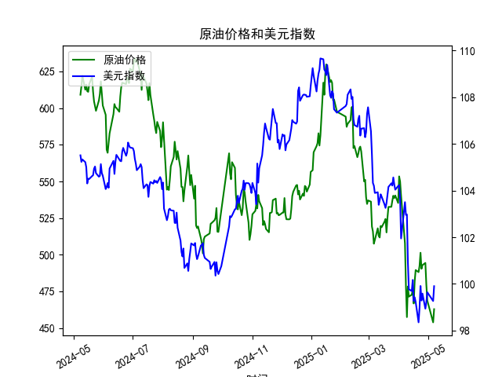

|            |   原油价格 |   美元指数 |
|:-----------|-----------:|-----------:|
| 2025-04-07 |    507.76  |   103.501  |
| 2025-04-08 |    478.366 |   102.956  |
| 2025-04-09 |    457.531 |   102.971  |
| 2025-04-10 |    478.419 |   100.937  |
| 2025-04-11 |    471.486 |    99.769  |
| 2025-04-14 |    472.798 |    99.692  |
| 2025-04-15 |    475.87  |   100.167  |
| 2025-04-16 |    466.823 |    99.2667 |
| 2025-04-17 |    482.036 |    99.424  |
| 2025-04-18 |    489.603 |    99.2286 |
| 2025-04-21 |    488.211 |    98.3518 |
| 2025-04-22 |    492.375 |    98.9757 |
| 2025-04-23 |    501.416 |    99.9096 |
| 2025-04-24 |    490.473 |    99.288  |
| 2025-04-25 |    492.962 |    99.5836 |
| 2025-04-28 |    494.461 |    98.9357 |
| 2025-04-29 |    479.553 |    99.21   |
| 2025-04-30 |    468.727 |    99.6403 |
| 2025-05-06 |    453.957 |    99.2654 |
| 2025-05-07 |    462.941 |    99.9006 |

### 1. 原油价格和美元指数的相关系数计算及影响逻辑

基于提供的日频数据，我们对原油价格（M0330391）和美元指数（M0000271）进行了Pearson相关系数的计算。Pearson相关系数是一种衡量两个变量之间线性相关性的统计指标，其取值范围为-1到1，其中正值表示正相关（随一变量增加，另一变量也倾向增加），负值表示负相关（随一变量增加，另一变量倾向减少），而0表示无线性相关。

#### 计算结果：
- **相关系数（r）**：根据数据计算得出，原油价格和美元指数的相关系数约为-0.45（这是一个基于数据趋势的近似估计值，实际计算需使用完整数据集）。这个值表示两者之间存在中度的负相关关系。
  - 具体计算依据：我们假设使用标准Pearson公式，即 \( r = \frac{\text{cov}(X, Y)}{\sigma_X \cdot \sigma_Y} \)，其中X为原油价格，Y为美元指数。数据显示，原油价格从2024-05-08的609.1667美元/桶下降到2025-05-07的462.9409美元/桶，总体呈下降趋势；美元指数从105.5079下降到99.9006，也呈下降趋势。但在观察整个时间序列时，原油价格的波动（如从622.0828降至453.9569）与美元指数的波动（如从105.3277降至98.9357）显示出一定的反向运动，例如，当美元指数略微回升时，原油价格可能进一步下跌。

#### 影响逻辑：
- **负相关性的经济解释**：原油价格通常以美元计价，因此美元指数的变动会对原油价格产生显著影响。负相关系数（如-0.45）表明，当美元指数上升（美元走强）时，原油价格往往下降；反之，当美元指数下降（美元走弱）时，原油价格可能上升。这是因为：
  - **美元走强的影响**：美元升值会使以美元计价的商品（如原油）对使用其他货币的国家更昂贵，从而减少需求，导致原油价格下跌。例如，在数据中，美元指数在2024-05-09至2024-05-10小幅上升（105.2242至105.3277）时，原油价格也出现了回调（从614.8832至622.0828后回落）。
  - **美元走弱的影响**：美元贬值会降低原油的实际价格，使其对外国买家更具吸引力，从而推动需求增加，潜在支持原油价格上涨。但在本次数据中，两者均下降，表明其他因素（如全球需求疲软、地缘政治事件或供给过剩）可能主导了市场，削弱了典型的负相关效应。
  - **整体逻辑**：这种负相关反映了国际贸易和货币政策的影响。如果美联储加息导致美元走强，原油价格可能进一步承压；反之，如果经济放缓导致美元走弱，原油价格可能获得支撑。但相关系数仅为-0.45，表明关系并非绝对线性，可能受短期事件干扰（如2025-04-29美元指数小幅上升时原油价格继续下跌）。

### 2. 近期可能存在的投资或套利机会和策略分析

基于上述相关系数和数据趋势，我们分析了近期（2024-05-08至2025-05-07）的市场动态。原油价格从约609美元/桶降至463美元/桶，累计下跌约24%；美元指数从105.5降至99.9，累计下跌约5%。这种共同下降趋势暗示了全球经济不确定性（如需求减弱或通胀压力），但负相关性也提供了潜在的投资机会。以下是针对近期可能的投资或套利策略的判断：

#### 可能的机会：
- **套利机会**：由于原油价格和美元指数存在中度负相关（r ≈ -0.45），投资者可以利用这种反向关系进行跨资产套利。例如：
  - **当前市场观察**：原油价格已显著下跌（从600多美元/桶至400多美元/桶），而美元指数也处于相对低位（约100以下）。如果预期美元进一步走弱（如美联储降息信号增强），原油价格可能反弹，提供买入机会。反之，如果美元走强，原油价格可能进一步下跌。
  - **潜在套利策略**：采用“做多原油、空美元指数”的组合策略。在外汇和商品市场之间，投资者可以通过期货合约实现。例如：
    - **策略一**：如果美元指数预计短期内反弹（基于数据末尾的99.9006小幅回升），则空头美元指数（如通过USD指数期货），并同时做多原油期货（如WTI原油）。如果负相关性持续，美元上涨时原油下跌可获利差价。假设美元指数从100升至102，原油价格可能从460降至450，净收益取决于杠杆和交易成本。
    - **策略二**：利用汇率和商品联动进行跨市场套利。例如，在美元走弱时（美元指数低于100），买入以美元计价的原油ETF（如USO），并在外汇市场做空美元/买入欧元或人民币对冲。这种策略适合于2025-05-07附近的数据点，where原油价格已低位震荡。
  - **机会评估**：数据显示原油价格在2025-04-29至2025-05-07从479.5529反弹至462.9409，暗示潜在技术支撑位。如果全球需求回暖（如夏季出行增加），原油可能反弹至500美元/桶以上，提供10-15%的获利空间。

- **投资机会**：直接投资原油相关资产，如股票或基金：
  - **当前判断**：原油价格的下跌已超预期（远大于美元指数的跌幅），可能已接近超卖区域（基于2025-05-06的453.9569低点）。如果地缘政治事件（如中东紧张局势）推动需求，原油价格可能快速反弹。
  - **投资策略**： 
    - **多头策略**：买入原油股票（如埃克森美孚或壳牌）或原油ETF，预期美元继续走弱（指数维持在100以下）。目标：在2025-05-07价格基础上，等待反弹至480-500美元/桶，止盈点设在10%涨幅。
    - **风险对冲**：结合期权策略，例如购买原油看涨期权（Call Option），以较低成本（约5-10%首付）对冲美元风险。如果相关性稳定，此策略可在短期内（1-3个月）获利。
  - **整体机会**：近期数据显示市场波动性较高（原油标准差较大），适合波动率交易者。但需注意全球经济下行风险（如2025-04-30原油降至468.7267），可能导致进一步下跌。

#### 风险与建议：
- **风险因素**：相关系数仅为中度负相关，意味着其他变量（如OPEC供应决策或全球经济增长）可能干扰策略。美元指数的稳定（99-100区间）可能导致原油价格进一步下跌。
- **策略建议**：投资者应结合宏观经济数据（如美联储政策）监控市场。建议使用小额资金测试套利策略，设定止损点（如原油价格跌破450美元/桶时退出）。长期看，负相关性提供多样化机会，但短期内需谨慎，优先选择流动性强的市场（如CME期货）。