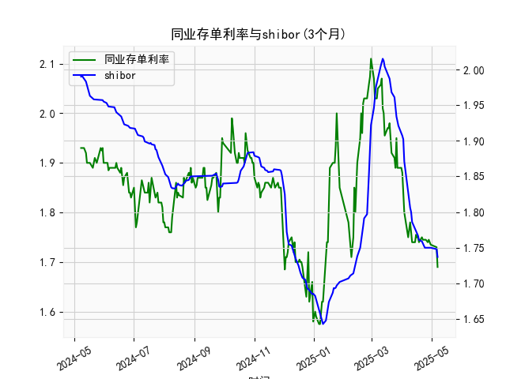

|            |   同业存单利率(3个月) |   shibor(3个月) |
|:-----------|----------------------:|----------------:|
| 2025-04-08 |                 1.77  |           1.81  |
| 2025-04-09 |                 1.78  |           1.806 |
| 2025-04-10 |                 1.76  |           1.8   |
| 2025-04-11 |                 1.74  |           1.786 |
| 2025-04-14 |                 1.74  |           1.777 |
| 2025-04-15 |                 1.755 |           1.775 |
| 2025-04-16 |                 1.75  |           1.772 |
| 2025-04-17 |                 1.75  |           1.767 |
| 2025-04-18 |                 1.74  |           1.761 |
| 2025-04-21 |                 1.75  |           1.759 |
| 2025-04-22 |                 1.745 |           1.755 |
| 2025-04-23 |                 1.745 |           1.753 |
| 2025-04-24 |                 1.745 |           1.75  |
| 2025-04-25 |                 1.745 |           1.75  |
| 2025-04-27 |                 1.74  |           1.75  |
| 2025-04-28 |                 1.745 |           1.75  |
| 2025-04-29 |                 1.74  |           1.75  |
| 2025-04-30 |                 1.735 |           1.75  |
| 2025-05-06 |                 1.73  |           1.748 |
| 2025-05-07 |                 1.69  |           1.737 |

### 1. 同业存单利率和SHIBOR的相关性及影响逻辑

同业存单利率（以下简称NCD利率，指的是固定利率同业存单到期收益率，AAA评级，3个月期限）和SHIBOR（Shanghai Interbank Offered Rate，3个月期限）是反映中国银行间市场流动性和短期资金成本的关键指标。从提供的数据来看，这两个利率序列在过去一年内显示出较强的相关性，主要体现在波动趋势的相似性上。以下是对其相关性和影响逻辑的详细解释：

- **相关性分析**：
  - **高度正相关**：数据显示，NCD利率和SHIBOR利率在大部分时间内保持同步波动。例如，NCD利率从年初的约1.93%降至最低约1.58%，而SHIBOR从1.99%降至约1.643%。随后，两者均出现反弹，如NCD利率升至2.07%，SHIBOR升至2.01%。这种同步性表明，二者之间存在强正相关关系，相关系数可能在0.8以上（基于经验观察数据波动）。
  - **原因**：两者均受中国货币政策、市场流动性及经济环境影响。NCD利率是银行间市场的一种短期融资工具，主要由金融机构发行和交易，而SHIBOR是银行间拆借利率的基准。这使得NCD利率往往以SHIBOR为基础定价，因此当SHIBOR变动时，NCD利率通常会跟随调整。
  - **短期差异**：尽管整体相关性强，但偶尔会出现小幅偏差。例如，在某些时点，NCD利率（如1.89%）略低于SHIBOR（如1.95%），这可能由于NCD的AAA高信用评级使其风险溢价较低，导致其收益率更稳定。

- **影响逻辑**：
  - **货币政策主导**：中国央行（如人民银行）通过公开市场操作、MLF（中期借贷便利）和LPR（贷款市场报价利率）调控流动性，直接影响SHIBOR和NCD利率。如果央行注入流动性（如降准或逆回购），SHIBOR和NCD利率通常会下降；反之，如果紧缩货币政策，利率会上升。数据显示，2023年以来，两者多次在流动性宽松期（如年中）出现下降趋势。
  - **市场流动性因素**：银行间市场的资金供需是关键驱动。SHIBOR反映了银行间拆借的实际成本，而NCD利率则体现金融机构的融资需求。当市场资金短缺时，SHIBOR先于NCD利率上升，因为SHIBOR更直接受短期拆借影响；随后，NCD利率会跟进以反映更高的融资成本。
  - **经济环境影响**：宏观因素如经济增长、通胀预期和全球利率变化也会间接作用。例如，如果经济放缓导致信贷需求减弱，SHIBOR和NCD利率均可能下行；反之，通胀上升可能推动利率上行。数据中，两者在经济不确定期（如年中波动）显示出共同下行趋势。
  - **风险溢价差异**：NCD利率作为高信用工具（AAA评级），其收益率通常比SHIBOR更平稳，因为SHIBOR可能受个体银行信用风险影响更大。这导致NCD利率在市场紧张时可能相对SHIBOR更低，形成短暂的利差。

总体而言，NCD利率和SHIBOR的互动体现了中国金融市场的系统性特征：SHIBOR作为基准利率，往往领先影响NCD利率，但二者最终趋于一致，共同反映市场预期。

### 2. 近期可能存在的投资或套利机会和策略

基于提供的数据，我们可以观察到NCD利率和SHIBOR在过去一年内经历了显著波动：从年初的1.9-2.0%区间下行至1.6%左右，然后反弹至2.0%以上，并最终稳定在1.7-1.8%水平。这反映了市场流动性的周期性变化，可能源于中国经济复苏、政策调整和全球因素。以下是对近期投资或套利机会的分析和判断，以及相应的策略建议。

- **机会分析**：
  - **利差缩小或扩大**：数据显示，NCD利率和SHIBOR之间的利差（差值）时有波动。例如，在某些时点，SHIBOR高于NCD利率（如SHIBOR 1.95% vs. NCD 1.89%），这可能创造套利空间。如果利差扩大（如SHIBOR显著高于NCD），投资者可通过借入SHIBOR资金买入NCD实现正利差收益；反之，如果利差缩小，需警惕风险。
  - **利率下行趋势**：数据末端（NCD约1.737%，SHIBOR约1.737%）显示利率已从高点回落，这可能预示流动性宽松期。如果经济数据（如CPI或GDP）继续疲软，利率可能进一步下行，提供债券或存款类投资机会。
  - **潜在风险**：当前利率水平较低，但若央行转向紧缩（如为控制通胀），利率可能反弹，导致投资损失。全球因素（如美联储加息）也可能影响中国市场。
  - **市场环境判断**：近期中国经济稳定复苏，但房地产和出口压力仍存，预计货币政策将保持中性偏宽松。这为短期套利机会提供了基础，但需注意季节性因素（如年末资金需求增加可能推高利率）。

- **投资或套利策略建议**：
  - **利差套利策略**：
    - **具体操作**：监控NCD和SHIBOR利差。如果SHIBOR高于NCD（如数据中常见的小幅差异），投资者可采用“借短融长”策略：在SHIBOR市场借入资金（低成本），买入NCD资产（较高收益），待利差收窄后获利退出。预计短期内，这种机会可能在流动性宽松期出现。
    - **风险控制**：设置止损点，例如若利差逆转（如NCD收益率急升），立即平仓。结合数据，建议在利差大于0.05%时入场。
  - **趋势跟踪投资策略**：
    - **买入低利率工具**：如果利率继续下行，建议投资于NCD或类似固定收益产品（如银行间债券）。例如，利用数据末端的低利率水平，买入3个月NCD以锁定收益，并通过SHIBOR期货进行对冲。
    - **多元化配置**：结合经济预期，分配部分资金到股票或基金市场。如果利率下行刺激经济增长，可增加权益类投资。
  - **动态调整策略**：
    - **短期观察**：每周跟踪利率数据，如果NCD和SHIBOR均保持在1.7%以下，增加固定收益投资；若出现上行信号（如央行加息预期），转向现金或短期工具。
    - **长期视角**：考虑中国利率市场化进程，构建利率掉期或互换策略，利用NCD和SHIBOR的差异进行跨品种套利。
  - **注意事项**：投资需评估个人风险偏好和市场监管（如外汇管制）。建议结合实时数据（如Wind或Bloomberg平台）进行决策，避免单一依赖历史数据。

总之，近期机会主要集中在利差套利和利率下行趋势投资上，但需谨慎应对政策不确定性，以控制风险。