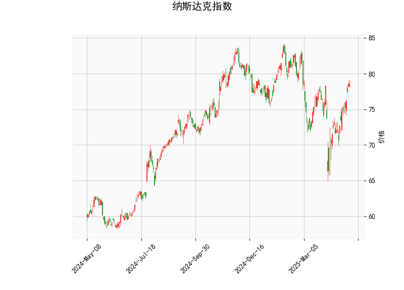

### 1. 对纳斯达克指数的技术分析结果进行分析

以下是对提供的纳斯达克指数技术分析结果的详细解读，基于关键指标如RSI、MACD、Bollinger Bands和K线形态。我们将逐一分析这些指标，以评估当前的市场态势。

- **当前价格（78.57）**: 当前价格位于75.85（中轨带）的上方，但未触及83.32（上轨带），表明指数处于相对稳定的区间内。这可能反映出近期市场存在温和的上行压力，但尚未进入超买状态。如果价格继续向上逼近上轨带（83.32），可能预示进一步上涨；反之，如果回落至下轨带（68.38）附近，则需警惕潜在回调。

- **RSI（62.26）**: RSI值处于中性偏上区域（50以上表示看涨，70以上为超买）。当前62.26的水平显示纳斯达克指数有轻微的强势态势，但未出现过度买入的信号。这暗示市场动量健康，可能继续维持上涨趋势。然而，如果RSI快速升至70以上，可能会增加回调风险。

- **MACD指标**:
  - MACD线（0.864）高于信号线（0.026），且MACD直方图（0.838）为正值，这是一个典型的看涨信号。MACD线的正向交叉（即MACD线高于信号线）通常表示短期动量增强，建议投资者关注潜在的买入机会。
  - 直方图的正值（0.838）进一步强化了这一信号，显示价格动量正在加速向上。但需注意，如果MACD线开始回落并低于信号线，可能预示趋势逆转。

- **Bollinger Bands**:
  - 上轨带（83.32）、中轨带（75.85）和下轨带（68.38）构成了价格的波动区间。目前价格（78.57）位于中轨带上方，接近上轨带，这反映出市场波动性适中且偏向于上行。如果价格突破上轨带，可能触发更强烈的上涨；反之，价格回落至中轨带以下，可能出现修正或熊市信号。Bollinger Bands的收窄或扩张也可作为未来波动性的参考。

- **K线形态（CDLGAPSIDESIDEWHITE）**: 这是一个看涨K线模式，通常表示价格出现向上跳空（Gap），伴随较强的白实体蜡烛（即实体部分较长，暗示买方主导）。这种形态常被视为短期多头信号，表明市场情绪积极，可能推动价格进一步上涨。但K线形态需结合其他指标验证其可靠性，如果后续出现负面形态（如下跌跳空），则可能逆转这一信号。

总体而言，纳斯达克指数的技术指标显示出轻微看涨的态势。RSI和MACD的组合暗示短期动量向上，Bollinger Bands支持价格在当前区间的稳定，而K线形态进一步强化了多头潜力。然而，市场并非极度强势，存在回调风险，尤其如果外部因素（如经济数据或地缘事件）引发波动。

### 2. 分析判断近期可能存在的投资或套利机会和策略

基于上述技术分析，纳斯达克指数近期可能存在一定的投资机会，特别是针对多头趋势的交易策略。同时，考虑到套利通常涉及低风险套取价差，我们将重点讨论基于技术指标的短期交易机会（如动量套利），而非传统无风险套利。以下是具体判断和建议：

- **可能存在的投资机会**:
  - **看涨机会主导**: 当前指标整体偏多头，RSI接近中性上沿、MACD显示正向动量，以及K线形态的支撑，表明纳斯达克指数可能在短期内继续上行。投资者可关注价格向Bollinger Bands上轨带（83.32）的突破，作为潜在买入点。如果外部市场（如科技股表现强劲）配合，这一机会可能在1-3个月内显现。
  - **回调后的机会**: 如果价格回落至中轨带（75.85）附近，RSI和MACD可能提供低风险买入点，这是一种常见的“逢低布局”策略，尤其适合长线投资者。
  - **潜在风险**: RSI若升至70以上，可能引发超买回调；MACD直方图若转为负值，则信号转为中性或看空。因此，机会需伴随风险管理。

- **可能的套利或交易策略**:
  - **动量交易策略（基于MACD）**: 由于MACD线高于信号线，建议采用动量套利策略。例如，在MACD直方图保持正值时买入纳斯达克相关ETF（如QQQ），并在价格接近上轨带时部分获利了结。目标：短期内捕捉5-10%的涨幅。风险控制：设置止损在下轨带（68.38）下方，避免单向趋势逆转。
  - **波动率交易策略（基于Bollinger Bands）**: 当前价格在中轨带上方，适合进行波动率套利，如卖出看涨期权（如果预期价格不会大幅突破上轨带）或买入跨式期权组合。策略示例：在78.57附近买入看涨期权，同时卖出更高行权价的期权，以套取时间价值差。潜在收益：如果价格在80-83区间波动，可获利；但需监控RSI，避免超买引发的剧烈波动。
  - **K线形态结合策略**: 利用“CDLGAPSIDESIDEWHITE”的看涨信号，进行短期套利。例如，在确认跳空后买入，并设定目标价位在83.32附近。结合RSI监控，RSI若回落至55以下时加仓，以捕捉回调后的反弹。适用于日内或短线交易者。
  - **整体风险管理建议**: 任何策略均应结合多样化（如搭配债券或黄金作为对冲），并设置10-15%的止损阈值。鉴于纳斯达克的波动性，建议优先在模拟账户测试策略，避免高杠杆操作。

总之，近期纳斯达克指数的投资机会以多头为主，适合动量或波动率策略，但需警惕回调风险。投资者应结合基本面（如经济数据和企业财报）验证这些技术信号，以优化决策。