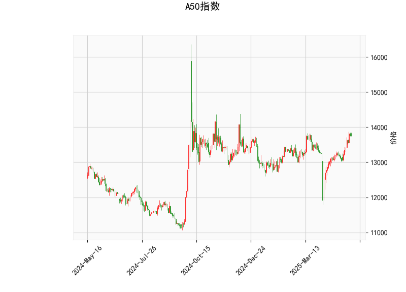

### A50指数技术分析结果分析

#### 1. 对技术指标的详细分析
基于提供的A50指数数据，我们对关键技术指标进行逐一解读，以评估当前市场趋势和潜在风险。

- **当前价格（13760.0）**: A50指数当前价格为13760.0，位于布林带的中上区域（中轨为13256.64，上轨为13901.03）。这表明价格已从中轨向上突破，但尚未触及上轨上限，显示短期内可能存在上行压力。然而，接近上轨也暗示潜在的超买风险，如果价格突破上轨，可能引发进一步上涨；反之，若回落，可能测试中轨支撑。

- **RSI（相对强弱指数，65.465）**: RSI值超过70的阈值（通常视为超买区域），这表示A50指数短期内可能被过度买入，市场情绪偏向乐观，但也增加了回调的风险。投资者需警惕可能的修正，特别是如果外部因素（如经济数据或地缘事件）引发卖盘。

- **MACD指标（MACD线：154.278，信号线：81.172，柱状图：73.106）**: MACD线高于信号线，且柱状图为正值，这是一个典型的看涨信号，表明短期多头势头强劲。柱状图的正值（73.106）进一步强化了上升趋势的可持续性。然而，随着RSI的超买状况，如果MACD柱状图开始收窄或转为负值，可能预示趋势逆转。

- **布林带（Upper Band：13901.03，Middle Band：13256.64，Lower Band：12612.24）**: 当前价格接近上轨（13901.03），这往往是波动率增加的信号。布林带的收缩或扩张可以反映市场波动：如果价格突破上轨，可能进入强势上涨阶段；反之，若跌破中轨，可能会测试下轨（12612.24），增加下行风险。目前的布林带格局显示市场处于相对活跃状态，但超买风险值得注意。

- **K线形态（CDLMATCHINGLOW和CDLSHORTLINE）**: 
  - **CDLMATCHINGLOW**：这是一种看涨形态，通常表示价格在低点附近形成匹配低点，可能预示短期反弹或支撑增强。这暗示市场可能在当前水平找到买盘支撑，适合观望多头机会。
  - **CDLSHORTLINE**：这表示K线实体较短，反映价格波动较小，可能预示市场处于整理阶段或即将突破。结合其他指标，这可能是一个短期休整信号，而不是强烈趋势。

总体而言，A50指数显示出混合信号：MACD和K线形态支持看涨，但RSI的超买和布林带位置提示潜在回调风险。当前市场可能处于上行趋势的后期阶段，需要密切关注后续价格行为。

#### 2. 近期可能存在的投资或套利机会和策略
基于上述分析，我们判断A50指数的近期机会，并提出相应的策略。需强调，市场充满不确定性，建议结合基本面分析和风险管理（如设置止损位）进行操作。

- **可能的投资机会**:
  - **看涨机会**：MACD的正向信号和K线形态（如CDLMATCHINGLOW）暗示短期内可能继续上涨，尤其是如果价格突破布林上轨（13901.03）。若全球股市或中国经济数据向好，这可能放大多头势头。
  - **回调机会**：RSI超买（65.465）增加了修正风险，价格可能回落至中轨（13256.64）附近。这为逆势投资者提供买入点，例如在回调后逢低布局多头头寸。
  - **风险点**：如果外部事件（如利率变化或地缘紧张）触发卖盘，价格可能快速跌向下轨（12612.24），导致短期损失。

- **可能套利机会**:
  - **跨市场套利**：A50指数与中国A股或其他亚洲指数（如沪深300）相关性较高。如果A50相对于这些指数出现价差（如A50相对高估），可以考虑在A50做空的同时，在相关低估指数做多，实现无风险或低风险套利。当前RSI超买可能放大这种价差。
  - **技术套利**：基于指标背离，例如MACD看涨但RSI超买，可以采用“均值回归”策略——在价格接近上轨时做空，等待回落至中轨后再平仓。或者，利用K线形态的短期整理期进行波动率套利，如在波动率较低时买入期权头寸。

- **推荐策略**:
  - **多头策略**：如果您看好短期趋势，在MACD柱状图保持正值时买入A50相关ETF或期货，但将止损设置在布林中轨（13256.64）下方。同时，监控RSI是否回落至50-60区间，以确认入场时机。
  - **空头或中性策略**：鉴于RSI超买，考虑在价格接近上轨时做空，或使用期权构建保护性头寸（如买入看跌期权）。若K线形态显示整理，采用范围交易策略：在13760附近卖出高点，买入低点。
  - **套利策略**：监控A50与其他指数（如恒生指数）的价差，如果A50相对溢价超过历史平均值，进行反向套利（如A50空头 + 相关指数多头）。风险控制：限制仓位在总资金的10-20%，并设置动态止盈止损。
  - **整体建议**：短期内，市场可能呈现“上涨后回调”的模式。投资者应优先选择流动性强的工具（如ETF），并结合宏观环境（如中国经济复苏信号）调整策略。长期而言，等待RSI降至中性水平（50以下）再加仓，以降低风险。