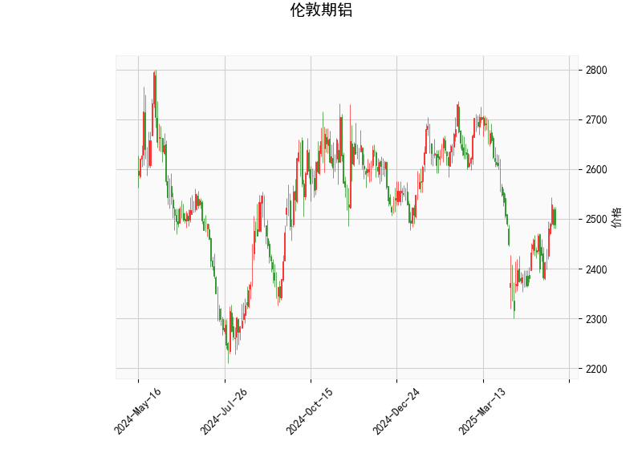

# 伦敦期铝技术分析结果分析

## 1. 对技术分析结果的详细分析
基于提供的伦敦期铝技术指标数据，我们可以从多个维度对其进行解读。当前价格为2489.0，整体市场处于相对稳定的状态，但存在一些潜在的信号。以下是对各指标的逐一分析：

- **RSI (相对强弱指数)**: 当前RSI值为54.55，这表明市场处于中性区域（通常RSI高于70为超买，低于30为超卖）。RSI的这一水平暗示价格动能适中，没有明显的超买或超卖风险，短期内可能维持横盘或小幅波动。

- **MACD (移动平均收敛散度)**: MACD线值为3.012，信号线值为-13.636，直方图值为16.648。正直方图（MACD线高于信号线）显示出看涨的动量，表明短期内可能有向上交叉的信号。这是一个潜在的买入机会，但需注意信号线的负值，可能反映了近期的一些下行压力。

- **Bollinger Bands (布林带)**: 上轨为2764.88，中轨为2520.72，下轨为2276.56。目前价格2489.0 位于中轨附近，略低于中轨，这表示价格处于布林带的中间区域，波动性相对温和。没有触及上轨或下轨，暗示市场缺乏强烈的趋势方向，更多是 sideways（横向）运动。

- **K线形态**: 检测到的形态包括“CDLMATCHINGLOW”（匹配低点）和“CDLSHORTLINE”（短线）。CDLMATCHINGLOW 通常表示价格可能在关键支撑位形成底部，暗示潜在的反转信号；CDLSHORTLINE 则反映了短期的小幅波动或整理期。这两个形态结合，表明市场可能在低位筑底，但尚未确认强势反弹。

总体而言，技术指标显示伦敦期铝当前处于中性偏看涨的态势。RSI和Bollinger Bands 强调了市场的稳定性，而MACD和K线形态提供了轻微的看涨线索。然而，缺乏强烈的趋势信号，短期内可能继续震荡，投资者需关注后续价格行为以确认方向。

## 2. 近期可能存在的投资或套利机会和策略
基于上述分析，伦敦期铝市场存在一些潜在的投资和套利机会，但风险需谨慎评估。以下是针对近期市场的判断和建议策略：

### 可能的机会
- **投资机会**: 
  - **看涨潜力**: MACD直方图的正值和K线形态（如CDLMATCHINGLOW）暗示短期反弹可能。如果价格突破中轨（2520.72）并向上测试上轨（2764.88），这可能触发多头入场。当前价格2489.0 接近支撑位，RSI的中性水平也为买入提供了缓冲。
  - **套利机会**: 期铝市场可能与现货铝或其他金属（如铜或锌）存在价差套利机会。例如，如果伦敦期铝价格与上海期货交易所的铝价出现异常背离（如期铝相对低估），投资者可考虑跨市场套利。但需监控全球经济因素，如需求复苏或供应链中断，可能放大价差。

- **风险因素**: 
  - 如果RSI升至70以上，市场可能超买并回调；反之，如果价格跌破下轨（2276.56），则可能转为看跌。K线形态的短线特征也意味着波动性较高，需防范突发事件（如地缘政治风险）导致的价格跳水。

### 推荐策略
- **趋势跟踪策略**: 
  - **买入建议**: 在MACD线向上交叉信号线时（当前已显示初步信号），考虑在2489.0附近买入多头头寸。设置止损在下轨2276.56以下，以控制风险。目标位可设在中轨2520.72上方，争取测试上轨2764.88。
  - **卖出建议**: 如果RSI接近70或价格触及上轨，考虑短期卖出以锁定利润。

- **均值回归策略**: 
  - 由于价格在中轨附近震荡，投资者可采用区间交易。例如，在价格回落至2300-2400区间时买入，在接近2600时卖出。这适合波动率较低的 sideways 市场，利用Bollinger Bands的收缩进行套利。

- **套利组合策略**: 
  - **跨品种套利**: 若伦敦期铝与LME其他金属（如铜）价差扩大，可构建多头期铝和空头铜的组合，以捕捉回归均值的机会。
  - **风险管理**: 所有策略均应结合资金管理，如仓位控制在总资金的10%以内，并使用技术止损（如基于Bollinger Bands）。此外，密切关注宏观数据（如中国工业产出或全球铝库存变化），作为进出场的辅助指标。

总之，近期伦敦期铝的投资机会以短期反弹为主，套利机会依赖于市场价差。但市场不确定性较高，建议投资者结合基本面（如铝需求复苏）和风险偏好制定计划，避免过度杠杆。