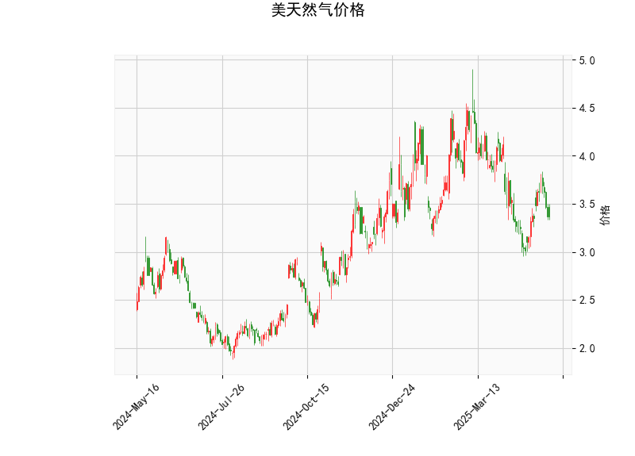

### 美天然气价格的技术分析结果解析

#### 1. 对技术分析结果的详细分析
基于提供的美天然气价格数据（当前价为3.366美元），我们对关键技术指标进行逐一解读，以评估价格的当前态势和潜在趋势。这些指标共同反映了市场的动量、趋势强度和波动性。

- **RSI（相对强弱指数）: 44.27**  
  RSI当前值为44.27，处于中性偏弱区域（RSI在30以下为超卖，70以上为超买）。这表明美天然气价格近期可能缺乏强势买盘支撑，市场情绪较为疲软，但尚未进入超卖状态。如果RSI继续下降至30以下，可能预示短期反弹机会；反之，如果回升至50以上，则可能标志着多头势头的恢复。

- **MACD（移动平均收敛散度）指标: MACD线-0.032, 信号线-0.057, 直方图0.024**  
  MACD线（-0.032）高于信号线（-0.057），直方图为正值（0.024），这暗示短期内可能出现看涨信号。尽管整体MACD值为负（表示短期均线仍在长期均线下），但直方图的正值表明多头动能正在逐步增强。如果MACD线向上穿越信号线，将形成“黄金交叉”，可能触发价格反弹。当前状态显示市场可能从弱势中恢复，但需警惕任何向下交叉的风险。

- **Bollinger Bands（布林带）: 上带4.545, 中带3.751, 下带2.956**  
  当前价格（3.366）位于中带（3.751）和下带（2.956）之间，接近下带，这通常表示价格处于相对低位，可能接近支撑区域。布林带的宽度显示市场波动性适中（上带和下带间距为1.589）。如果价格触及下带并反弹，这可能是一个买入信号；反之，如果价格跌破下带，则可能进入更深度的下跌趋势。总体上，这反映了价格在窄幅区间内震荡，等待突破方向。

- **K线形态: CDLLONGLINE 和 CDLMATCHINGLOW**  
  “CDLLONGLINE”通常表示一根长实体K线（如大阳线或大阴线），暗示市场可能出现强势单边运动，当前可能反映了价格企稳或初步反弹的迹象。“CDLMATCHINGLOW”则表示价格触及一个与前期低点相匹配的水平，可能预示支撑位形成或反转信号。这两个形态结合，显示短期内价格可能在低位筑底，但需确认后续K线以避免假突破。

总体而言，美天然气价格当前处于弱势整理阶段。RSI和MACD显示潜在的看涨机会，而Bollinger Bands和K线形态则强调了价格的支撑作用。市场可能正从近期低点反弹，但外部因素（如天气、地缘政治或需求变化）可能放大波动。

#### 2. 近期可能存在的投资或套利机会和策略判断
基于上述技术分析，我们评估了美天然气市场的潜在机会。当前价格在技术指标支持下，可能存在短期反弹空间，但整体市场仍需谨慎对待。以下是针对投资和套利的分析及策略建议：

- **投资机会判断**  
  - **潜在买入机会**: 当前RSI偏低、MACD直方图转正，以及价格接近Bollinger Bands下带，暗示短期内可能出现反弹。K线形态的“CDLMATCHINGLOW”进一步支持价格可能在低位企稳。如果全球需求（如冬季取暖）或供应中断（如地缘事件）因素介入，价格上行空间将放大。预计短期内（1-3周），价格可能测试中带（3.751）附近。  
  - **潜在卖出风险**: 如果RSI跌破30或MACD线向下交叉，价格可能进一步下跌至2.956以下，投资者需警惕空头趋势。  
  - **整体市场展望**: 美天然气市场季节性强，当前处于非高峰期，投资机会主要集中在技术反弹而非长期趋势。

- **套利机会判断**  
  - **跨市场或季节性套利**: 天然气价格受全球市场影响，可考虑与原油或电力市场相关的套利。例如，如果美天然气价格相对欧洲天然气（TTF期货）出现折价（当前美气价格较低），可通过价差交易（如买入美气期货并卖出欧洲合约）捕捉机会。季节性套利（如冬季需求高峰前囤货）也可能存在，但需关注库存水平。  
  - **短期波动套利**: Bollinger Bands的窄幅暗示低波动期，可能通过期权策略（如买入看涨期权）套利价格反弹。当前价位提供低入场成本，但需注意全球事件（如飓风或政策变化）可能引发突发波动。

- **投资和套利策略建议**  
  - **买入策略**: 在价格反弹信号确认（如MACD黄金交叉）时，买入现货或期货合约。设定止损在Bollinger Bands下带（2.956）以下，目标位设在中带（3.751）或上带（4.545）。风险管理：控制仓位不超过总资金的10%，并结合基本面（如EIA库存报告）验证。  
  - **卖出策略**: 若RSI升至60以上或K线显示新空头形态，考虑短线卖出。使用MACD背离作为信号，避免在支撑位强行卖出。  
  - **套利策略**: 采用价差交易，例如在美气与欧洲气价差扩大时，建立多头/空头组合。使用期权保护（例如购买看跌期权作为保险），并监控季节性因素（如夏季库存积累）。  
  - **风险提示**: 天然气市场易受非技术因素影响（如天气或地缘政治），建议结合基本面分析。总体策略应以短期波段操作为主，避免高杠杆操作，以控制波动风险。

通过这些分析，美天然气市场短期内可能提供有限的买入和套利机会，但投资者需密切跟踪指标变化和外部事件，以优化决策。