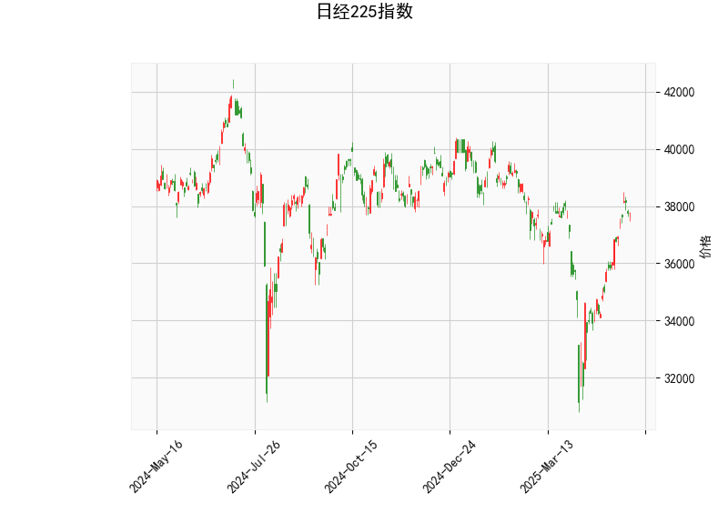

### 日经225指数技术分析结果分析

#### 1. 对技术指标的详细分析
基于提供的日经225指数数据，我们可以从多个技术指标入手，评估当前市场态势。以下是对各指标的逐一解读：

- **当前价格（37753.72）**：  
  日经225指数当前价格为37753.72点，这位于Bollinger Bands的中轨（36300.88）和上轨（39731.50）之间，表明指数处于相对强势区域。价格接近上轨，暗示短期内可能存在上行潜力，但也需警惕潜在的回调风险，因为上轨往往是阻力位。

- **RSI（62.50）**：  
  RSI值处于62.50，超过50的阈值，显示市场整体强势（强势区通常在50以上）。然而，它已接近70的超买水平（超买阈值），这可能预示着短期内存在修正或回调的风险。如果RSI继续上升，可能进一步确认多头趋势；反之，如果回落至50以下，则可能转为中性或空头信号。

- **MACD指标**：  
  - MACD线（658.04）高于信号线（374.41），且MACD直方图（283.64）为正值，这是一个典型的看涨信号，表明短期多头动能强劲。MACD线上穿信号线（金叉）通常被视为买入机会，暗示价格可能继续上涨。然而，直方图的正值虽支持多头，但如果未来直方图开始缩小或转为负值，则可能预示动量减弱。

- **Bollinger Bands**：  
  - 上轨（39731.50）、中轨（36300.88）和下轨（32870.25）显示当前价格处于中轨上方，接近上轨。这反映了市场的波动性适中，但价格靠近上轨可能表示超买状态，增加逆转的可能性。如果价格突破上轨，则可能进一步上行；反之，如果回落至中轨以下，则可能进入盘整或下跌阶段。

- **K线形态（CDLDOJI, CDLHIGHWAVE, CDLLONGLEGGEDDOJI, CDLSPINNINGTOP）**：  
  这些形态整体显示市场不确定性和犹豫。Doji和Long-Legged Doji通常表示买卖力量平衡，可能预示顶部形成或潜在逆转；High Wave和Spinning Top强调高波动性下的无方向性，暗示投资者 indecisiveness。结合其他指标，这可能意味着短期内市场缺乏明确方向，尽管多头信号存在，但逆转风险不可忽视。

总体而言，技术指标呈现出混合信号：RSI和MACD支持多头趋势，而Bollinger Bands和K线形态则提示不确定性和潜在回调。日经225指数当前处于强势，但市场可能在高位积累风险，建议关注后续价格行为。

#### 2. 近期可能存在的投资或套利机会和策略判断
基于上述分析，我们可以推断日经225指数的近期机会。总体判断是，短期内存在多头投资潜力，但不确定性较高，因此策略应以风险控制为主。以下是具体机会和策略建议：

- **可能的投资机会**：  
  - **多头机会**：RSI和MACD的看涨信号表明，指数可能继续向上测试上轨（39731.50）或更高。如果全球市场（如美国股市）保持强势，日经225作为亚洲主要指数，可能受益于风险偏好提升。当前价格在中轨上方，也支持潜在的上行空间。  
  - **回调机会**：K线形态的犹豫和RSI接近超买，暗示可能出现小幅回调（如回落到中轨附近）。这为逢低买入提供机会，尤其是在多头趋势未被证伪的情况下。  
  - **套利机会**：日经225指数与全球市场（如S&P 500或中国A股）相关性较高，可能存在跨市场套利。例如，如果日经225相对于S&P 500出现相对 undervaluation（基于历史相关性），可以通过多头日经225和空头S&P 500的组合策略获利。但需注意，实际套利需依赖实时数据和杠杆工具，如期货合约。

- **推荐的投资策略**：  
  - **多头策略**：在RSI和MACD支持下，考虑买入日经225指数ETF（如EWJ）或期货合约，目标价位设在上轨（39731.50）附近。止损位可设在中轨（36300.88）下方，以防范K线形态引发的逆转。持有期建议短期（1-2周），并结合全球经济新闻（如日本央行政策）调整。  
  - **风险管理策略**：由于不确定性高，采用“金字塔加仓”法——先小额买入，待价格确认突破上轨后再加仓。同时，监控RSI是否超过70；若超买确认，可转为观望或轻仓空头。  
  - **套利策略**：如果识别到日经225与相关资产（如美元/日元汇率）的价差，建议使用配对交易。例如，多头日经225期货并空头日元（若日元强势），但需借助专业平台。总体上，套利适合经验丰富的投资者，初学者应优先选择简单多头投资。  
  - **整体风险提示**：市场不确定性（如地缘政治事件或日本经济数据）可能放大波动。建议将投资仓位控制在总资产的20%以内，并定期复盘指标变化。

总之，近期日经225指数的投资机会以多头为主，但需警惕回调风险。通过结合RSI、MACD和K线形态的信号，投资者可制定灵活策略，实现潜在收益。建议在实际操作前咨询专业顾问，并结合基本面分析。