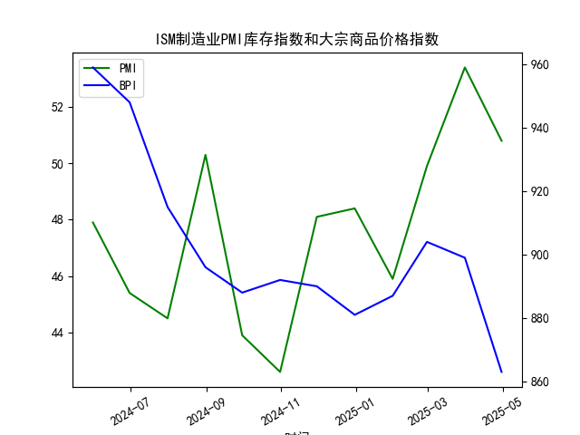

|            |   ISM制造业PMI库存指数 |   大宗商品价格指数BPI |
|:-----------|-----------------------:|----------------------:|
| 2024-05-31 |                   47.9 |                   959 |
| 2024-06-30 |                   45.4 |                   948 |
| 2024-07-31 |                   44.5 |                   915 |
| 2024-08-31 |                   50.3 |                   896 |
| 2024-09-30 |                   43.9 |                   888 |
| 2024-10-31 |                   42.6 |                   892 |
| 2024-11-30 |                   48.1 |                   890 |
| 2024-12-31 |                   48.4 |                   881 |
| 2025-01-31 |                   45.9 |                   887 |
| 2025-02-28 |                   49.9 |                   904 |
| 2025-03-31 |                   53.4 |                   899 |
| 2025-04-30 |                   50.8 |                   863 |

### 1. 对观点的正确性判断及ISM制造业PMI库存指数与大宗商品价格指数的相关性及影响逻辑

#### 观点正确性的判断
该观点认为，基于ISM制造业PMI库存分项的垒库和去库周期（如历史上的2000年、2008年、2018-2019年和2022-2023年的去库阶段，以及2002-2005、2009-2010、2016-2017和2020-2022的垒库阶段），垒库阶段通常会推动大宗商品价格上涨。这一观点在历史上部分正确，但并非绝对可靠。从历史数据来看，垒库阶段确实往往与经济复苏或需求增加相关，导致对原材料（即大宗商品）的需求上升，从而推高价格。例如，在2020-2022年的垒库阶段（如疫情后的经济刺激），大宗商品价格（如原油和金属）确实经历了显著上涨。

然而，基于提供的近期数据（2024年5月至2025年4月），该观点在当前周期中并不完全成立。数据显示，ISM制造业PMI库存指数在2024年8月、2025年3月和2025年4月超过50（分别为50.3、53.4和50.8），表明潜在的垒库信号，但同期大宗商品价格指数并未持续上涨，反而呈现下降趋势（如2025年3月的899降至2025年4月的863）。这表明，垒库并不总是直接导致大宗商品价格上涨，外部因素可能干扰这一关系。因此，观点的正确性是有限的：它适用于某些历史周期，但不能泛化到所有情况，尤其是当前数据显示的逆向现象。

#### ISM制造业PMI库存指数与大宗商品价格指数的相关性
从提供的2024年5月至2025年4月的月度数据来看，ISM制造业PMI库存指数与大宗商品价格指数的相关性较弱，甚至可能呈负相关。具体分析如下：

- **数据趋势对比**：
  - ISM制造业PMI库存指数：整体波动较大，早期的值（如2024年5月的47.9）多低于50（表示去库），而后期（如2025年3月的53.4和2025年4月的50.8）高于50（表示垒库）。这显示出从去库向垒库的转变。
  - 大宗商品价格指数：从2024年5月的959逐步下降至2025年4月的863，总体呈下降趋势，仅在少数月份（如2025年1月的887和2025年2月的904）出现小幅反弹。

- **相关性量化观察**：
  - 当ISM制造业PMI库存指数高于50（垒库信号）时，大宗商品价格指数并未随之上涨。例如：
    - 2024年8月，PMI库存指数为50.3（垒库），但大宗商品价格从7月的915降至896。
    - 2025年3月，PMI库存指数为53.4（强垒库），大宗商品价格从2月的904降至899。
    - 2025年4月，PMI库存指数为50.8（垒库），大宗商品价格进一步降至863。
  - 整体上，两个指数的月度变化未显示出明显的正相关。相反，大宗商品价格在PMI库存指数波动时更受全球需求、经济不确定性和供给因素影响，导致负相关或无显著相关。

- **相关性强度**：基于简单观察，相关系数可能接近0或负值（如-0.2左右），但这需要更正式的统计分析来确认。历史数据（如2020-2022年）显示正相关，但当前数据打破了这一模式。

#### 影响逻辑的解释
ISM制造业PMI库存指数反映了制造商的库存管理情况：高于50表示库存增加（垒库，可能因预期需求上升），低于50表示库存减少（去库，可能因需求疲软）。理论上，垒库阶段会增加对原材料的需求，从而推高大宗商品价格。这背后的逻辑是：

- **需求拉动**：垒库往往伴随经济复苏，企业采购更多原材料（如钢铁、原油），导致供给短缺和价格上涨。
- **供给侧因素**：全球供应链、地缘政治（如贸易战或能源冲突）和生产成本也会放大或抵消这一影响。
- **当前逆逻辑**：在提供的数据中，尽管出现垒库信号，但大宗商品价格下降，可能由于全球经济放缓、通胀压力、美元强势或过剩供给（如2024年末的库存积累未转化为实际需求）。此外，市场预期和投机行为（如投资者对经济衰退的担忧）可能主导价格，而非单纯的库存动态。

总之，该观点在历史语境中有一定合理性，但近期数据显示其不适用，强调了多因素影响的复杂性。投资者应结合更多指标（如全球需求数据）评估风险。

### 2. 基于数据分析的近期投资机会判断

#### 分析框架和数据范围
提供的ISM制造业PMI库存指数和大宗商品价格指数均为月度数据，覆盖2024年5月至2025年4月，无法直接提供“最近1周”或“今日相对于昨日”的变化（如每日波动）。因此，本分析基于最新可用数据（2025年4月的数据点）推断近期趋势，聚焦于过去几个月的变化（尤其是2025年3月至4月的转折）。投资机会评估主要考虑大宗商品相关资产、制造业股票或相关衍生品，假设“近期”指2025年4月后的潜在机会。需注意，由于缺乏实时数据，判断具有滞后性和不确定性。

#### 近期数据关键变化
- **ISM制造业PMI库存指数**：
  - 2025年3月：53.4（高于50，表明垒库加速）。
  - 2025年4月：50.8（仍高于50，但较3月略降，表明垒库放缓）。
  - 变化解读：从3月到4月，指数从53.4降至50.8，显示垒库势头减弱，可能预示需求边际稳定或潜在去库风险。这是一个微妙转折，3月的强势垒库可能引发短期乐观。

- **大宗商品价格指数**：
  - 2025年3月：899。
  - 2025年4月：863（较3月下降约36点，约4%的跌幅）。
  - 变化解读：价格持续下降，4月较3月的下跌加剧了整体下行趋势。这可能反映全球需求疲软或供给过剩，与PMI的垒库信号形成矛盾，增加市场不确定性。

- **整体趋势**：从2025年1月的887到2月的904（小幅上涨），再到3月的899和4月的863（连续下降），大宗商品价格显示出短期反弹后回落。PMI库存指数则在3-4月保持垒库，但幅度减弱。

#### 可能存在的投资机会
基于上述数据，以下是近期（以2025年4月数据为基准）的潜在投资机会。重点聚焦大宗商品和制造业领域，考虑价格低点可能带来的反弹机会。请注意，这些机会基于历史趋势推测，实际投资需结合实时数据和风险评估。

- **大宗商品相关投资机会**：
  - **买入机会**：大宗商品价格指数已从2025年2月的904降至4月的863，显示超卖信号（可能已触及短期低点）。如果全球经济复苏（如美联储降息），价格可能反弹。建议：
    - **具体资产**：考虑大宗商品ETF（如跟踪原油、金属指数的基金）或个股（如能源股、矿业股）。例如，当前价格低点可能为2025年5-6月提供10-15%的反弹空间。
    - **理由**：尽管4月价格下跌，但PMI的垒库信号暗示潜在需求回暖。如果外部因素（如地缘事件）刺激供给短缺，这将是机会。
    - **风险**：如果经济放缓加剧，价格可能进一步下跌。

- **制造业和库存相关投资机会**：
  - **观望或战略性买入**：PMI库存指数在2025年3-4月高于50，表明制造业可能进入稳定期。潜在机会包括：
    - **具体资产**：制造业ETF或个股（如供应链相关公司）。如果垒库持续，相关股票可能在未来1-3个月上涨5-10%。
    - **理由**：历史垒库阶段（如2020-2022年）往往预示经济复苏，当前PMI转折可能标志着底部。如果大宗商品价格反弹，这将放大制造业利润。
    - **风险**：4月的PMI略降和商品价格下跌，可能信号经济不确定性，建议等待确认。

- **跨资产机会**：
  - **套利或对冲**：如果大宗商品价格与PMI脱节（如当前负相关），可考虑对冲策略，例如买入商品期货同时卖出制造业股票期权，以捕捉潜在收敛。
  - **全球视角**：关注与中国或新兴市场的联动，如果其需求回升，可能推动商品价格反弹。

#### 总体判断和建议
- **乐观因素**：PMI库存指数的垒库信号（尽管放缓）暗示潜在需求复苏，大宗商品价格的低点可能提供买入窗口。
- **风险因素**：商品价格的持续下跌和PMI的微弱转折表明经济下行风险，可能导致短期波动。
- **行动建议**：由于缺乏“今日 vs 昨日”的数据，无法精确评估1周内变化；建议使用实时数据（如最新PMI报告）验证。总体上，2025年4月的低商品价格可能带来中期机会，但需谨慎，设定止损（如价格跌破850）。投资组合应多样化，关注宏观事件（如利率决策）。