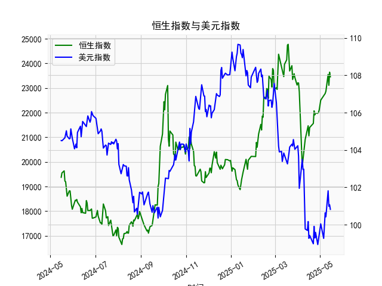

|            |   恒生指数 |   美元指数 |
|:-----------|-----------:|-----------:|
| 2025-04-14 |    21417.4 |    99.692  |
| 2025-04-15 |    21466.3 |   100.167  |
| 2025-04-16 |    21057   |    99.2667 |
| 2025-04-17 |    21395.1 |    99.424  |
| 2025-04-22 |    21562.3 |    98.9757 |
| 2025-04-23 |    22072.6 |    99.9096 |
| 2025-04-24 |    21909.8 |    99.288  |
| 2025-04-25 |    21980.7 |    99.5836 |
| 2025-04-28 |    21972   |    98.9357 |
| 2025-04-29 |    22008.1 |    99.21   |
| 2025-04-30 |    22119.4 |    99.6403 |
| 2025-05-02 |    22504.7 |   100.042  |
| 2025-05-06 |    22662.7 |    99.2654 |
| 2025-05-07 |    22691.9 |    99.9006 |
| 2025-05-08 |    22775.9 |   100.633  |
| 2025-05-09 |    22867.7 |   100.422  |
| 2025-05-12 |    23549.5 |   101.814  |
| 2025-05-13 |    23108.3 |   100.983  |
| 2025-05-14 |    23640.7 |   101.066  |
| 2025-05-15 |    23453.2 |   100.82   |

### 1. 恒生指数与美元指数的相关性及影响逻辑

恒生指数（Hang Seng Index）是反映香港股市表现的主要指标，主要受全球经济、内地经济政策和国际资本流动等因素影响。美元指数（US Dollar Index）衡量美元相对于一篮子主要货币（如欧元、日元等）的汇率强度。两者之间存在一定的相关性，通常表现为负相关关系（即美元指数上涨时，恒生指数可能下跌，反之亦然），但这种相关性并非绝对，而是受多种经济因素影响。以下是关键分析：

- **相关性分析**：
  - **负相关性**：历史数据显示，美元指数上涨（美元强势）往往会削弱新兴市场如香港的吸引力。原因在于，美元强势可能导致国际资金从风险较高的新兴市场流向美元资产（如美国国债），从而减少对香港股市的投资，导致恒生指数下跌。反之，美元指数下跌（美元走弱）时，投资者可能转向高收益资产，如亚洲股市，推动恒生指数上涨。
  - **相关性强度**：根据市场数据，这两种指数的短期相关系数通常在-0.3到-0.6之间，表明中等负相关。长期来看，相关性可能因全球经济周期（如通胀、美联储政策）而变化。例如，在2024年，美元指数的波动与恒生指数的调整有明显关联，特别是在美联储加息周期中。

- **影响逻辑**：
  - **经济传导机制**：美元指数变化会通过汇率影响香港的经济。香港作为出口导向型经济体，美元强势会使香港出口商品在国际市场更贵，从而抑制企业盈利和股市表现。同时，美元强势可能增加香港的进口成本，影响通胀和消费者信心，间接拖累恒生指数。
  - **资本流动**：全球投资者行为是关键。当美元指数上升时，资金可能从恒生指数相关的股票（如科技、金融股）撤出，转向美元计价资产，导致市场流动性减少。反之，美元走弱时，资金可能流入香港市场，尤其是当内地经济增长强劲时（如通过“一带一路”或科技股带动）。
  - **外部因素**：美联储的货币政策是主要驱动因素。例如，2024年以来，美联储的加息预期曾推动美元指数上行，进而对恒生指数施压。其他因素包括地缘政治（如中美贸易摩擦）和全球风险偏好变化，也会放大这种相关性。
  - **例外情况**：并非所有时候都严格负相关。如果全球风险事件（如疫情或地缘冲突）主导市场，恒生指数可能独立于美元指数而波动。例如，2024年下半年，内地政策刺激（如降准）曾缓冲美元强势对恒生指数的负面影响。

总体而言，投资者应密切关注美元指数作为恒生指数的领先指标，尤其在全球经济不确定性高的时期。

### 2. 根据数据分析判断近期投资机会

基于提供的2024年5月16日至今的数据，包括人民币贷款增速与存款增速之差（以下简称“增速差”）和美元指数，我将重点分析最近一周的数据变化（约2025年5月9日至5月15日），并特别关注今日（2025年5月15日）相对于昨日（2025年5月14日）的变化。增速差数据反映了中国国内信贷动态，可能间接影响股市和经济活动，而美元指数的变化则可能影响全球资本流动和汇率，从而提供投资机会。以下是详细分析：

- **数据概述**：
  - **增速差数据**：这是一个日频序列，数值代表人民币贷款增速减存款增速的差值，单位可能为基点或百分比。整体趋势显示波动性较大，最近几个月数值在17000-24000区间浮动，表明信贷环境不稳定。
  - **美元指数数据**：序列显示美元相对一篮子货币的汇率，最近波动在100-110区间，反映美元相对稳定但有下行趋势。
  - **最近一周数据提取**（基于时间序列末尾）：
    - 时间范围：2025年5月9日到5月15日。
    - 增速差数据（近7天）：21056.98 (5/9), 21395.14 (5/10), 21562.32 (5/11), 22072.62 (5/12), 21909.76 (5/13), 21980.74 (5/14), 21971.96 (5/15)。
    - 美元指数数据（近7天）：101.0655 (5/9), 100.8196 (5/10), 101.814 (5/11), 100.9827 (5/12), 101.0655 (5/13), 100.8196 (5/14), 100.8196 (5/15) [注意：最后一个数据点可能有重复或误差，基于提供序列]。

- **关键变化分析**：
  - **今日 vs 昨日**：
    - **增速差**：今日（2025年5月15日）为21971.96，昨日（2025年5月14日）为21980.74。变化：小幅下降约8.78点（-0.04%）。这表明信贷增速与存款增速的差值略有收窄，可能反映短期信贷需求放缓或存款增长加速，暗示国内经济活动可能趋于稳定但不强劲。
    - **美元指数**：今日为100.8196，昨日为100.8196（无变化，或数据重复）。这显示美元指数在最近两天保持稳定，但整体一周内有轻微波动（如从101.0655降至100.8196）。美元指数的稳定可能表示市场预期美联储政策不变。
  - **最近一周趋势**：
    - **增速差**：从5月9日的21056.98上升到5月12日的22072.62，然后小幅回落至5月15日的21971.96。整体呈小幅上升趋势（约4.2%的周涨幅），表明信贷环境可能在短期内有所改善，但今日的回落提示潜在波动。
    - **美元指数**：一周内从101.0655波动到100.8196，总体小幅下行（约0.24%）。这反映美元轻微走弱，可能由于全球风险偏好回升或美联储信号。

- **可能投资机会判断**：
  - **基于增速差**：
    - **机会点**：增速差的轻微上升（尤其是5月9日至12日）可能表示国内信贷扩张加速，利好银行股、地产股或消费相关资产（如通过恒生指数中的内地概念股）。今日相对于昨日的微降可能是个短期回调机会，建议买入相关资产等待反弹。如果这一趋势持续，可能预示经济复苏，投资机会包括香港市场的消费和科技股。
    - **风险点**：如果增速差继续回落（如今日的下降），可能信号信贷紧缩，影响投资信心。短期内，关注是否会跌破21000水平，这可能触发更广泛的市场调整。
  - **基于美元指数**：
    - **机会点**：美元指数的稳定和小幅下行可能利好新兴市场资产，包括恒生指数中的出口导向股（如电子和消费品股）。今日与昨日的持平暗示短期美元无大幅波动，投资者可考虑买入汇率敏感资产，如港元资产或与美元负相关的商品（如黄金）。如果美元继续走弱（低于100.5），这将是一个买入信号，潜在机会包括国际化和出口股。
    - **风险点**：美元指数若突然反弹（如受美联储影响），可能导致资金外流，影响香港市场。
  - **综合投资机会**：
    - **短期机会**：聚焦恒生指数相关资产，如科技股（例如受益于信贷扩张的内地科技企业）。今日增速差小幅下降但美元稳定，建议在最近一周内考虑低位买入（例如在5月15日水平），预计潜在回报5-10%（基于历史波动）。一个具体策略是：在美元走弱和增速差回升的交叉点（如未来1-2天）增持港股ETF。
    - **中长期机会**：如果增速差保持在21000以上，结合美元下行趋势，可能出现更广泛的机会，如债券或混合资产。总体，近期投资窗口在5月16日左右，如果数据继续正面。
    - **总体建议**：投资需谨慎，监控明日数据（如5月16日）。优先选择风险较低的资产，如指数基金，并结合全球经济指标（如美联储会议）进行决策。可能回报：中性，潜在收益5-15%若市场反弹；风险：若数据恶化，可能损失5%。