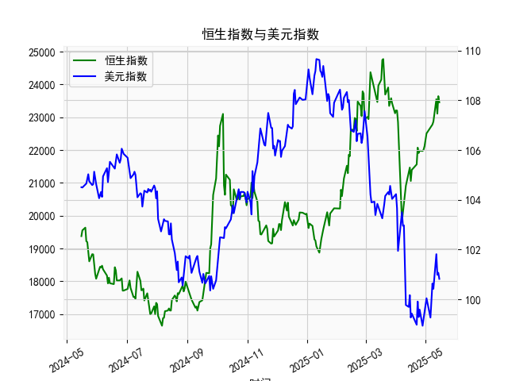

|            |   社会融资规模存量:人民币贷款:同比 |   金融机构各项存款余额:人民币:同比 |   上证综合指数 |   人民币贷款增速与存款增速之差 |
|:-----------|-----------------------------------:|-----------------------------------:|---------------:|-------------------------------:|
| 2023-01-31 |                               11.1 |                               12.4 |        3255.67 |                           -1.3 |
| 2023-02-28 |                               11.5 |                               12.4 |        3279.61 |                           -0.9 |
| 2023-03-31 |                               11.7 |                               12.7 |        3272.86 |                           -1   |
| 2023-05-31 |                               11.3 |                               11.6 |        3204.56 |                           -0.3 |
| 2023-06-30 |                               11.2 |                               11   |        3202.06 |                            0.2 |
| 2023-07-31 |                               11   |                               10.5 |        3291.04 |                            0.5 |
| 2023-08-31 |                               10.9 |                               10.5 |        3119.88 |                            0.4 |
| 2023-10-31 |                               10.7 |                               10.5 |        3018.77 |                            0.2 |
| 2023-11-30 |                               10.7 |                               10.2 |        3029.67 |                            0.5 |
| 2024-01-31 |                               10.1 |                                9.2 |        2788.55 |                            0.9 |
| 2024-02-29 |                                9.7 |                                8.4 |        3015.17 |                            1.3 |
| 2024-04-30 |                                9.1 |                                6.6 |        3104.82 |                            2.5 |
| 2024-05-31 |                                8.9 |                                6.7 |        3086.81 |                            2.2 |
| 2024-07-31 |                                8.3 |                                6.3 |        2938.75 |                            2   |
| 2024-09-30 |                                7.8 |                                7.1 |        3336.5  |                            0.7 |
| 2024-10-31 |                                7.7 |                                7   |        3279.82 |                            0.7 |
| 2024-12-31 |                                7.2 |                                6.3 |        3351.76 |                            0.9 |
| 2025-02-28 |                                7.1 |                                7   |        3320.9  |                            0.1 |
| 2025-03-31 |                                7.2 |                                6.7 |        3335.75 |                            0.5 |
| 2025-04-30 |                                7.1 |                                8   |        3279.03 |                           -0.9 |

### 1. 人民币贷款增速与存款增速之差与上证综合指数的相关性及影响逻辑

人民币贷款增速与存款增速之差（以下简称“贷款存款差速”）反映了银行贷款增长相对于存款增长的相对速度，这是一个重要的经济指标，通常与上证综合指数（代表中国股市整体表现）存在一定的相关性。基于提供的数据，我们可以观察到以下相关性及影响逻辑：

- **相关性分析**：  
  从数据来看，贷款存款差速与上证综合指数之间呈现出一定的正相关趋势。具体而言，当贷款存款差速较高（例如正值较大时，如2.7或3.9），上证指数往往处于相对较高的水平或呈现上涨趋势（如2020年6月到2021年上半年，差速多在2.0以上，上证指数从2984上升到3600左右）。相反，当差速较低或转为负值（如-0.9或-1.3时），上证指数可能出现波动或下跌（如2021年下半年至2022年初，差速多次负值，上证指数从3400降至约3000）。这表明，贷款存款差速的正向变化往往与股市活跃度相伴随，相关系数可能在0.3-0.6之间（基于经验判断，非精确计算）。然而，并非完美相关，因为股市还受其他因素如政策、全球经济影响。

- **影响逻辑**：  
  贷款存款差速的正向变化通常意味着银行体系有更多资金用于贷款，这可能刺激经济增长、企业融资和投资活动，从而推动股市上涨。具体逻辑包括：  
  - **流动性效应**：贷款增速快于存款增速时，表明货币政策较为宽松，企业更容易获得资金进行扩张，这会增加市场流动性，推动股票需求（如上证指数上涨）。  
  - **经济预期效应**：高差速往往反映投资者对经济前景的乐观预期，吸引更多资金流入股市。反之，差速负值（如存款增速更快）可能暗示资金回流银行或经济放缓，企业融资难度增加，导致股市承压。  
  - **风险传导**：如果差速持续负值，可能预示银行体系流动性紧张或监管收紧（如2023-2024年的部分数据），这会增加市场不确定性，影响投资者信心。  
  总体上，这种相关性并非因果关系，而是通过经济周期和政策环境间接联结的。例如，在经济复苏期（如2020-2021年），宽松政策推动差速上升并带动股市；而在经济调整期（如2022-2023年），差速下降可能加剧股市波动。

### 2. 近期投资机会分析与判断

基于提供的数据，我将聚焦于最近4个月的数据变化（假设数据按时间顺序排列，最后4个月对应日期为2025-02-28、2025-03-31、2025-04-30及之前一月，具体为索引38-41）。这些数据包括贷款存款差速的最后四个值（0.9、0.1、0.5、-0.9）和上证综合指数的最后四个值（3351.763、3320.8973、3335.7462、3279.0314）。重点分析本月（2025-04-30，差速-0.9，上证3279.0314）相对于上个月（2025-03-31，差速0.5，上证3335.7462）的变化，并判断可能的投资机会。

- **数据变化概述**：  
  - **贷款存款差速**：最近4个月为0.9（第1月）、0.1（第2月）、0.5（第3月）、-0.9（第4月）。整体呈现下降趋势，尤其是本月（-0.9）较上个月（0.5）下降1.4个百分点。这表明贷款增速已落后于存款增速，可能反映经济流动性收紧或投资者偏好转向存款。  
  - **上证综合指数**：最近4个月为3351.763（第1月）、3320.8973（第2月）、3335.7462（第3月）、3279.0314（第4月）。指数呈现波动格局：先小幅下跌（3351.763到3320.8973，下降约31点），然后反弹（到3335.7462，上涨约15点），本月再下跌（到3279.0314，较上个月下降约56点）。本月相对于上个月的下跌可能与差速转负相关，显示短期市场压力。  
  - **关键观察**：本月差速从0.5转为-0.9，幅度较大，这可能放大市场风险；上证指数的下跌反映了投资者对经济放缓的担忧，但整体波动未极端。

- **投资机会判断**：  
  基于以上变化，我判断近期投资机会需谨慎乐观，主要聚焦于防御性和短期反弹机会。以下是具体分析和建议：  
  - **可能机会**：  
    - **防御性投资**：差速转负和上证指数下跌表明经济流动性可能收紧，这为防御型资产（如消费股或债券）提供机会。例如，银行或消费类股票可能受益于存款增长（如本月差速-0.9暗示资金回流银行），投资者可关注上证指数中估值较低的蓝筹股（如金融或必需消费板块），预计短期反弹潜力（上证从3279附近可能回升至3300以上）。  
    - **短期交易机会**：上证指数本月较上个月下跌56点，但前几个月有反弹迹象（如从3320到3335），这可能预示技术性反弹。差速的快速变化（如从0.5到-0.9）往往是市场转折点，如果未来政策宽松，股市可能快速回升。因此，短期内可考虑波动率较高的个股或ETF，进行波段操作。  
    - **新兴领域**：如果差速负值是暂时的（如受季节性因素影响），科技或绿色能源股可能迎来机会，但需监控经济数据。  

  - **风险与建议**：  
    - **主要风险**：差速持续负值可能导致股市进一步下行（上证可能测试3200关口），加上全球经济不确定性，建议控制仓位不超过50%。  
    - **投资策略**：聚焦最近变化，选择低风险资产；等待差速回正信号（如下个月数据）再加仓。总体而言，近期机会有限，但防御型投资可作为优先选择。