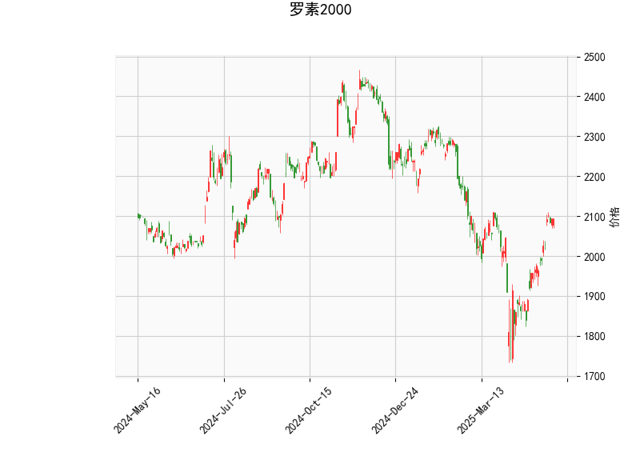

### 罗素2000指数技术分析结果详解

#### 1. 当前技术指标概述
罗素2000指数当前价格为2094.69，显示出较为积极的技术面信号，但也存在潜在风险。以下是对关键指标的详细分析：

- **RSI（相对强弱指数）**：当前值为64.27。这表明指数处于轻微超买区域（RSI高于70通常被视为超买）。RSI的上升趋势反映了近期买盘强劲，但如果继续上升，可能引发回调或修正。

- **MACD（移动平均收敛散度）**：MACD线为33.86，信号线为13.48，直方图为20.38。MACD线高于信号线，且直方图为正值，这是一个明显的看涨信号，表明短期内多头动能占优，价格可能继续上行。然而，如果MACD线开始收敛，可能会预示趋势逆转。

- **布林带（Bollinger Bands）**：上轨为2202.65，中轨为2006.86，下轨为1811.07。当前价格（2094.69）位于中轨和上轨之间，接近上轨。这暗示价格处于波动区间的高位，潜在上行空间有限，但也增加了回调的风险。如果价格突破上轨，可能进一步上涨；反之，跌破中轨可能引发下行。

- **K线形态**：形态包括“CDLCLOSINGMARUBOZU”（收盘大阳线）和“CDLLONGLINE”（长线）。这些形态通常表示强烈的市场情绪。“CDLCLOSINGMARUBOZU”暗示强势多头控制，可能预示短期趋势持续；“CDLLONGLINE”显示大波动，结合其他指标，可能强化看涨信号。但需注意，这种形态若出现逆转，可能导致快速回落。

总体而言，罗素2000指数显示出短期看涨趋势，驱动因素包括MACD的正向交叉和强势K线形态。但RSI接近超买水平和价格靠近布林带上轨，增加了市场过热的潜在风险，投资者应警惕修正。

#### 2. 近期投资或套利机会及策略判断
基于上述技术分析，罗素2000指数短期内可能存在投资机会，但也伴随回调风险。以下是对潜在机会的分析和建议策略：

##### **可能存在的投资机会**
- **看涨机会**：指数的技术面整体偏多头，MACD和K线形态支持进一步上涨。如果市场情绪持续积极，价格可能测试布林带上轨（2202.65）或更高水平。这为多头投资者提供买入点，尤其是在小型股指数（如罗素2000）表现优于大盘时。
- **回调买入机会**：RSI接近超买，暗示短期修正可能性。如果价格回落至中轨（2006.86）附近，这可能成为低风险买入点，形成“逢低布局”的机会。
- **套利机会**：罗素2000指数期货或期权市场可能存在套利空间。例如，利用MACD的正向信号进行跨期套利（如买入近期期货、卖出远期期货），或在期权市场通过看涨期权获利。但需注意，当前波动率较高，可能放大套利风险。

##### **推荐投资策略**
- **多头策略**：在当前看涨信号下，建议买入指数ETF或期货头寸。设置止损位在布林带中轨（2006.86）以下，以控制风险。目标位可设定在2200附近，如果突破上轨。
- **回调策略**：若RSI升至70以上，等待价格回调至2000-2050区间再入场。这是一种“均值回归”方法，利用布林带的波动特性。
- **期权策略**：买入短期看涨期权（如CALL期权），以放大潜在收益。结合K线形态，如果出现更多强势信号，可增加头寸。但若RSI超买加剧，考虑卖出看跌期权作为对冲。
- **套利策略**：通过统计套利（如罗素2000与S&P 500指数的价差套利），如果罗素2000相对强势，可买入罗素2000期货并卖出S&P 500期货。风险控制：限额套利，保持头寸规模不超过总仓位的20%。
- **风险管理建议**：市场不确定性高，建议结合基本面（如经济数据和利率变化）验证技术信号。始终设置止盈止损，并控制仓位（如不超过总资产的30%）。如果RSI突破70或MACD直方图收窄，及时减仓以避免潜在回调。

总之，近期罗素2000指数可能迎来短期上涨，但超买风险不可忽视。投资者应根据个人风险偏好和市场动态调整策略，优先选择波动率较低的工具以降低损失。